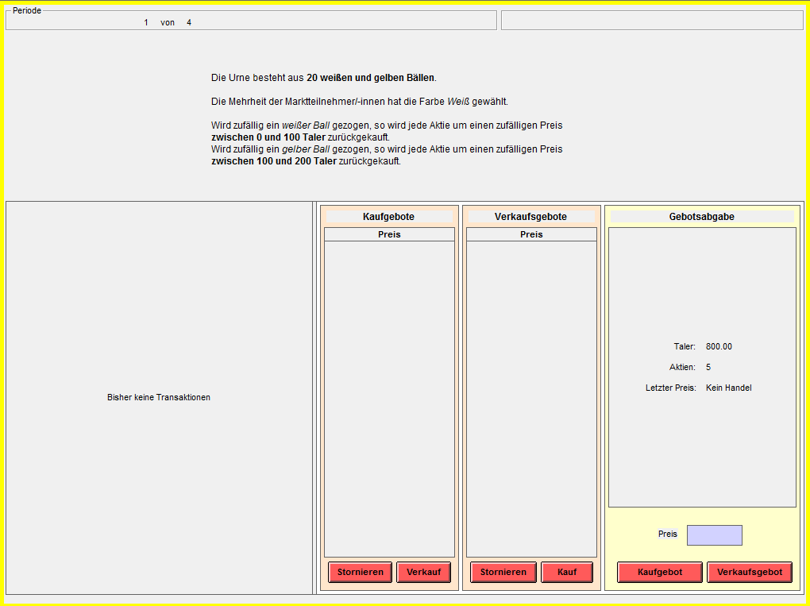
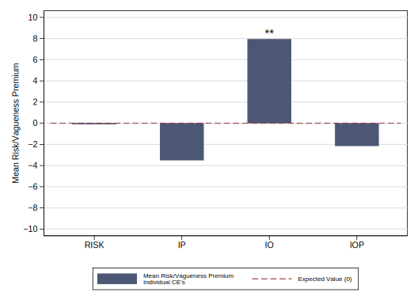
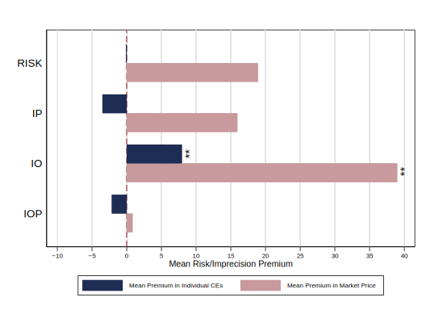
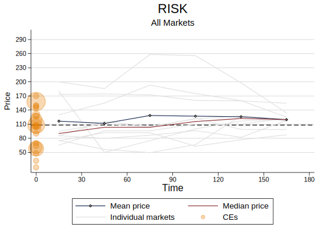
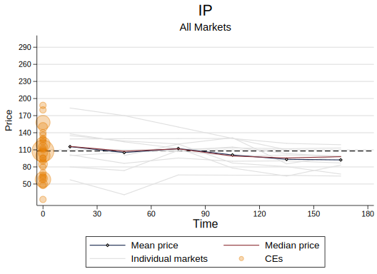
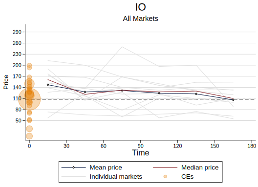
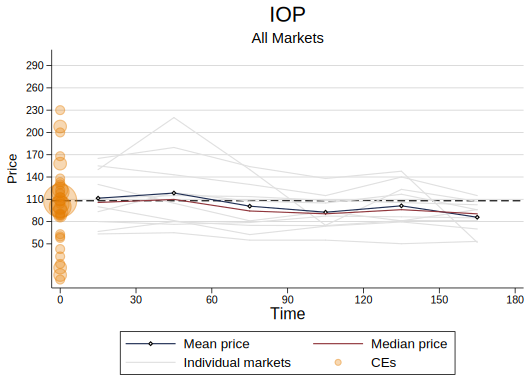

```{r setup, include=FALSE}
options(htmltools.dir.version = FALSE)
```

class: title-slide, center, middle

# Individual Attitudes and Market Dynamics Towards Imprecision

## Christoph Huber and Julia Rose

### Department of Banking and Finance
### University of Innsbruck

#### Experimental Finance 2019

### June 15, 2019
### Copenhagen

---
class: inverse, center, middle

# Introduction

---
<footer></footer>

# Motivation

- Financial markets:

  Dividend processes, returns, fundamental values are _imprecise_ / _vague_:

  - __probabilities__ over realizations are uncertain (ambiguity)
  
  - actual __amounts__ of realizations are uncertain

--

- __Aim of this study__:

  - Disentangle the effect of __uncertain probilities__ and __uncertain outcomes__
  
  - Relate investors _individual_ attitudes towards imprecision to _market outcomes_

---
<footer></footer>

# Related Literature

- Early incorporation of ambiguity in economic theory (Knight, 1921; Savage, 1954; Ellsberg, 1961)

  $\rightarrow$ challenged due to its incoherence with experimental observations
 
--

- Following work:

  - Camerer and Weber (1992): comprehensive framework
  
  - Gilboa and Schmeidler (1989): formalized the 'malevolent' decision rule

---
<footer></footer>

# Related Literature

Mixed experimental evidence for _ambiguity_ (imprecision in probabilities) aversion in __markets__:

--

  - Camerer and Kunreuther (1989): experimental markets for insurance against potential losses
    $\rightarrow$ mixed, minor effects
    
  - Weber (1989), Sarin and Weber (1993): multitude of experimental asset market designs
    $\rightarrow$ robust 'ambiguity premium'
    
  - Bossaerts et al. (2010): $\rightarrow$ ambiguity aversion under certain criteria
  
  - Kocher et al. (2013): self-selection into risky or ambiguous markets
    $\rightarrow$ no 'ambiguity premium'
    
  - F&uuml;llbrunn et al. (2014): $\rightarrow$ mixed effects

---
<footer></footer>

# Related Literature:

What about imprecision in _outcomes_?

--

- Du and Budescu (2005):

  - compare preferences for precise and imprecise probabilities and outcomes in individual choice tasks

  - $\rightarrow$ no 'ambiguity premium', but imprecision-_seeking_ for imprecise outcomes

--

Our contribution:

1. analyze the impact of imprecise probabilities _and_ imprecise outcomes in an _asset market environment_
2. relate individual attitudes/preferences to market outcomes

---
class: inverse, center, middle

# Experimental Design

---
<footer></footer>

# Experimental Design

- 320 participants (80 in each treatment; 47% male, mean age 23 years)

- Between-subjects design with 4 treatments:

--

Treatment | Outcome Realizations  | Probabilities|
:---:     | :---:                 | :---:
RISK      | 58                    | 50%
          | 158                   | otherwise
--
IO        | [8, 108]              | 50%
          | [108, 208]            | otherwise
--
IP        | 58                    | [0%, 100%]
          | 158                   | otherwise
--
IOP       | [8, 108]              | [0%, 100%]
          | [108, 208]            | otherwise          

---
<footer></footer>

# Experimental Design: Lottery draws

_Before_ each experimental session, we...

--

- sample distributions over probabilities (IP and IOP: [0%, 100%])
--

- sample distributions over realizations (IO and IOP: [8, 108] and [108, 208])

--

... using the random number generator on `random.org`

--

$\rightarrow$ sample distribution is uncertain

--

_At the end_ of each experimental session, we...

- randomly draw from this uncertain sample distribution

---
<footer></footer>

# Experimental Design

Two tasks:

1. __Individual decision-task__: elicit each subject's certainty equivalent (CE) for each treatment

2. __Continuous double-auction market__: observe market prices

---
<footer></footer>

# Individual decision-task

.center[]

---
<footer></footer>

# Continuous double-auction market

- 8 traders per market, endowed w/ 800 Taler, 5 assets

- 3 minutes of single-unit trading

- same four treatments as for individual task: RISK, IO, IP, IOP

- treatments determine __buyback price__ of an asset at the end of trading

---
<footer></footer>

# Continuous double-auction market

.center[]

---
class: inverse, center, middle

# Results

---
<footer></footer>

# Results: Individual decision-task

.center[]

--

- significant _imprecision-in-outcomes seeking_

---
<footer></footer>

# Results: Markets

.center[]

--

- significant _imprecision-in-outcomes seeking_

---
<footer></footer>

# Results: Markets

.pull-left[] 

.pull-right[]

.pull-left[]

.pull-right[]


---
<footer></footer>

# Results: Market variables

```{r, include=FALSE}
library(tidyverse)
library(haven)
library(kableExtra)

dta <- read_dta("../../05_Data and Analysis/Christoph/_prices.dta")
```
```{r, echo=FALSE}
dta$treat1 <- factor(dta$treat, levels=c("RISK", "VO", "VP", "VOP"), labels=c("RISK", "IO", "IP", "IOP"))
dta %>%
  group_by(treat1, market1) %>%
  mutate(VolumeTraded = VolumeTraded / (5*8)) %>%
  summarise(VolumeTraded = mean(VolumeTraded),
            SD_logret = mean(SD_logret),
            spread = mean(spread)) %>%
  group_by(treat1) %>%
  summarise(ST = median(VolumeTraded), Vola = median(SD_logret), Spread = median(spread, na.rm=TRUE)) %>%
  kable(format="html", digits=2, col.names=c("Treatment", "ST", "Vola", "Spread")) %>%
  kable_styling(full_width = F)

```


---
class: center, middle


# Thanks!

.small[christoph.huber@uibk.ac.at]

### This project was funded by the _University of Innsbruck (Aktion D. Swarovski 2017)_ and the _Austrian Science Fund FWF (P29362-G27, SFB F63)_.

.tiny[Slides created via the R package [**xaringan**](https://github.com/yihui/xaringan).]
.tiny[The chakra comes from [remark.js](https://remarkjs.com), [**knitr**](http://yihui.name/knitr), and [R Markdown](https://rmarkdown.rstudio.com).]
