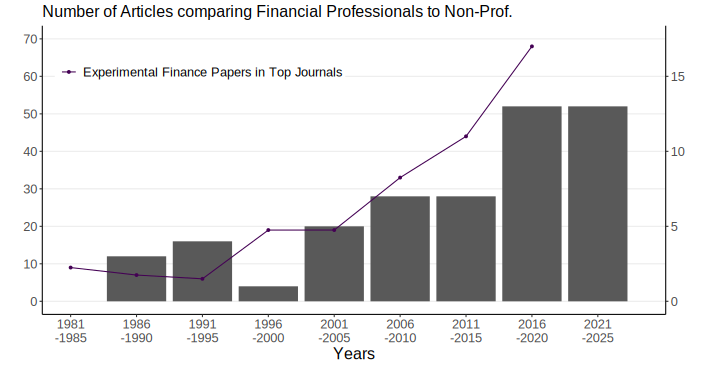
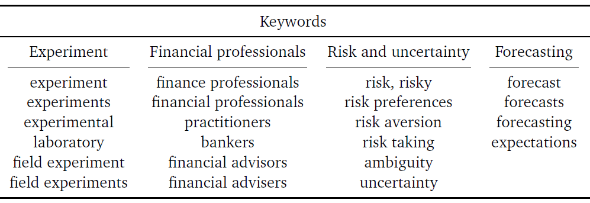
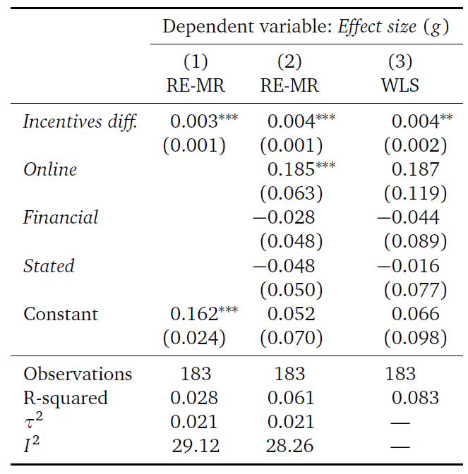
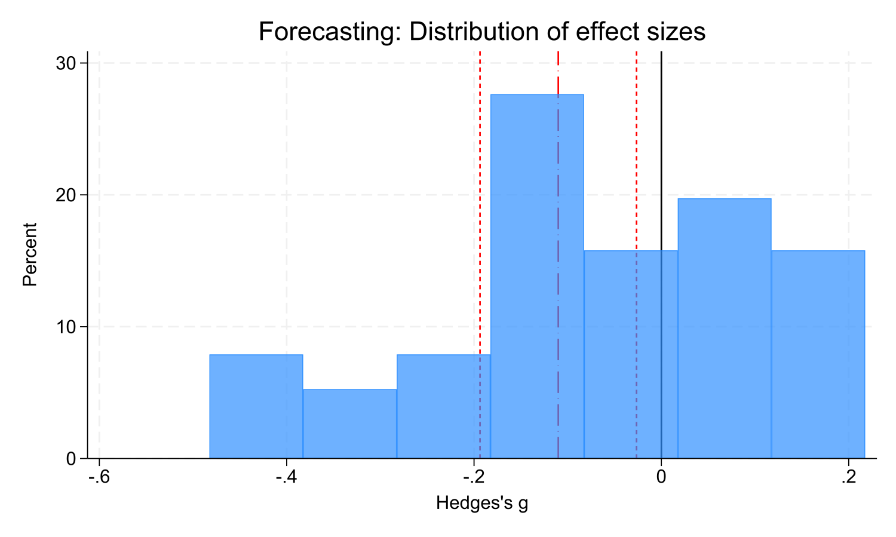
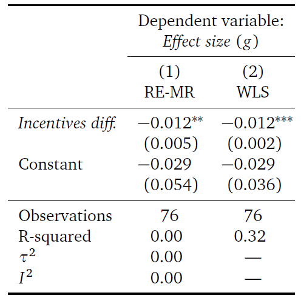
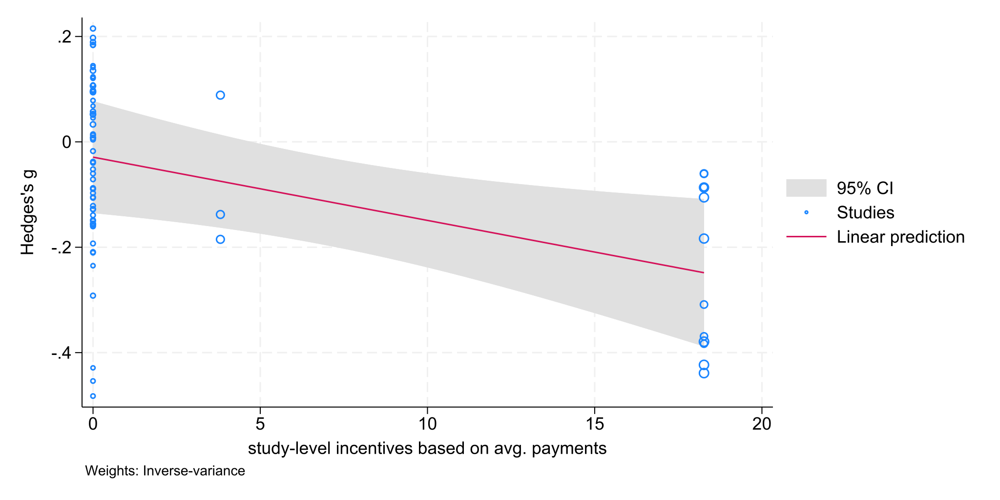
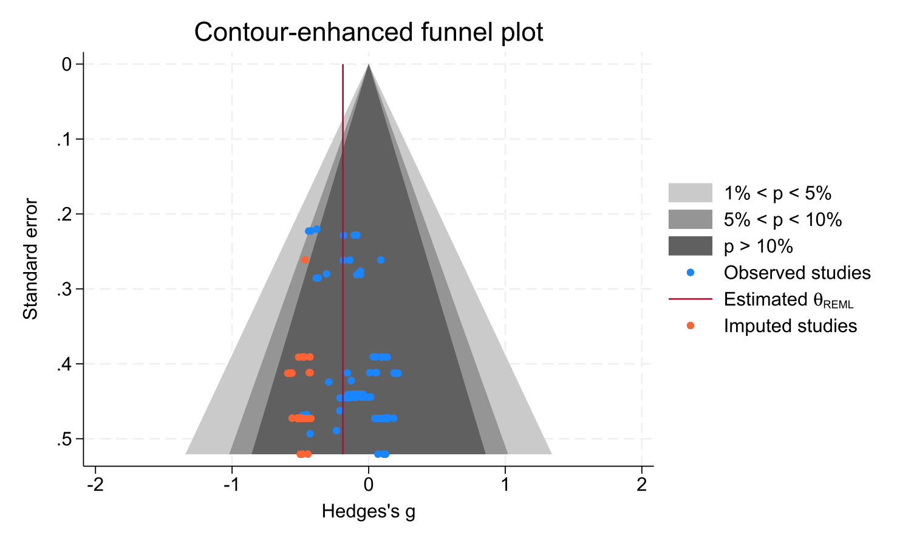

## Motivation

- early experimental literature: mostly student participants

. . .

- increasingly also _financial professionals_

  - employees, managers, self-employed traders, brokers, financial advisors, and other entrepreneurs in the realm of financial markets  

. . .

- External validity concerns

  - Is the behavior among students representative of the behavior of people in the "real world" situations we want to model?

. . .

Plott (1982): lab experiments are _"... real ... in the sense that real people participate for real and substantial profits and follow real rules in doing so. It is precisely because they are real that they are interesting."_ - if anything, this criticism is __"a hypothesis about behavior in different subject pools ... [and] .. a call for more experiments" !__ 

---

## Introduction

- Professionals in experiments compared to non-professionals since 1980s

- __53 studies__ covering many different research topics

{fig-align="center"}

---

## Introduction {visibility="uncounted"}

- Professionals in experiments compared to non-professionals since 1980s

- __53 studies__ covering many different research topics ... and finding __mixed results__

    
## Introduction {visibility="uncounted"}

- Professionals in experiments compared to non-professionals since 1980s

- __53 studies__ covering many different research topics ... and finding __mixed results__

  - some identify differences between professionals and non-professionals   (Haigh & List 2005, Alevy et al. 2007, Kaustia et al. 2008, Cohn et al. 2014, Kirchler et al. 2018)
  
  
## Introduction {visibility="uncounted"  auto-animate=true}

- Professionals in experiments compared to non-professionals since 1980s

- __53 studies__ covering many different research topics ... and finding __mixed results__

  - some identify differences between professionals and non-professionals   (Haigh & List 2005, Alevy et al. 2007, Kaustia et al. 2008, Cohn et al. 2014, Kirchler et al. 2018)
  
  - some report little or no differences   (Rahwan et al. 2019, Holzmeister et al. 2020)

. . .

__This paper:__

. . .

- $\rightarrow$ synthesize and review the existing literature 

- $\rightarrow$ provide quantitative evidence $\rightarrow$ __meta-analyses__

## Introduction {auto-animate=true}

__This paper:__

- $\rightarrow$ synthesize and review the existing literature 

- $\rightarrow$ provide quantitative evidence $\rightarrow$ __meta-analyses__

. . .

Research Questions: 

- Do financial professionals behave differently from non-professionals? 

. . .

- Does the existing literature reveal any methodological or thematic aspects that predict whether professionals and non-professionals differ in their behavior? 

---

## Inclusion criteria

__Lab, lab-in-the-field, or online experiments__ with __at least two different groups of participants__: a group of financial professionals and a comparison sample of laypeople  

. . .

Inclusion criteria:

- The study involves a laboratory, lab-in-the-field, or online experiment. 

. . .

- The study employs financial professionals as participants in comparison to at least another participant group of laypeople (e.g., students, general population samples).

. . .

- The experimental procedures for financial professionals and non-professionals are comparable in the sense that the only difference between treatments with professionals and non-professionals are the subject's profession and expertise.     

---

## Scope

__53 studies__ covering many different research topics

Research topics: 

::: {.fragment}
- Risk and uncertainty
:::

::: {.fragment}
- Forecasting
:::

::: {.fragment}
- Asset markets
:::

---

## Scope {visibility="uncounted"}

__53 studies__ covering many different research topics

Research topics: 

::: {.fragment .highlight-blue}
- Risk and uncertainty
:::

::: {.fragment .highlight-blue}
- Forecasting
:::

::: {}
- Asset markets
:::

::: {}
- Other topics
:::

---

## Literature search

- Keyword searches on Google Scholar, EconLit, IDEAS databases up until January 2024

::: {style="text-align:center; width: 80%;"}
{fig-align="center"}
:::

--- 

## Literature search {visibility="uncounted"}

- Keyword searches on Google Scholar, EconLit, IDEAS databases up until January 2024

  - Risk and uncertainty: 116, 21, and 52 studies identified
  - Forecasting: 38, 21, and 111 studies identified  

. . .

- After applying inclusion criteria: 22 unique studies

  - 15 for risk and uncertainty
  - 2 for forecasting
  - 5 eligible for both topics

---

## Literature search

- Manual search queries on relevant databases
- Ancestry approach: screening references of identified studies
- Posting a call for papers on the ESA mailing list

$\rightarrow$ total sample: __35 eligible studies__  

. . .

- Next step: locate the data for meta-analyses

. . .

$\rightarrow$ __183 effects from 20 studies__ for _risk and uncertainty_

$\rightarrow$ __76 effects from 4 studies__ for _forecasting_

# Results {.center background-color="#003366" style="text-align:center;"}

## _Risk and uncertainty_: Meta-analysis {auto-animate=true}

- 183 effects from 20 studies (17 published, 3 unpublished)
- 88,609 data points from 11 different countries 

. . .

  <table>
      <tr>
          <td>Haigh & List (2005)</td>
          <td>2</td>
          <td>Holzmeister et al. (2020)</td>
          <td>81</td>
          <td>Holmen et al. (2023)</td>
          <td>4</td>
      </tr>
      <tr>
          <td>List & Haigh (2005)</td>
          <td>3</td>
          <td>Huber et al. (2021, 2022)</td>
          <td>20</td>
          <td>Kirchler et al. (2020)</td>
          <td>2</td>
      </tr>
      <tr>
          <td>List & Haigh (2010)</td>
          <td>3</td>
          <td>Razen et al. (2020)</td>
          <td>6</td>
          <td>Stefan et al. (2022)</td>
          <td>2</td>
      </tr>
      <tr>
          <td>Roth & Voskort (2014)</td>
          <td>3</td>
          <td>Hanaki (2022)</td>
          <td>14</td>
          <td>Lambert et al. (2012)</td>
          <td>1</td>
      </tr>
      <tr>
          <td>Kirchler et al. (2018)</td>
          <td>9</td>
          <td>Weitzel et al. (2020)</td>
          <td>14</td>
          <td>Leuermann & Roth (2012)</td>
          <td>3</td>
      </tr>
      <tr>
          <td>Angrisani et al. (2020)</td>
          <td>2</td>
          <td>Huber et al. (2019)</td>
          <td>4</td>
          <td>Arnold et al. (2011)</td>
          <td>1</td>
      </tr>
      <tr>
          <td>Gajewski & Meunier (2020)</td>
          <td>1</td>
          <td>Hackethal et al. (2023)</td>
          <td>8</td>
          <td></td>
          <td></td>
      </tr>
  </table>

## _Risk and uncertainty_: Meta-analysis {auto-animate=true}

- 183 effects from 20 studies (17 published, 3 unpublished)
- 88,609 data points from 11 different countries  

- 137 tests (75%) show a positive effect
- 45 tests (25%) show a negative effect
- 93 out of 183 effects are small in absolute values (Hedges's $g\leq0.2$)  

. . .

$\rightarrow$ mean effect size $g=0.195$
(95\% confidence interval (CI): $[0.154, 0.236]$; $p<0.001$)  
$I^2=29.71$; $\tau^2=0.022$, robust to WLS with clustered std. err.

## _Risk and uncertainty_: Meta-analysis {auto-animate=true}

{fig-align="center"}

$\rightarrow$ mean effect size $g=0.195$
(95\% confidence interval (CI): $[0.154, 0.236]$; $p<0.001$)  
$I^2=29.71$; $\tau^2=0.022$, robust to WLS with clustered std. err.

. . .

### $\rightarrow$ __Professionals are, on average, more risk-loving than non-prof.__

## _Risk and uncertainty_: Meta-regressions {auto-animate=true}

{fig-align="center"}

---

## _Risk and uncertainty_: Incentives {auto-animate=true}

{fig-align="center"}

## _Forecasting_: Meta-analysis {auto-animate=true}

. . .

- 76 effects from 4 studies (all published)
- 25,622 data points from at least 3 different countries 

. . .

  <table>
      <tr style="border-top:0">
          <td>Huber et al. (2021, 2022)</td>
          <td>12</td>
      </tr>
      <tr style="border-top:0">
          <td>Hanaki (2022)</td>
          <td>3</td>
      </tr>
      <tr style="border-top:0">
          <td>Huber et al. (2019)</td>
          <td>56</td>
      </tr>
      <tr style="border-top:0">
          <td>Zaleskiewicz (2011)</td>
          <td>5</td>
      </tr>
  </table>

. . .

- 31 tests (41%) show a positive effect; 45 tests (59%) show a negative effect
- 62 out of 76 effects (82%) are small in absolute values (Hedges's $g\leq0.2$) 

. . .

$\rightarrow$ random-effects meta analysis yields mean effect size $g=-0.110$  
(95\% confidence interval (CI): $[-0.194, -.027]$; $p=0.010$)

---

## _Forecasting_: Meta-analysis {auto-animate=true}

{fig-align="center"}

$\rightarrow$ random-effects meta analysis yields mean effect size $g=-0.110$  
(95\% confidence interval (CI): $[-0.194, -.027]$; $p=0.010$)

. . .

__BUT__: WLS with clustered std. err. at the study level: $g = −0.110$ ($p = 0.295$)

. . . 

### $\rightarrow$ __Professionals are, on average, <i>not</i> better forecasters.__

---

## _Forecasting_: Meta-regressions {auto-animate=true}

{fig-align="center"}

---

## _Forecasting_: Incentives

{fig-align="center"}

---

## Conclusion {.reverse .center background-color="#335c85" transition="slide-in none-out" auto-animate=true}

## Conclusion {.reverse .center background-color="#335c85" transition="slide-in none-out" auto-animate=true visibility="uncounted"}

- Risk and uncertainty
  - Professionals are, on average, more risk-loving than non-professionals.
  - Larger diff. in incentives $\rightarrow$ larger diff. in risk preferences
  - No moderating effect of _online_ setting, _financial_ framing, or _stated_ preferences

## Conclusion {.reverse .center background-color="#335c85" transition="slide-in none-out" auto-animate=true visibility="uncounted"}

- Risk and uncertainty
  - Professionals are, on average, more risk-loving than non-professionals.
  - Larger diff. in incentives $\rightarrow$ larger diff. in risk preferences
  - No moderating effect of _online_ setting, _financial_ framing, or _stated_ preferences
  
- Forecasting
  - Professionals are, on average, <u>not</u> better forecasters than non-professionals.
  - Larger diff. in incentives $\rightarrow$ larger diff. in forecasting accuracy

## Conclusion {.reverse .center background-color="#335c85" transition="slide-in none-out" auto-animate=true visibility="uncounted"}

- Risk and uncertainty
  - Professionals are, on average, more risk-loving than non-professionals.
  - Larger diff. in incentives $\rightarrow$ larger diff. in risk preferences
  - No moderating effect of _online_ setting, _financial_ framing, or _stated_ preferences
  
- Forecasting
  - Professionals are, on average, <u>not</u> better forecasters than non-professionals.
  - Larger diff. in incentives $\rightarrow$ larger diff. in forecasting accuracy

- Asset markets

- Other topics

## Thanks {.center background-color="#003366" style="text-align:center;"}

christoph.huber@wu.ac.at

chr-huber.com

# Appendix {visibility="uncounted"}

## Publication bias {visibility="uncounted"}

{fig-align="center"}

## Publication bias {visibility="uncounted"}

{fig-align="center"}

