## Introduction

::: columns
::: {.column .incremental width="65%"}
-   asset prices bubbles and crashes are at the heart of financial markets

-   joint hypothesis problem in empirical data as FV not observable

-   $\rightarrow$ **asset market experiments**  (Smith, Suchanek, Williams, 1988)

-   {width="60%"}
:::

::: {.column width="35%"}
{style="margin:0;"}
{style="margin:0;"}
:::
:::

::: {.footer .footer1}

Christoph Huber 

:::

::: notes
costs to individuals, households, and society
:::

## Introduction

::: columns
::: {.column width="65%"}
Limitations of this literature:
:::

::: {.column width="35%"}
{style="margin:0;"}
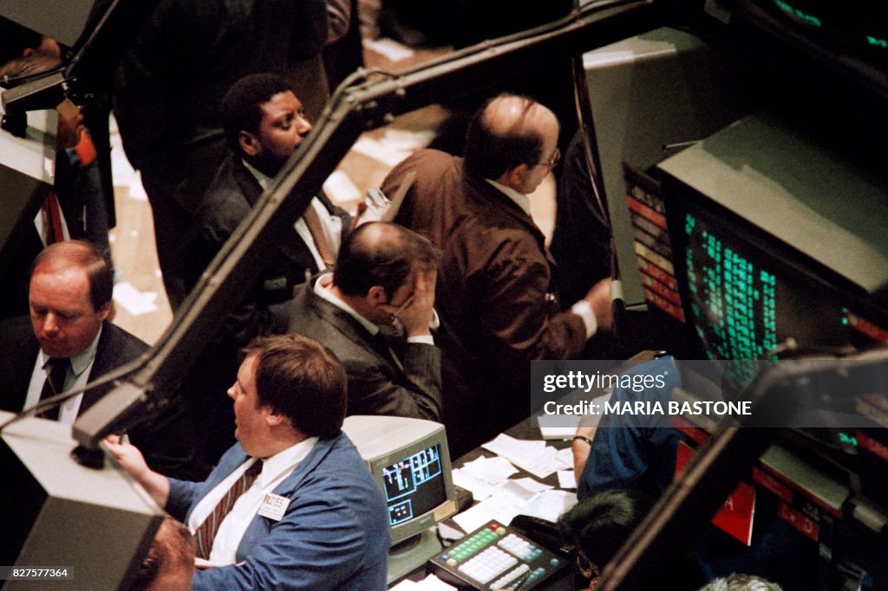{style="margin:0;"}
:::
:::

## Introduction {visibility="uncounted"}

::: columns
::: {.column width="65%"}
Limitations of this literature:

-   many results rely on a single study
-   most results rely on <u>very few independent observations</u>
    - groups of 6, 8, 10 traders  $\rightarrow$ only 1 independent market price per group
    - rarely more than 10 groups, often fewer
-   lack of randomization
:::

::: {.column width="35%"}
{style="margin:0;"}
{style="margin:0;"}
:::
:::

## Introduction {visibility="uncounted"}

::: columns
::: {.column width="65%"}
Limitations of this literature:

-   many results rely on a single study
-   most results rely on <u>very few independent observations</u>
    - groups of 6, 8, 10 traders  $\rightarrow$ only 1 independent market price per group
    - rarely more than 10 groups, often fewer
-   lack of randomization

$\rightarrow$ limited statistical power, weakened causal inference
:::

::: {.column width="35%"}
{style="margin:0;"} {style="margin:0;"}
:::
:::

## Introduction {visibility="uncounted"}

::: columns
::: {.column width="65%"}
Limitations of this literature:

-   many results rely on a single study
-   most results rely on <u>very few independent observations</u>
    - groups of 6, 8, 10 traders  $\rightarrow$ only 1 independent market price per group
    - rarely more than 10 groups, often fewer
-   lack of randomization

$\rightarrow$ limited statistical power, weakened causal inference

$\rightarrow$ important to assess the credibility of reported findings   $\rightarrow$ **replications**
:::

::: {.column width="35%"}
{style="margin:0;"} {style="margin:0;"}
:::
:::

## This paper

::: columns
::: {.column width="65%"}
High-powered preregistered replications of 17 key results

-   results taken from four prominent papers published in Am Econ Rev, J Finance, Rev Financ Stud, Rev Financ

    -   Kocher et al. (2019): Unleashing animal spirits: Self-control and overpricing in experimental asset markets

    -   Andrade et a. (2016): Bubbling with excitement: An experiment

    -   Eckel et al. (2015): Thar she blows? Gender, competition, and bubbles in experimental asset markets

    -   Corgnet et al. (2018): What makes a good trader? On the role of intuition and reflection on trader performance
:::

::: {.column width="35%"}
:::
:::

## This paper {visibility="uncounted"}

::: columns
::: {.column width="65%"}
High-powered preregistered replications of 17 key results

-   results taken from four prominent papers published in Am Econ Rev, J Finance, Rev Financ Stud, Rev Financ

    -   Kocher et al. (2019): Unleashing animal spirits: Self-control and overpricing in experimental asset markets

    -   Andrade et a. (2016): Bubbling with excitement: An experiment

    -   Eckel et al. (2015): Thar she blows? Gender, competition, and bubbles in experimental asset markets

    -   Corgnet et al. (2018): What makes a good trader? On the role of intuition and reflection on trader performance
:::

::: {.column width="35%"}
{width="60%" style="margin:0;"} emotions
:::
:::

## This paper {visibility="uncounted"}

::: columns
::: {.column width="65%"}
High-powered preregistered replications of 17 key results

-   results taken from four prominent papers published in Am Econ Rev, J Finance, Rev Financ Stud, Rev Financ

    -   Kocher et al. (2019): Unleashing animal spirits: Self-control and overpricing in experimental asset markets

    -   Andrade et a. (2016): Bubbling with excitement: An experiment

    -   Eckel et al. (2015): Thar she blows? Gender, competition, and bubbles in experimental asset markets

    -   Corgnet et al. (2018): What makes a good trader? On the role of intuition and reflection on trader performance
:::

::: {.column width="35%"}
{width="60%" style="margin:0;"} emotions

{width="60%" style="margin:0;"} self-control
:::
:::

## This paper {visibility="uncounted"}

::: columns
::: {.column width="65%"}
High-powered preregistered replications of 17 key results

-   results taken from four prominent papers published in Am Econ Rev, J Finance, Rev Financ Stud, Rev Financ

    -   Kocher et al. (2019): Unleashing animal spirits: Self-control and overpricing in experimental asset markets

    -   Andrade et a. (2016): Bubbling with excitement: An experiment

    -   Eckel et al. (2015): Thar she blows? Gender, competition, and bubbles in experimental asset markets

    -   Corgnet et al. (2018): What makes a good trader? On the role of intuition and reflection on trader performance
:::

::: {.column width="35%"}
{width="60%" style="margin:0;"} emotions

{width="60%" style="margin:0;"} self-control

{width="60%" style="margin:0;"}   behavioral/cognitive factors
:::
:::

::: notes
--\> relationship between asset market prices and emotions, self-control, experience, and gender\
--\> what characteristics - cognitive reflection, fluid intelligence, and theory of mind - can explain trading success

-   replication sample sizes between 1.6x and 9x original sample size\
    (average: 7.2x original)
:::

## Replication protocol

### Treatments

Laboratory asset market experiment with 4 conditions:

::: columns
::: {.column width="50%"}
From Andrade et al. (2016):  induce emotions with 5min movie clip

{width="20%" fig-align="center" style="margin:0"}

-   Excitement treatment

-   Calm treatment
:::

::: {.column width="50%"}
:::
:::

## Replication protocol {visibility="uncounted"}

### Treatments

Laboratory asset market experiment with 4 conditions:

::: columns
::: {.column width="50%"}
From Andrade et al. (2016):  induce emotions with 5min movie clip

{width="20%" fig-align="center" style="margin:0"}

-   Excitement treatment

-   Calm treatment
:::

::: {.column width="50%"}
From Kocher et al. (2019):  exhaust self-control with Stroop task

{width="80%" fig-align="center" style="margin:0"}

-   Low Self-Control (LowSC) treatment

-   High Self-Control (HighSC) treatment
:::
:::

## Replication protocol

### Market settings

Continuous double-auction markets resembling Smith et al. (1988, SSW):

-   long-lived asset with risky dividend payments

-   8 or 10 traders per market

-   Ten 2-minute periods

-   Dividends: 0 or 10 ECUs (50% prob.)

-   Endowments: (60; 1,000) or (20; 3,000)

## Replication protocol {visibility="uncounted"}

### Market settings

Continuous double-auction markets resembling Smith et al. (1988, SSW):

-   long-lived asset with risky dividend payments

-   8-10 traders per market

-   Ten 2-minute periods

-   Dividends: 0 or 10 ECUs (50% prob.)

-   Endowments: (60; 1,000) or (20; 3,000)

-   *New element:* 2 repetitions of each market

## Data collection

Preregistered to collect 166 markets in 83 sessions:

-   31 markets per condition in replication of AOL

-   52 markets per condition in replication of KLS

$\rightarrow$ 1.6x to 9x original sample size   $\rightarrow$ **at least 90% power to detect 2/3 of the original effect sizes at the 5% level**

## Data collection {visibility="uncounted"}

Preregistered to collect 166 markets in 83 sessions:

-   31 markets per condition in replication of AOL

-   52 markets per condition in replication of KLS

$\rightarrow$ 1.6x to 9x original sample size   $\rightarrow$ **at least 90% power to detect 2/3 of the original effect sizes at the 5% level**

  **82 sessions** with **1,528 participants** completed

::: aside
-   Average time: 1h 50min
-   Average payments: € 30.28 in AOL-treatments; € 37.08 in KLS-treatments
:::

# Results {visibility="hidden"}

##  {.center background-color="#9BD84C"}

<h1>Results</h1>

::: {.footer .logo}

Christoph Huber 

:::

## Emotions and market efficiency

::: columns
::: {.column width="50%"}
<strong> </strong>

-   overpricing (RD) is higher in the Excitement condition than in the Calm condition\
    p \< 0.001, n = 39
-   peak overpricing (RD_MAX) is higher in the Excitement condition than in the Calm condition\
    p \< 0.001, n = 39
:::

::: {.column width="50%"}
**Original study (Andrade et al., 2016)**

:::
:::

::: {.footer .logo}

Christoph Huber 

:::

## Emotions and market efficiency {visibility="uncounted"}

::: columns
::: {.column width="50%"}
**Direct Replication** 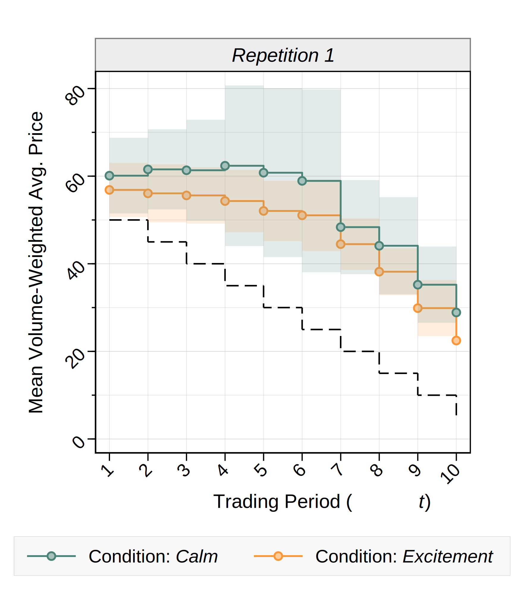{fig-align="center" width="80%" style="margin-top:0;"}
:::

::: {.column width="50%"}
**Original study (Andrade et al., 2016)**

:::
:::

::: {.footer .logo}

Christoph Huber 

:::

## Emotions and market efficiency

::: columns
::: {.column width="50%"}
**Direct Replication** {fig-align="center" width="80%" style="margin-top:0;"}
:::

::: {.column .incremental width="50%"}
<strong> </strong>

-   overpricing (RD) is <u>not</u> higher in the Excitement condition than in the Calm condition\
    p = 0.369, n = 62

-   peak overpricing (RD_MAX) is <u>not</u> higher in the Excitement condition than in the Calm condition\
    p = 0.483, n = 62
:::
:::

::: {.footer .logo}

Christoph Huber 

:::

## Emotions and market efficiency {visibility="uncounted"}

::: columns
::: {.column width="50%"}
**Direct Replication** {fig-align="center" width="80%" style="margin-top:0;"}
:::

::: {.column width="50%"}
<strong> </strong>

-   overpricing (RD) is <u>not</u> higher in the Excitement condition than in the Calm condition\
    p = 0.369, n = 62

-   peak overpricing (RD_MAX) is <u>not</u> higher in the Excitement condition than in the Calm condition\
    p = 0.483, n = 62

::: {.alert-box .warning}
$\rightarrow$ **Replication fails**   effect not significant   effect in opposite direction
:::
:::
:::

::: {.footer .logo}

Christoph Huber 

:::

## Self-control and market efficiency

::: columns
::: {.column width="50%"}
<strong> </strong>

-   overpricing (RD) is higher in the LowSC than in the HighSC condition\
    p = 0.0742, n = 16 (Mann-Whitney U-test)\
    p = 0.0580 (re-estimated t-test)
-   mispricing (RAD) is higher in the LowSC condition than in the HighSC condition\
    p = 0.0460, n = 16 (Mann-Whitey U-test)\
    p = 0.0317 (re-estimated t-test)
:::

::: {.column width="50%"}
**Original study (Kocher et al., 2019)**

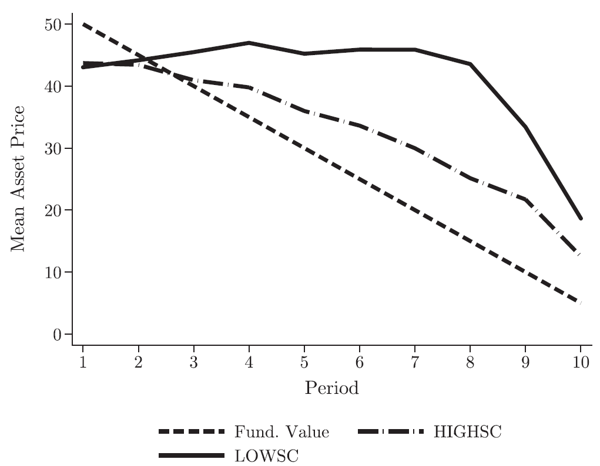
:::
:::

::: {.footer .logo}

Christoph Huber 

:::

## Self-control and market efficiency {visibility="uncounted"}

::: columns
::: {.column width="50%"}
**Direct Replication** {fig-align="center" width="80%" style="margin-top:0;"}
:::

::: {.column width="50%"}
**Original study (Kocher et al., 2019)**

:::
:::

::: {.footer .logo}

Christoph Huber 

:::

## Self-control and market efficiency

::: columns
::: {.column width="50%"}
**Direct Replication** {fig-align="center" width="80%" style="margin-top:0;"}
:::

::: {.column .incremental width="50%"}
<strong> </strong>

-   overpricing (RD) is <u>not</u> higher in the LowSC than in the HighSC condition\
    p = 0.630, n = 102

-   mispricing (RAD) is <u>not</u> higher in the LowSC condition than in the HighSC condition\
    p = 0.543, n = 102
:::
:::

::: {.footer .logo}

Christoph Huber 

:::

## Self-control and market efficiency {visibility="uncounted"}

::: columns
::: {.column width="50%"}
**Direct Replication** {fig-align="center" width="80%" style="margin-top:0;"}
:::

::: {.column width="50%"}
<strong> </strong>

-   overpricing (RD) is <u>not</u> higher in the LowSC than in the HighSC condition\
    p = 0.630, n = 102

-   mispricing (RAD) is <u>not</u> higher in the LowSC condition than in the HighSC condition\
    p = 0.543, n = 102

::: {.alert-box .warning}
$\rightarrow$ **Replication fails**   effect not significant   effect in opposite direction
:::
:::
:::

::: {.footer .logo}

Christoph Huber 

:::

## Gender composition and market efficiency

::: columns
::: {.column width="45%"}
**Original study (Eckel/Füllbrunn, 2015)**

-   fraction of female traders is negatively associated with "bubble measures":
    -   average bias (AB): Spearman correlation −0.477 (p = 0.004, n = 35)
    -   positive deviation (PD): Spearman correlation −0.351 (p = 0.039, n = 35)
    -   boom duration: Spearman correlation −0.390 (p = 0.021, n = 35)
    -   bust duration: Spearman correlation 0.529 (p = 0.001, n = 35)
:::

::: {.column widt="55%"}
:::
:::

::: {.footer .logo}

Christoph Huber 

:::

## Gender composition and market efficiency {visibility="uncounted"}

::: columns
::: {.column width="45%"}
**Original study (Eckel/Füllbrunn, 2015)**

-   fraction of female traders is negatively associated with "bubble measures":
    -   average bias (AB): Spearman correlation −0.477 (p = 0.004, n = 35)
    -   positive deviation (PD): Spearman correlation −0.351 (p = 0.039, n = 35)
    -   boom duration: Spearman correlation −0.390 (p = 0.021, n = 35)
    -   bust duration: Spearman correlation 0.529 (p = 0.001, n = 35)
:::

::: {.column widt="55%"}
{fig-align="center"}
:::
:::

::: {.footer .logo}

Christoph Huber 

:::

## Gender composition and market efficiency {visibility="uncounted"}

::: columns
::: {.column width="45%"}
**Original study (Eckel/Füllbrunn, 2015)**

-   fraction of female traders is negatively associated with "bubble measures":
    -   average bias (AB): Spearman correlation −0.477 (p = 0.004, n = 35)
    -   positive deviation (PD): Spearman correlation −0.351 (p = 0.039, n = 35)
    -   boom duration: Spearman correlation −0.390 (p = 0.021, n = 35)
    -   bust duration: Spearman correlation 0.529 (p = 0.001, n = 35)
:::

::: {.column widt="55%"}
::: {.alert-box .warning}
$\rightarrow$ **Replication fails**
:::

-   fraction of female traders is <u>not</u> negatively associated with "bubble measures":
    -   average bias (AB): Spearman correlation 0.155 (p = 0.048, n = 164)
    -   positive deviation (PD): Spearman correlation 0.169 (p = 0.031, n = 164)
    -   boom duration: Spearman correlation 0.109 (p = 0.164, n = 164)
    -   bust duration: Spearman correlation −0.036 (p = 0.646, n = 164)
:::
:::

::: {.footer .logo}

Christoph Huber 

:::

## Trading success

**Original study (Corgnet et al., 2018)**

Relationship trading success $\longleftrightarrow$ cognitive reflection, fluid intelligence, theory of mind

1.  𝝁 = 𝜶 + \[CRT, APM, TOM\] 𝜷 + 𝛀 𝝎 + 𝝐

2.  𝝁 = 𝜶 + \[CRT, APM, TOM\] 𝜷 + \[CRT 𝗑 TOM, APM 𝗑 TOM\] 𝜸 + 𝛀 𝝎 + 𝝐

3.  𝝁 = 𝜶 + \[SI\] 𝜷1 + \[HET\] 𝜷2 + \[SI 𝗑 HET\] 𝜼 + 𝛀 𝝎 + 𝝐

4.  𝝁 = 𝜶 + \[CRT, APM, TOM\] 𝜷1 + \[HET\] 𝜷2 + \[CRT 𝗑 HET, APM 𝗑 HET, TOM 𝗑 HET\] 𝜻 + 𝛀 𝝎 + 𝝐

::: {.footer .logo}

Christoph Huber 

:::

## Trading success

**Conceptual Replication**

::: columns
::: {.column width="60%"}
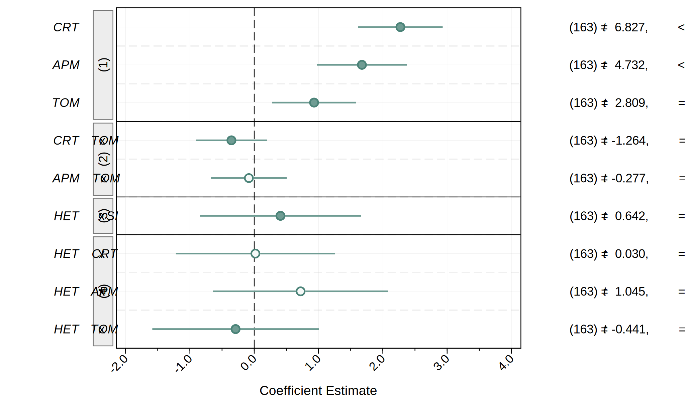{fig-align="center"}
:::

::: {.column width="40%"}
Main effects:

::: {.alert-box .success}
$\rightarrow$ **Replication successful**  
:::

  Interaction effects:

::: {.alert-box .info}
$\rightarrow$ **Partly successful**   significant effects not replicated  non-significant effects replicated
:::
:::
:::

::: {.footer .logo}

Christoph Huber 

:::

## Experience reduces mispricing

::: columns
::: {.column width="42%"}
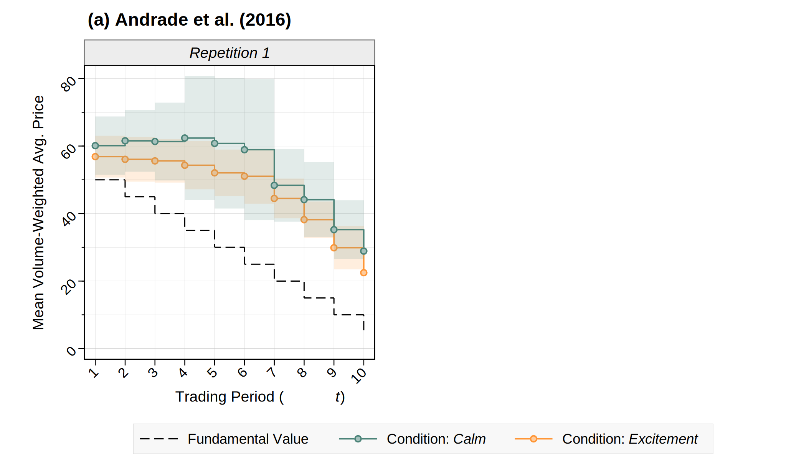{fig-align="center" width="100%" style="margin:0;"} 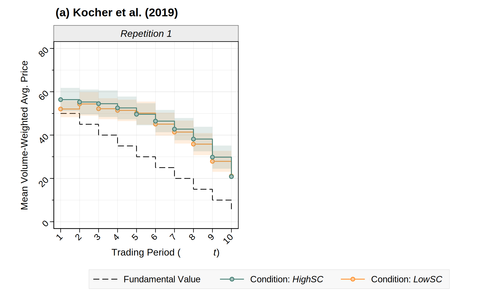{fig-align="center" width="100%" style="margin:0;"}
:::

::: {.column width="58%"}
:::
:::

::: {.footer .logo}

Christoph Huber 

:::

## Experience reduces mispricing {visibility="uncounted"}

::: columns
::: {.column width="42%"}
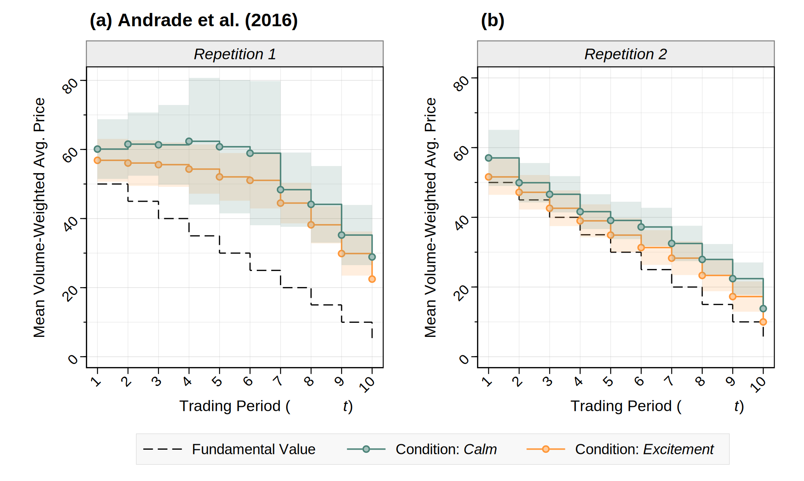{fig-align="center" width="100%" style="margin:0;"} 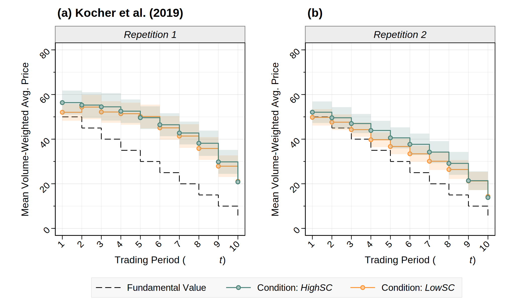{fig-align="center" width="100%" style="margin:0;"}
:::

::: {.column width="58%"}
:::
:::

::: {.footer .logo}

Christoph Huber 

:::

## Experience reduces mispricing {visibility="uncounted"}

::: columns
::: {.column width="42%"}
{fig-align="center" width="100%" style="margin:0;"} {fig-align="center" width="100%" style="margin:0;"}
:::

::: {.column width="58%"}
Two repetitions of each market

{fig-align="center"}

$\rightarrow$ sig. lower Relative Deviation, Peak Overpricing, and Relative Abs. Deviation in 2nd repetition

$\rightarrow$ <b>stylized fact confirmed</b>
:::
:::

::: {.footer .logo}

Christoph Huber 

:::

# Do Experimental Asset Markets Replicate? {visibility="hidden"}

##  {background-image="thanks-background1.png"}

::: columns
::: {.column width="37%"}
<h2 class="thanks" style="margin:0; line-height:1em;">

Do Experimental Asset Markets Replicate?

</h2>
:::

::: {.column width="63%"}
:::
:::

::: {.footer .logo}

Christoph Huber 

:::

##  {background-image="thanks-background1.png" visibility="uncounted"}

::: columns
::: {.column width="37%"}
<h2 class="thanks" style="margin:0; line-height:1em;">

Do Experimental Asset Markets Replicate?

</h2>
:::

::: {.column width="63%"}
-   High-powered, preregistered experiment with 1,528 participants to replicate 17 key results on experimental asset markets   
:::
:::

::: {.footer .logo}

Christoph Huber 

:::

##  {background-image="thanks-background1.png" visibility="uncounted"}

::: columns
::: {.column width="37%"}
<h2 class="thanks" style="margin:0; line-height:1em;">

Do Experimental Asset Markets Replicate?

</h2>

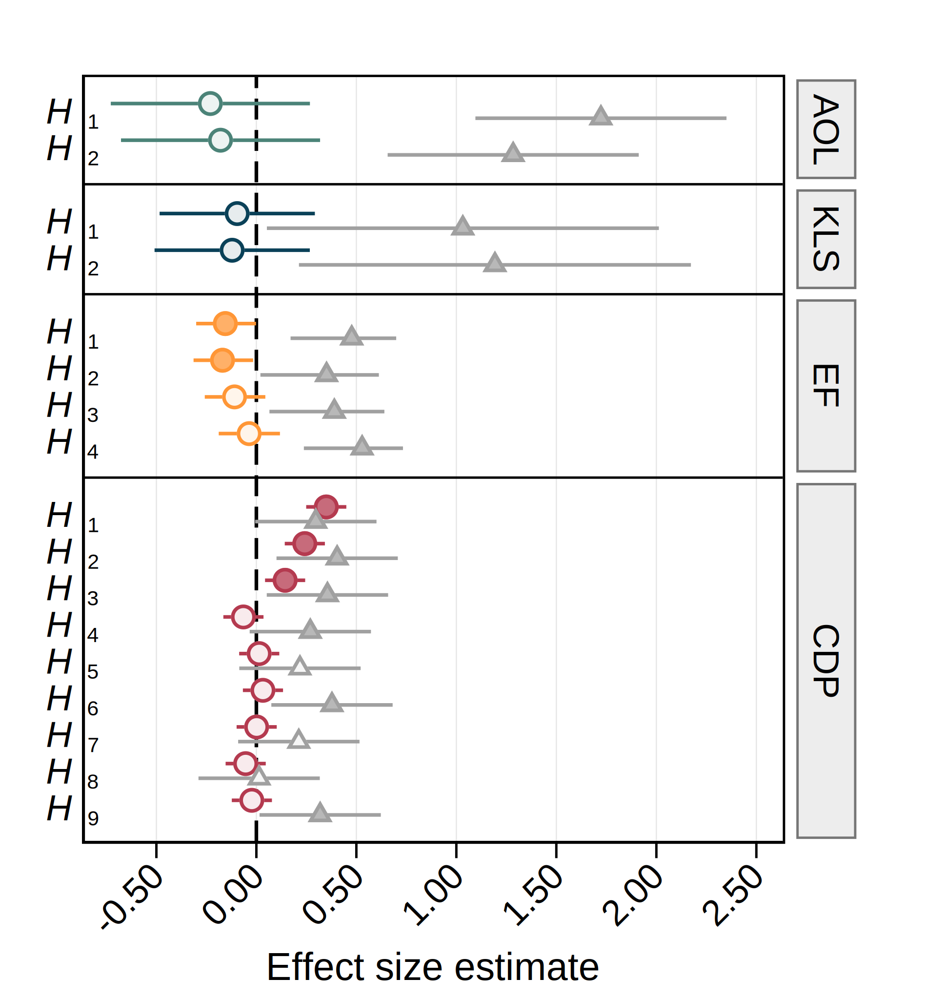{width="90%" style="margin:0;"}
:::

::: {.column width="63%"}
-   High-powered, preregistered experiment with 1,528 participants to replicate 17 key results on experimental asset markets   
:::
:::

::: {.footer .logo}

Christoph Huber 

:::

##  {background-image="thanks-background1.png" visibility="uncounted"}

::: columns
::: {.column width="37%"}
<h2 class="thanks" style="margin:0; line-height:1em;">

Do Experimental Asset Markets Replicate?

</h2>

{width="90%" style="margin:0;"}
:::

::: {.column width="63%"}
-   High-powered, preregistered experiment with 1,528 participants to replicate 17 key results on experimental asset markets   

-   emotions do not affect market efficiency
:::
:::

::: {.footer .logo}

Christoph Huber 

:::

##  {background-image="thanks-background1.png" visibility="uncounted"}

::: columns
::: {.column width="37%"}
<h2 class="thanks" style="margin:0; line-height:1em;">

Do Experimental Asset Markets Replicate?

</h2>

{width="90%" style="margin:0;"}
:::

::: {.column width="63%"}
-   High-powered, preregistered experiment with 1,528 participants to replicate 17 key results on experimental asset markets   

-   emotions do not affect market efficiency

-   self-control does not affect market efficiency
:::
:::

::: {.footer .logo}

Christoph Huber 

:::

##  {background-image="thanks-background1.png" visibility="uncounted"}

::: columns
::: {.column width="37%"}
<h2 class="thanks" style="margin:0; line-height:1em;">

Do Experimental Asset Markets Replicate?

</h2>

{width="90%" style="margin:0;"}
:::

::: {.column width="63%"}
-   High-powered, preregistered experiment with 1,528 participants to replicate 17 key results on experimental asset markets   

-   emotions do not affect market efficiency

-   self-control does not affect market efficiency

-   gender composition does not affect market efficiency   
:::
:::

::: {.footer .logo}

Christoph Huber 

:::

##  {background-image="thanks-background1.png" visibility="uncounted"}

::: columns
::: {.column width="37%"}
<h2 class="thanks" style="margin:0; line-height:1em;">

Do Experimental Asset Markets Replicate?

</h2>

{width="90%" style="margin:0;"}
:::

::: {.column width="63%"}
-   High-powered, preregistered experiment with 1,528 participants to replicate 17 key results on experimental asset markets   

-   emotions do not affect market efficiency

-   self-control does not affect market efficiency

-   gender composition does not affect market efficiency   

-   only 3 out of 14 original results reported as statistically significant successfully replicated
:::
:::

::: {.footer .logo}

Christoph Huber 

:::

##  {background-image="thanks-background1.png" visibility="uncounted"}

::: columns
::: {.column width="37%"}
<h2 class="thanks" style="margin:0; line-height:1em;">

Do Experimental Asset Markets Replicate?

</h2>

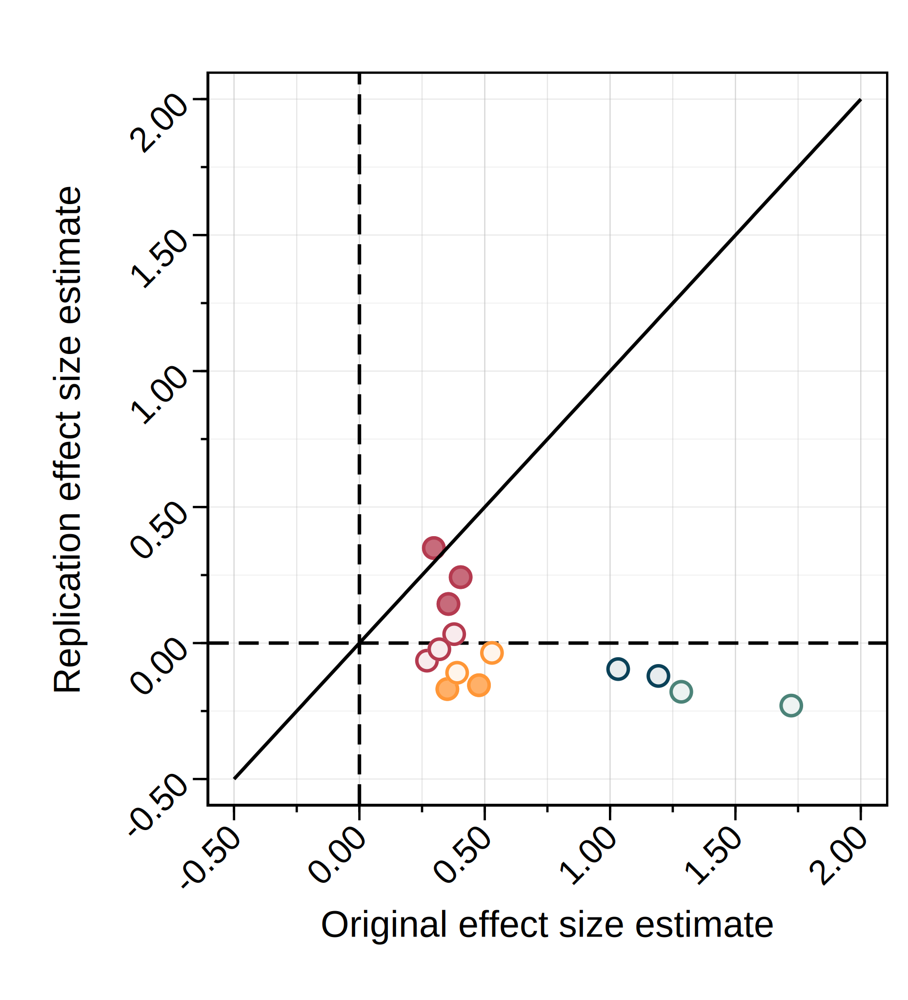{width="90%" style="margin:0;"}
:::

::: {.column width="63%"}
-   High-powered, preregistered experiment with 1,528 participants to replicate 17 key results on experimental asset markets   

-   emotions do not affect market efficiency

-   self-control does not affect market efficiency

-   gender composition does not affect market efficiency   

-   only 3 out of 14 original results reported as statistically significant successfully replicated

-   average replication effect size:  2.4% of the original estimates
:::
:::

::: {.footer .logo}

Christoph Huber 

:::

##  {background-image="thanks-background1.png" visibility="uncounted"}

::: columns
::: {.column width="37%"}
<h2 class="thanks" style="margin:0; line-height:1em;">

Do Experimental Asset Markets Replicate?

</h2>

{width="90%" style="margin:0;"}
:::

::: {.column width="63%"}
-   High-powered, preregistered experiment with 1,528 participants to replicate 17 key results on experimental asset markets   

-   emotions do not affect market efficiency

-   self-control does not affect market efficiency

-   gender composition does not affect market efficiency   

-   only 3 out of 14 original results reported as statistically significant successfully replicated

-   average replication effect size:  2.4% of the original estimates

$\rightarrow$ need for <u><b>further replication efforts</b></u>  and <u><b>larger sample sizes</b></u>
:::
:::

::: {.footer .logo}

Christoph Huber 

:::

# Thanks {visibility="hidden"}

##  {.center background-image="thanks-background.png" visibility="uncounted"}

::: columns
::: {.column width="45%"}
:::

::: {.column width="55%"}
<h2 class="thanks">

Thanks

</h2>

::: {style="border: none; border-top: 5px solid black; width: 100px; height: 1cm; text-align: left; margin: 0;"}
:::

christoph.huber\@aalto.fi

chr-huber.com

{fig-align="left" width="250"}

:::
:::

::: footer
:::

## Replications Projects {visibility="uncounted"}

Reproducibility Project: Psychology (RPP; Open Science Collaboration, 2015):

-   97 studies published in three psychology journals --\> 36% successfully replicated

Experimental Economics Replication Project (EERP; Camerer et al., 2016):

-   18 studies published in AER and QJE --\> 61% successfully replicated

Social Sciences Replication Project (SSRP; Camerer et al. 2018):

-   21 social science experiments published in Nature and Science --\> 62% successfully replicated

Management Science Replication Project (MSRP; Davis et al.. 2023):

-   10 operations management experiments published in Management Science --\> 70% successfully replicated

## Direct replication of Andrade, Odean, Liu (2016) {visibility="uncounted"}

**Ex-ante manipulation check on Prolific**

\~200 participants randomized into two conditions: Excitement and Calm

67.4% describe their emotions as "excited/eager/enthusiastic" in Excitement\
2.9% in Calm (p \< 0.001)

4.2% describe their emotions as "calm/relaxed/peaceful" in Excitement\
68.0% in Calm (p \< 0.001)

## Direct replication of Andrade, Odean, Liu (2016) {visibility="uncounted"}

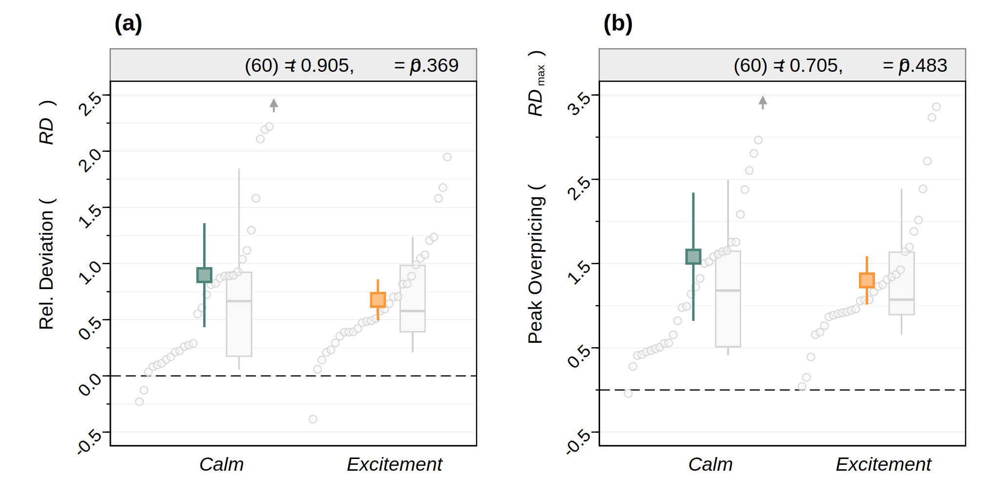{fig-align="center"}

## Direct replication of Kocher, Lucks, Schindler (2019) {visibility="uncounted"}

## Relevance of chosen studies {visibility="uncounted"}

-   Andrade et al. (2016):
    -   Review of Finance (IF: 5.6)
    -   cited 149 citations
-   Kocher et al. (2019):
    -   Review of Financial Studies (IF: 6.8)
    -   cited 53 times
-   Eckel & Füllbrunn (2015):
    -   American Economic Review (IF: 10.3)
    -   cited 272 times
-   Corgnet et al. (2018)
    -   Journal of Finance (IF: 7.6)
    -   cited 108 times
