class: title-slide middle inverse

```{r xaringan-themer, include=FALSE, warning=FALSE}
library(xaringanthemer)
#style_xaringan(
#  text_font_size = "1.2rem",
#  header_h1_font_size = "2.4rem",
#  inverse_background_color = "#3399CC",
#  inverse_text_color = "#FFF",
#  header_font_google = google_font("Trocchi"),
#  text_font_google = google_font("Montserrat", "400"),
#  table_row_even_background_color = "#FFF",
#  table_border_color = "#FFF",
#  table_row_border_color = "#FFF"
#)
style_mono_light(
  text_font_size = "1.2rem",
  header_h1_font_size = "2.4rem",
  padding = "16px 64px 16px 64px"
)

library(pacman)
p_load(tidyverse)
p_load(colorspace)
p_load(tidyquant)

```


# Lab Experiment: Decisions on Financial Markets

#### Christoph Huber    
#### Aalto University School of Business

<br>
#### Joint Vienna Institute: Crisis and resilience course 
#### November 5, 2024

---

# About your lecturer

Christoph Huber

- International Business Studies (BA), Banking & Finance (MSc), <br>Economics (PhD, 2021 University of Innsbruck)
- Postdoctoral Researcher at WU Vienna 2021-2024

--

- Assistant Professor at Aalto University School of Business, since Aug 2024

--

<br>

- Research on market efficiency, decision-making under uncertainty, social and cognitive factors in (financial) decision-making,  (un)ethical behavior


--

<br>
Web: chr-huber.com &emsp; Email: christoph.huber@aalto.fi

---
class: middle

## First ...

# Let's do some experiments!

---
class: middle

## First ...

# Let's do some <u>experiments</u>!

--

.pull-left[
Principles of economic experiments: 

- application of experimental methods to study economic questions
in a controlled environment

- no deception

- real consequences $\rightarrow$ there is a prize
]

.pull-right[
  
]

---
class: middle

## First ...

# Let's do some <u>experiments</u>!

"Taking part in classroom experiments is a little like going to dinner at a cannibal’s house. Sometimes you will be the diner, sometimes you will be part of the dinner, sometimes both. <br>
It is hard to imagine that a chemist can put herself in the place of a hydrogen molecule, or that a biologist knows what it feels like to be a duck. But here we are <b>studying the behavior and interactions of people in economically interesting situations.</b> In the experiment, you will be one of these interacting economic agents, you will be able to experience the problems faced by such an agent first-hand."


---
class: center, middle

## Experiment 1

# [short.wu.ac.at/experiment1](http://short.wu.ac.at/experiment1)

---
class: center, middle

## Experiment 2

# [short.wu.ac.at/experiment2](http://short.wu.ac.at/experiment2)


---
class: title-slide middle inverse

# Bubbles and crashes in financial markets: <br>insights from behavioral experiments

#### Christoph Huber
#### Aalto University School of Business

<br>
#### Joint Vienna Institute: Crisis and resilience course 
#### November 5, 2024

---
class: title-slide middle inverse

# Bubbles and crashes in financial markets: <br>insights from <u>behavioral experiments</u>

#### Christoph Huber
#### Aalto University School of Business

<br>
#### Joint Vienna Institute: Crisis and resilience course 
#### November 5, 2024

---

# Earnings from experiments

.pull-left[
#### Experiment 1

```{r, echo=FALSE, warning=FALSE, message=FALSE}

library(gt)

csv <- read.csv("../experiment_cda/data/cda_rep1_2024-11-05.csv")

earnings <- csv |> 
  filter(
    session.code == "1lhbzwkd",
    subsession.round_number == subsession.num_rounds
  ) |>
  group_by(
    participant.label
  ) |> 
  summarise(
    Earnings = mean(participant.payoff)
  ) |> 
  mutate(
    Rank = rank(-Earnings)
  )

earnings |> 
  filter(Rank <= 3) |> 
  arrange(Rank) |> 
  select(Rank,everything()) |> 
  gt() |> 
  tab_style(
    style = cell_fill(color = "white"),
    locations = cells_body()
  )
```

#### Experiment 2

```{r, echo=FALSE, warning=FALSE, message=FALSE}
postexp <- read.csv("../experiment_vsib/data/postexp_2024-11-05.csv")

earnings <- postexp |> 
  filter(
    !is.na(player.payoff_return)
  ) |> 
  mutate(
    Earnings = 10 * (1 + 3 * player.payoff_return/100)
  ) |> 
  mutate(
    Rank = rank(-Earnings)
  )

earnings |> 
  select(Rank, participant.label, Earnings) |> 
  filter(Rank <= 3) |> 
  arrange(Rank) |> 
  gt() |> 
  tab_style(
    style = cell_fill(color = "white"),
    locations = cells_body()
  )
```

]

.pull-right[

#### Lottery

$\rightarrow$ list of participant codes: 

- if your earnings are 100 points, your name will be 100 times in that list
- if your earnings are 500 points, your name will be 500 times in that list


]


---
class: middle, inverse

# Outline

--

- A Brief History of Speculation, Bubbles, and Financial Crises

--

- The Anatomy of a Typical Crisis

--

- Behavioral Insights into Bubble Formation and Crashes

--

- From the Market to the Trader

--

- Recap and a Look at Recent Bubbles

---

# Definition of Bubbles

--

.left-column-reverse[

__Definition__: Market prices are strongly above their fundamentally
justified values? Consequently, markets show only very low levels of
(informational) efficiency during these phases. 

The term "bubble" already foreshadows that the prices of some securities will
eventually decline, probably sharply. 

]

.right-column-reverse[
  
    
]

---

# Definition of Bubbles

.left-column-reverse[

__Definition__: Market prices are strongly above their fundamentally
justified values? Consequently, markets show only very low levels of
(informational) efficiency during these phases. 

The term "bubble" already foreshadows that the prices of some securities will
eventually decline, probably sharply. 

__Recent examples?__

]

.right-column-reverse[
  
    
]
---

# Definition of Bubbles

.left-column-reverse[

__Definition__: Market prices are strongly above their fundamentally
justified values? Consequently, markets show only very low levels of
(informational) efficiency during these phases. 

The term "bubble" already foreshadows that the prices of some securities will
eventually decline, probably sharply. 

__Recent examples?__

  - Dot-com bubble (2000)
  - US real estate bubble (2002-2007)
  - Chinese stock bubble (2007)
  - Cryptocurrency bubble (2017-2018)
  - Cryptocurrency bubble (2020-2022)? 
  - ... there are many more!
  

]

.right-column-reverse[
  
    
]
  
---

# Some Examples

.center[
```{r message=FALSE, echo=FALSE, fig.width=14, fig.height=3.5, fig.retina = 3}
library(tidyverse)
library(colorspace)
library(ggplot2)
load('merge.RData')

merge |> 
  filter(symbol == "000001.SS" | symbol == "^IXIC" | symbol == "^N225") |> 
  ggplot(aes(x = t, y = price, color = name)) + 
  geom_line() + 
  facet_wrap(~name) + 
  theme_bw() + 
  theme(
    legend.position = "none"
  ) + 
  xlab("Days from peak") + 
  ylab("Price (index, peak = 100)") + 
  scale_color_discrete_sequential(palette = "TealGrn") + 
  ggtitle("Stock indices")

```
]

--

.center[
```{r message=FALSE, echo=FALSE, fig.width=14, fig.height=3.5, fig.retina = 3}
library(ggplot2)
load('merge.RData')
merge %>% 
  filter(symbol == "WDI.HM" | (symbol == "BTC-USD" & t <= 0) | (symbol == "TSLA" & t <= 0 )) %>% 
  ggplot(aes(x = t, y = price, color = name)) + 
  geom_line() + 
  facet_wrap(~name) + 
  theme_bw() + 
  theme(
    legend.position = "none"
  ) + 
  xlab("Days from peak") + 
  ylab("Price (index, peak = 100)") + 
  scale_color_discrete_sequential(palette = "Red-Blue") + 
  ggtitle("Individual stocks")

```
]


---
class: inverse, center, middle

# A Brief History of Speculation, Bubbles, and Financial Crises

---

# A Brief History of Speculation, Bubbles, and Financial Crises

The big ten financial bubbles:

1. Dutch Tulip Bulb Bubble 1636
2. South Sea Bubble 1720
3. Mississippi Bubble 1720
4. Late 1920s stock price bubble 1927-1929
5. Surge in bank loans to Mexico and other developing countries in the 1970s
6. Bubble in real estate and stocks in Japan 1985-1989
7. Bubble in real estate and stocks in Finland, Norway, and Sweden, 1985-1989
8. Bubble in real estate and stocks in Thailand, Malaysia, Indonesia, and several
  other Asian countries, 1992-1997
9. Bubble in over-the-counter stocks in the US 1995-2000
10. Bubble in real estate in the US, Britain, Spain, Ireland, and Iceland, 2002-2007 

---

# Tulipmania of 1636/1637

.pull-left[

.small[
- First stock company (VOC – Durch East India Company) and stock exchange established in Amsterdam, Netherlands, in 1602.

- Amsterdam Exchange great success story – within a few years Amsterdam was _the_ financial center of Europe.

- By 1630ies plenty of cash from all over Europe flooding to Amsterdam.

<br>

- New "citizenry" and "money nobles", rich through spice trade, with plenty of money and leisure time .

- Tulips, recently imported from Persia, became fashionable.
]

]

.pull-right[

.center[

]

]

---

# Tulipmania of 1636/1637

.pull-left[

.small[
- First stock company (VOC – Durch East India Company) and stock exchange established in Amsterdam, Netherlands, in 1602.

- Amsterdam Exchange great success story – within a few years Amsterdam was _the_ financial center of Europe.

- By 1630ies plenty of cash from all over Europe flooding to Amsterdam.

<br>

- New "citizenry" and "money nobles", rich through spice trade, with plenty of money and leisure time .

- Tulips, recently imported from Persia, became fashionable.
]

]

.pull-right[

.center[

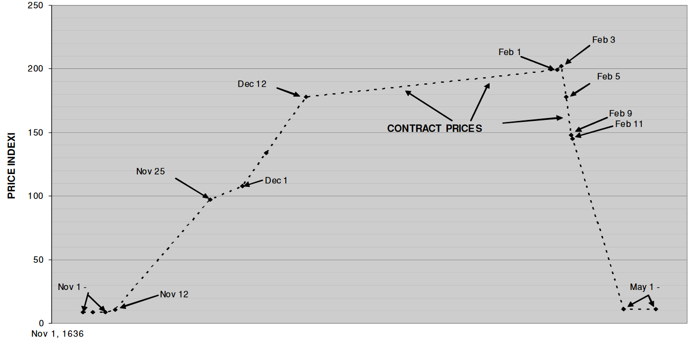
]

]

---

# Tulipmania of 1636/1637

.pull-left[

.small[
- First stock company (VOC – Durch East India Company) and stock exchange established in Amsterdam, Netherlands, in 1602.

- Amsterdam Exchange great success story – within a few years Amsterdam was _the_ financial center of Europe.

- By 1630ies plenty of cash from all over Europe flooding to Amsterdam.

$\rightarrow$ __cheap money, lots of liquidity, leverage__

- New "citizenry" and "money nobles", rich through spice trade, with plenty of money and leisure time .

- Tulips, recently imported from Persia, became fashionable.

$\rightarrow$ __a new product / new world __

]

]

.pull-right[

.center[


]

]

---

# John Law and the Mississippi Bubble of 1719-1721

.pull-left[

<br>


]

.pull-right[

.small[

Mississippi Company 

- business monopoly in French colonies in North America and the West Indies

John Law

- Controller General of Finances of France

- founded one of the first banks to develop the use of paper money: Banque Royale <br>
$\rightarrow$ notes were guaranteed by the king

- 1716: Law is given a charter for the Banque Royale under which national debt was assigned to the bank in return for extraordinary privileges. <br>
$\rightarrow$ authorization to issue notes, which were then used to pay government expenses and government debt <br>
$\rightarrow$ national debt would be paid from revenues derived from Mississippi Company

]

]

---

# John Law and the Mississippi Bubble of 1719-1721


.pull-left[

.small[
- Law exaggerated the wealth of Louisiana with an effective marketing scheme, which
promised success for the Mississippi Company by combining investor fervor and the wealth of its Louisiana prospects (gold) into a sustainable joint-stock trading company $\rightarrow$ wild speculation on the shares of the company in 1719
]


]

.pull-right[
.small[
- paper notes were guaranteed by the king and - in theory - backed by metal coinage <br>

- $\rightarrow$ _but_: number of paper notes being issued by the Banque Royale $>>$ the value of the amount of metal coinage it held

- Rapid downfall at the end of 1720: buyers of the paper notes attempted to convert their notes into 
specie (gold and silver) en masse, forcing the bank to stop payment on its paper notes

- Share price fell from its peak of ~10,000 to ~500 by September 1721


"Ingredients" of the bubble:<br>
$\rightarrow$ __New world, new opportunities__ (Louisiana) <br>
$\rightarrow$ __Cheap money and loans__ (paper instead of gold, unlimited supply, loans for everybody through Banque Royale)

]
]

---

# The Anatomy of a Typical Crisis

##### A simple model of financial crises developed by Hyman Minski (1/4)

--

Key idea: _supply of credit is pro-cyclical_

--

$\rightarrow$ "displacement", innovation, exogenous shock to the macroeconomic system

  if shock is large enough, anticipated profit opportunities $\uparrow$, e.g.: 

.small[
  <ul>
    <ul>
    <li>US in the 1920s: rapid increase in automobile production and development of highways, electrification, telephones</li>
    <li>Japan in the 1980s: financial liberalization and increase in supply of money and credit</li>
    <li>Asian financial crisis in 1997: discovery of "emerging market equities as a new asset class"</li>
    <li>United States in the 1990s: revolution in information technologies, sharp declines in costs of communication</li>
    </ul>
  </ul>
]

$\rightarrow$ firms and individuals borrow to take advantage of increased profit opportunities<br>
$\rightarrow$ economic growth quickens $\rightarrow$ feedback to even greater optimism

---

# The Anatomy of a Typical Crisis

##### A simple model of financial crises developed by Hyman Minski (2/4)

$\rightarrow$ expansion in the supply of credit fuels the boom

.small[
  <ul>
    <ul>
      <li>personal credit or vendor finance</li>
      <li>banks increase loans, supply of credit</li>
    </ul>
  </ul>
]

--

$\rightarrow$ demand for goods and services increases $\rightarrow$ prices increase
$\rightarrow$ higher levels of profit attract more investment 

--

Positive feedback: investment $\rightarrow$ economic growth $\uparrow$ $\rightarrow$ more investment

$\rightarrow$ "euphoria"


---

# The Anatomy of a Typical Crisis

##### A simple model of financial crises developed by Hyman Minski (3/4)

$\rightarrow$ "euphoria"
.small[
  <ul>
    <ul>
      <li>increase in optimism over economic growth and corporate profits</li>
      <li>speculation about increases in the price of securities or commodities</li>
    </ul>
  </ul>
]

--

$\rightarrow$ "mania"
.small[
  <ul>
    <ul>
      <li>more and more households and firms start to participate in the scramble for high profits</li>
    </ul>
  </ul>
]


---

# The Anatomy of a Typical Crisis

##### A simple model of financial crises developed by Hyman Minski (4/4)

Eventually, buyers become less eager to buy and sellers become more eager to sell.

--

Why? E.g.:

.small[
  <ul>
    <ul>
      <li>failure of a bank or a firm</li>
      <li>revelation of a swindle by an investor who sought to escape distress by dishonest means</li>
      <li>sharp fall in the price of a security or commodity</li>      
    </ul>
  </ul>
]

--

$\rightarrow$ prices decline, bankruptcies increase

As prices decline, more and more investors realize prices are unlikely to increase
and that they should sell before prices decline further. 

This realization can come gradually or suddenly.

---

# A Brief History of Speculation, Bubbles, and Financial Crises

- Financial excesses with bubbles and subsequent crashes are as old as markets themselves.

- Specific "story" and "packaging" vary, but the basic sources are often the same: greed, cheap money and leverage, and the hope for a "new world / new economy"


--

<br>
- Most scientists argue that occasional crashes are inevitable side effects of capitalism, but the degree to which this can be managed („soft landing“) is contested 

--

Also note: authorities are often aware that something exceptional is happening, but 
they believe that "this time is different"


---
class: inverse, center, middle

# How can <u>behavioral experiments</u> inform our understanding of bubbles and financial crises?

---

# Definition of Bubbles

.left-column-reverse[

__Definition__: Market prices are strongly above their fundamentally
justified values? Consequently, markets show only very low levels of
(informational) efficiency during these phases. 

The term "bubble" already foreshadows that the prices of some securities will
eventually decline, probably sharply. 

--

  - Problems: 
    - What are the fundamentally justified values (fundamental values, FV)?
    - How large must the deviation be to call it a 'bubble'?


]

.right-column-reverse[
  
    
]

---

# Implications of Bubbles

-  Market prices do not reflect fundamental values – no „wise crowd“!

- Reallocation of wealth among the market participants

- A recession in the real economy is mainly following bubbles and its
burst.

- Therefore, it is crucial to know more about the formation and prevention of bubbles:

  <ul>
  <li>
  As the number of bubbles on real world markets is not so large and as there
  are <b>problems in identifying the most important variables for bubble formation (e.g., fundamentals)</b> due to
  the complexity of real markets, it is very difficult to assess this
  question empirically.
  </li>
  <li>
  With the use of <b>behavioral experiments</b> (e.g., laboratory asset markets),
  fundamental values
  become observable and it is easy to control the influence of
  different policy actions/variables (e.g. abandon short selling, 
  liquidity shocks,…)
  </li>
  </ul>
  
---

# Why Experimental Finance?

Why do we need even more data? Isn‘t there enough real data, especially in finance?

--

- "Real" data typically includes many unobservable events that had an influence of market data (prices).

- E.g. we normally cannot know investor’s expectations.

- Theory of financial markets (and economics of uncertainty) is built on expectations.

- We thus need data on expectations to distinguish among competing theories.

---

# Why Experimental Finance?

- In a controlled experiment, the researcher can affect the expectations and knows the underlying parameters.

- With this knowledge, we know for example the assets' fundamental values and also other predictions of alternative theories.

- We can therefore conduct powerful tests of theories which were not possible from the field data (because we know little about the parameters and expectations that generate the field data from the stock exchanges).

--

$\rightarrow$ _control_

---

# Experiment 1

#### Market setup 

- Experimental asset market over 10 periods of 120s

  - 8 or 10 traders per market

  - Asset is worthless at the end of the experiment

  - Dividend payments 0 or 10 <br>
    $\rightarrow$ Fundamental value of the asset is decreasing over time
    
  
---

# Experiment 1

#### Fundamental value

  - Asset is worthless at the end of the experiment
  - Fundamental value is only determined by expected _remaining dividends_
  
<table border="1" style="border-collapse: collapse; font-size: 12px; width: 100%;">
    <tr>
        <th>Current Period</th>
        <th>Remaining dividend payments</th>
        <th>x</th>
        <th>Average dividend value per period (0 or 10 with equal probability)</th>
        <th>=</th>
        <th>Average remaining dividends per share that you own</th>
    </tr>
    <tr>
        <td>1</td>
        <td>10</td>
        <td></td>
        <td>5</td>
        <td></td>
        <td>50</td>
    </tr>
    <tr>
        <td>2</td>
        <td>9</td>
        <td></td>
        <td>5</td>
        <td></td>
        <td>45</td>
    </tr>
    <tr>
        <td>3</td>
        <td>8</td>
        <td></td>
        <td>5</td>
        <td></td>
        <td>40</td>
    </tr>
    <tr>
        <td>4</td>
        <td>7</td>
        <td></td>
        <td>5</td>
        <td></td>
        <td>35</td>
    </tr>
    <tr>
        <td>5</td>
        <td>6</td>
        <td></td>
        <td>5</td>
        <td></td>
        <td>30</td>
    </tr>
    <tr>
        <td>6</td>
        <td>5</td>
        <td></td>
        <td>5</td>
        <td></td>
        <td>25</td>
    </tr>
    <tr>
        <td>7</td>
        <td>4</td>
        <td></td>
        <td>5</td>
        <td></td>
        <td>20</td>
    </tr>
    <tr>
        <td>8</td>
        <td>3</td>
        <td></td>
        <td>5</td>
        <td></td>
        <td>15</td>
    </tr>
    <tr>
        <td>9</td>
        <td>2</td>
        <td></td>
        <td>5</td>
        <td></td>
        <td>10</td>
    </tr>
    <tr>
        <td>10</td>
        <td>1</td>
        <td></td>
        <td>5</td>
        <td></td>
        <td>5</td>
    </tr>
</table>


---

# Experiment 1

#### Your data 

.center[
```{r, echo=FALSE, warning=FALSE, message=FALSE, fig.width=9, fig.height=5, , fig.retina = 3}
library(tidyverse)
library(khroma)

csv <- read.csv("../experiment_cda/data/cda_rep1_2024-11-05.csv")

prices <- csv |> 
  filter(
    session.code == "1lhbzwkd"
  ) |> 
  group_by(
    group.id_in_subsession,
    subsession.round_number
  ) |> 
  summarise(
    Price = mean(group.average_price)
  ) |> 
  rename(
    Period = subsession.round_number,
    Market = group.id_in_subsession
  ) |> 
  mutate(
    FV = 50 - 5 * (Period - 1)
  )

ggplot(prices,
       aes(
         x = Period,
         y = Price,
         linetype = factor(Market),
         color = factor(Market)
       )
) + 
  geom_line(
    size = 1
  ) + 
  geom_line(
    aes(
      x = Period, 
      y = FV,
      color = "FV",
    ),
    size = 1,
    linetype = "solid",
    color = "black"
  ) + 
  theme_minimal() + 
  theme(
    legend.position = "bottom"
  ) + 
  scale_x_continuous(
    breaks = seq(1, 10, 1)
  ) + 
  scale_y_continuous(
    breaks = seq(0, 130, 10)
  ) + 
  scale_linetype_manual(
    name = "",
    values = c("dotdash", "longdash", "solid"),
    labels = c("Market 1", "Market 2", "FV")
  ) +
  scale_color_vibrant(
    name = "",
    labels = c("Market 1", "Market 2", "FV")
  ) +  
  labs(
    title ="Average price"
  )

```
]

Typical bubble pattern with crash towards the end

Avg. overvaluation: Market 1: 213% (!), Market 2: 89%


---

# Experiment 1

#### Evidence from 166 markets with 1,544 participants 

4 conditions, same results: consistent bubble-crash pattern

.pull-left[]

.pull-right[]

---

# Experiment 1

#### Evidence from 166 markets with 1,544 participants (1)

Experience reduces bubbles


---

# Experiment 1

#### Evidence from 166 markets with 1,544 participants (2)

Experience reduces bubbles


---

# Other Experiments I 

#### Weitzel et al. (2020, Review of Financial Studies)

- Experimental asset market over 20 periods of 120s

  - 8 traders per market

  - Final buyback price of 28 Taler
  
  - Dividend and interest payments <br>
    $\rightarrow$ Fundamental value of the asset is 28 at each point in time
  
--

- 4 Treatments:

  - 2 Bubble Drivers: INCreasing cash, HIGH cash (in relation to assets)
  
  - 2 Bubble Moderators: increasing cash with SHORT selling, LOW cash 
  
  - **Financial professionals (bankers) as participants**

---
<footer></footer>

# Other Experiments I

#### Weitzel et al. (2020, Review of Financial Studies)

.pull-left[]

---
<footer></footer>

# Other Experiments I

#### Weitzel et al. (2020, Review of Financial Studies)

.pull-left[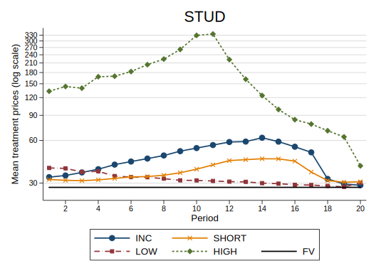]

--

.pull-right[]

---
<footer></footer>

# Other Experiments I

#### Weitzel et al. (2020, Review of Financial Studies)

.pull-left[]

.pull-right[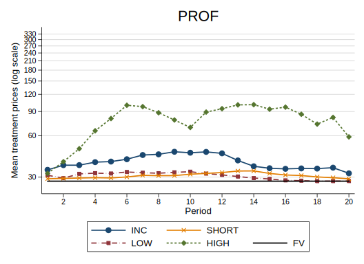]

--

- Bubble driver markets in PROF are significantly more efficient compared to student markets.

- BUT: Similar treatment effects within the professional sample as with students.

---

# Other Experiments II

#### Euphoria and Bubbles: Andrade et al. (2016, Review of Finance)

Hypothesis: Positive emotions leads to more „euphoric“ pricing and
hence to increased asset market bubbles. Conversely, if people feel
depressed, lower bubbles should be observed.

<ul>
  <li>Treatment <b>Excitement</b>: Subjects are shown a funny action movie of 5 minutes in advance.</li>

  <li>Treatment <b>Calm</b>: Subjects are shown a video intended to incite calmness before trading.</li>
</ul>

--

.center[
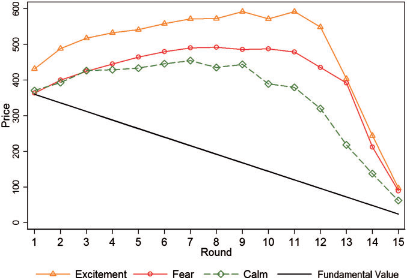
]

---

# Other Experiments III

.pull-left[

#### Inexperience: Dufwenberg et al. (2005, American Economic Review)

Markets are repeated three times with the same subjects; in the last repetition only one third of traders is experienced and the rest is inexpierienced.

.center[
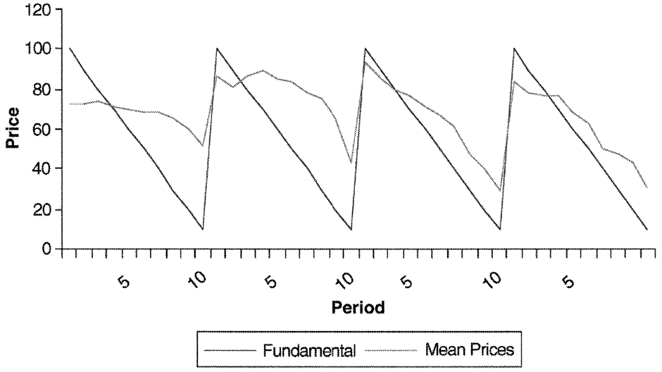
]

$\rightarrow$ reduced bubbles with repetition
]

.pull-right[

#### Inflow of inexperienced traders: Kirchler et al. (2015, European Economic Review)

Every 3rd period 4 new traders enter with new cash up to period 8.<br><br><br>

.center[
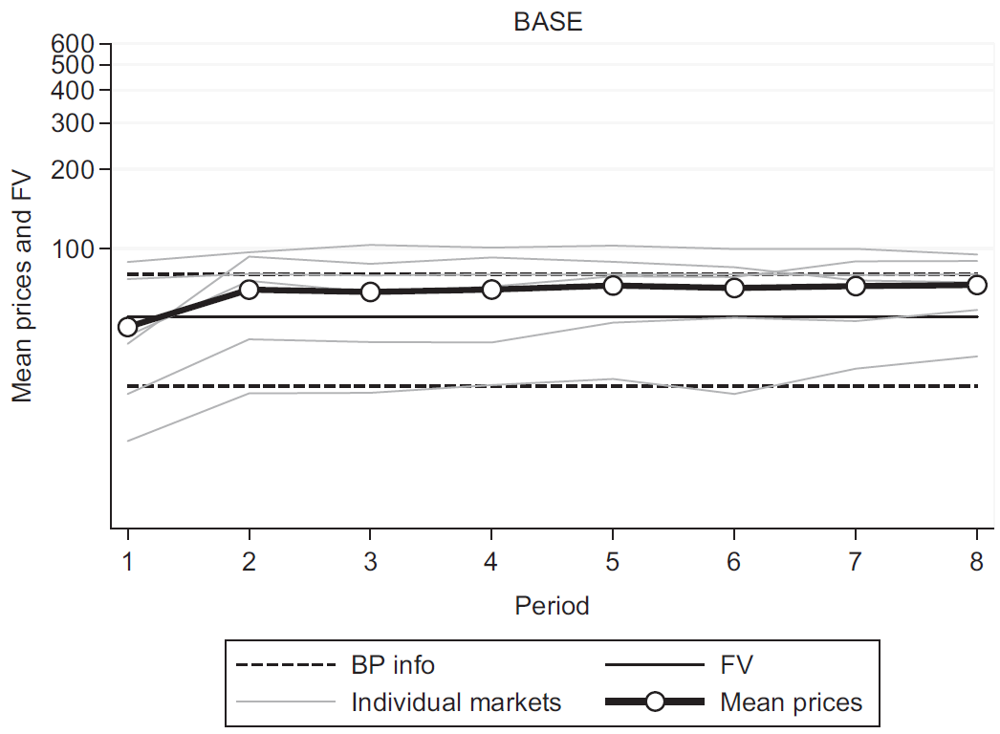
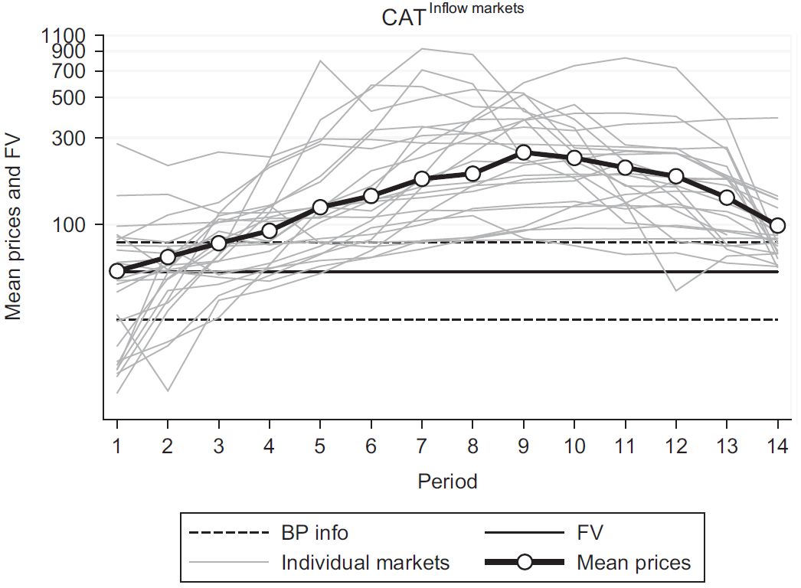
]


]

---

# Other Experiments IV

#### Cognitive reflection: Bosch-Rosa et al. (2018, Experimental Economics)

Cognitive Reflection Test: 

- A bat and a ball cost $1.10 in total. The bat costs $1.00 more than the ball. How much does the ball cost?

- If it takes 5 machines 5 minutes to make 5 widgets, how long would it take 100 machines to make 100 widgets?

- In a lake, there is a patch of lily pads. Every day, the patch doubles in size. If it takes 48 days for the patch to cover the entire lake, how long would it take for the patch to cover half of the lake?

---

# Other Experiments IV

#### Cognitive reflection: Bosch-Rosa et al. (2018, Experimental Economics)

Participants grouped into HIGH and LOW cognitive reflection groups 

.center[
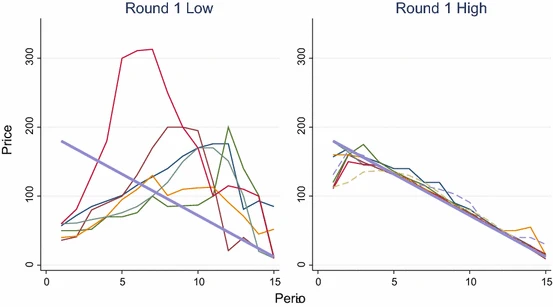
]

---

# Some Origins of Bubbles

.pull-left[
<ul>
  <li>Behavioral reasons:</li>
  <ul>
  <li>Euphoria (Andrade et al., 2016).</li>
  <li>Inexperience (Dufwenberg et al., 2005).</li>
  <li>Resale option theory (Harrison/Kreps, 1978; Ofek/Richardson, 2003).</li>
  <li>Confusion about fundamentals (Kirchler et al., 2012; Huber/Kirchler, 2012).</li>
  <li>Inflow of inexperienced traders (Kirchler et al., 2015).</li>
  <li>Asymmetric information bubbles (Allen et al., 1993).</li>
  <li>Limits of arbitrage (Abreu/Brunnermeier, 2002, 2003).</li>
  </ul>
</ul>
  
]

---

# Some Origins of Bubbles

.pull-left[
<ul>
  <li>Behavioral reasons:</li>
  <ul>
  <li>Euphoria (Andrade et al., 2016).</li>
  <li>Inexperience (Dufwenberg et al., 2005).</li>
  <li>Resale option theory (Harrison/Kreps, 1978; Ofek/Richardson, 2003).</li>
  <li>Confusion about fundamentals (Kirchler et al., 2012; Huber/Kirchler, 2012).</li>
  <li>Inflow of inexperienced traders (Kirchler et al., 2015).</li>
  <li>Asymmetric information bubbles (Allen et al., 1993).</li>
  <li>Limits of arbitrage (Abreu/Brunnermeier, 2002, 2003).</li>
  </ul>
</ul>
  
]

.pull-right[

<ul>
  <li>Institutional reasons:</li>
  <ul>
  <li>Credit bubbles and positive liquidity shocks (Geanakoplos, 2010; Haruvy/Noussair, 2006, Weitzel et al., 2020).</li>
  <li>Agency problems/incentives (Allen/Gorton, 1993; Kleinlercher et al., 2014; Holmen et al., 2014).</li>
  <li>Prohibition of short selling (Haruvy/Noussair, 2006; Weitzel et al., 2020).</li>
  </ul>
</ul>
]

---

[Skip](#91)

---

# From the market to the trader

Why do people trade on a stock market?

--

- Trade only happens, when there are different expectations and opinions in a market.
- If everyone has the same valuation, no one should trade.

--

What determines trading/investment decisions?

--

- (risk) preferences

- expectations

--

- Behavioral factors

  - heuristics and biases: e.g., framing effects, status quo bias, endowment effect, representativeness heuristic, 
  availability heuristic, anchoring, ... 
  - overconfidence
  - etc. ...

---

# An Example

### Netflix


.pull-left[
```{r, echo=FALSE, fig.width=10, fig.height=6}

netflix1 <- tq_get("NFLX",
                   from = "2019-02-02",
                   to = "2019-07-18")

netflix1 %>% 
  ggplot(aes(x = date, y = close)) + 
  geom_line() + 
  theme_tq() + 
  labs(title = "Netflix", y="Closing Price", x = "") + 
  xlim(as.Date("2019-02-02"), as.Date("2019-12-30")) + 
  ylim(250, 500)

```
]

.pull-right[

July 18, 2019:

- _"The company added 2.7 million new subscribers in the second quarter of 2019, according to its latest earnings report released Wednesday."_

- ... 

- _"Netflix now has 151.5 million subscribers globally."_

]

---

# An Example

### Netflix


.pull-left[
```{r, echo=FALSE, fig.width=10, fig.height=6}

netflix1 <- tq_get("NFLX",
                   from = "2019-02-02",
                   to = "2019-07-20")

netflix1 %>% 
  ggplot(aes(x = date, y = close)) + 
  geom_line() + 
  theme_tq() + 
  labs(title = "Netflix", y="Closing Price", x = "") + 
  xlim(as.Date("2019-02-02"), as.Date("2019-12-30")) + 
  ylim(250, 500)

```

$\rightarrow$ __price dropped 10.3% !__

]

.pull-right[

July 18, 2019:

- _"The company added 2.7 million new subscribers in the second quarter of 2019, according to its latest earnings report released Wednesday."_

- _"That is just over half of 5 million new subscribers that analysts were expecting."_

- _"Netflix now has 151.5 million subscribers globally."_

]

---

# An Example

### Netflix


.pull-left[
```{r, echo=FALSE, fig.width=10, fig.height=6}

netflix1 <- tq_get("NFLX",
                   from = "2019-02-02",
                   to = "2019-12-30")

netflix1 %>% 
  ggplot(aes(x = date, y = close)) + 
  geom_line() + 
  theme_tq() + 
  labs(title = "Netflix", y="Closing Price", x = "") + 
  xlim(as.Date("2019-02-02"), as.Date("2019-12-30")) + 
  ylim(250, 500)

```

$\rightarrow$ __price dropped 10.3% !__

]

.pull-right[

July 18, 2019:

- _"The company added 2.7 million new subscribers in the second quarter of 2019, according to its latest earnings report released Wednesday."_

- _"That is just over half of 5 million new subscribers that analysts were expecting."_

- _"Netflix now has 151.5 million subscribers globally."_

]


---

# Another Example

### Netflix (again)


.pull-left[
```{r, echo=FALSE, fig.width=10, fig.height=6}

netflix1 <- tq_get("NFLX",
                   from = "2020-10-01",
                   to = "2021-01-20")

netflix1 %>% 
  ggplot(aes(x = date, y = close)) + 
  geom_line() + 
  theme_tq() + 
  labs(title = "Netflix", y="Closing Price", x = "") + 
  xlim(as.Date("2020-10-01"), as.Date("2021-06-30")) + 
  ylim(400, 650)

```

]

.pull-right[

January 20, 2021:

- _"The streaming service said it now has more than 200 million subscribers globally, after adding 8.5 million subscribers in the fourth quarter of 2020, ..._

]

---

# Another Example

### Netflix (again)


.pull-left[
```{r, echo=FALSE, fig.width=10, fig.height=6}

netflix1 <- tq_get("NFLX",
                   from = "2020-10-01",
                   to = "2021-01-21")

netflix1 %>% 
  ggplot(aes(x = date, y = close)) + 
  geom_line() + 
  theme_tq() + 
  labs(title = "Netflix", y="Closing Price", x = "") + 
  xlim(as.Date("2020-10-01"), as.Date("2021-06-30")) + 
  ylim(400, 650)

```

$\rightarrow$ __price increased 16.9% !__

]

.pull-right[

January 20, 2021:

- _"The streaming service said it now has more than 200 million subscribers globally, after adding 8.5 million subscribers in the fourth quarter of 2020, ..._

- _"... beating its own expectations."_

]

---

# Another Example

### Netflix (again)


.pull-left[
```{r, echo=FALSE, fig.width=10, fig.height=6}

netflix1 <- tq_get("NFLX",
                   from = "2020-10-01",
                   to = "2021-06-30")

netflix1 %>% 
  ggplot(aes(x = date, y = close)) + 
  geom_line() + 
  theme_tq() + 
  labs(title = "Netflix", y="Closing Price", x = "") + 
  xlim(as.Date("2020-10-01"), as.Date("2021-06-30")) + 
  ylim(400, 650)

```

$\rightarrow$ __price increased 16.9% !__

]

.pull-right[

January 20, 2021:

- _"The streaming service said it now has more than 200 million subscribers globally, after adding 8.5 million subscribers in the fourth quarter of 2020, ..._

- _"... beating its own expectations."_

]


---

# A third Example

### Facebook (Meta Platforms)

--

.pull-left[
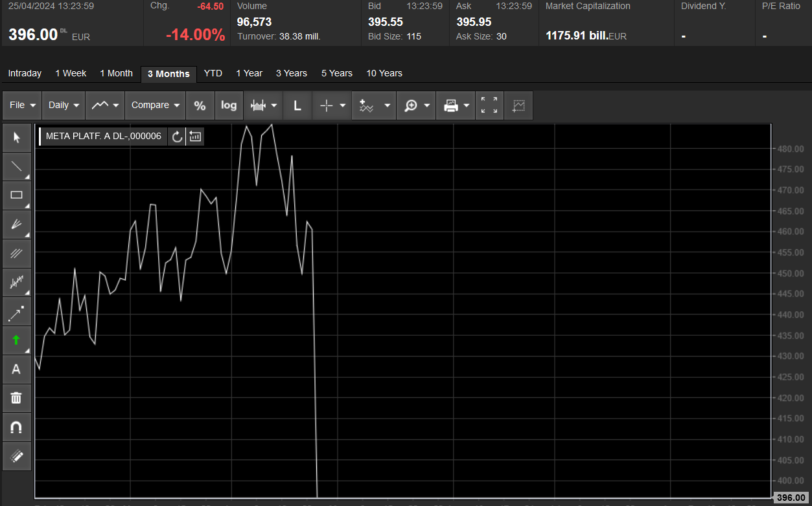
$\rightarrow$ __price dropped 14% !__ (as of 13:24)

]

.pull-right[

April 24/25, 2024:

- _"Meta Platforms (META) reported first quarter earnings of $4.71 per share, well above analyst estimates of $4.30. Revenue was about in line with expectations, $36.46 billion compared to the $36.12 billion estimate."_ 

]

---

# A third Example

### Facebook (Meta Platforms)


.pull-left[

$\rightarrow$ __price dropped 14% !__ (as of 13:24)

]

.pull-right[

April 24/25, 2024:

- _..._ 

- _"For the second quarter, the social media giant sees revenue of $36.5 billion to $39 billion. Analysts were expecting $38.24 billion of revenue in the quarter, which means the midpoint of the range is a disappointment to the Street."_
<br><br>
(announced at 4:05pm, 5 minutes after NYSE closed)


]

---


# Prices reflect expectations

- Assume the stock of Apple currently trades at 100 and the market expects an increase in the profit of 25%.

- At a press conference the CEO proudly reveals _"We had a very good year and were able to increase the profit by 20%!"_

- How will the stock price react?

<br>

--

- The announcement _"China‘s economy grows by 3%“_ would likely lead to a market crash.
<br> The message _"Germany‘s economy grows by 3%"_ to a positive price jump.

---

# Stock prices and expectations

- 2009-2019 the Chinese economy grew by a cumulative +180%, the German economy grew by only +14%.

--

- However, the Chinese stock index (blue) did not grow as much as the German DAX index.
- The market is more complex than most people think; __expectations are already priced in__.

.center[
```{r, echo=FALSE, fig.width=8, fig.height=5}

dax <- tq_get("^GDAXI",
                   from = "2009-01-01",
                   to = "2019-12-30")

hs <- tq_get("^HSI",
                   from = "2009-01-01",
                   to = "2019-12-30")

merge <- 
  bind_rows(
    dax,
    hs
  ) %>%
  filter(
    !is.na(adjusted)
  ) %>% 
  group_by(
    symbol
  ) %>% 
  mutate(
    maxprice = max(adjusted),
    id = row_number(),
    firstprice = ifelse(id == 1, adjusted, NA),
    firstprice = mean(firstprice, na.rm=TRUE),
    price = 100 * adjusted/firstprice
  )

merge %>% 
  ggplot(aes(x = date, y = price, color = symbol)) + 
  geom_line() + 
  theme_tq() + 
  labs(title = "", y="Index (2009-01-01 = 100)", x = "") 

```
]

---

# Already priced in are, for example, ... 

- China's continuing rise

- Europe's ageing society

- Instability in the Middle East

- Apple's consistent iPhone sales

- U.S. Fed's possible interest rate hikes 

- etc.

---

# Efficient Market Hypothesis (EMH)

.pull-left[
Eugene Fama (1970)<br>
(Nobel Laureate 2013)

_"a market is efficient, if prices at all times fully reflect all available information"_


]

.pull-right[
.center[

]
]

???

E(Pt+1) = Pt+E(R)

---

# Inefficient Markets

.pull-left[
.center[

]
]

.pull-right[
Robert Shiller <br>
(Nobel Laureate 2013)

"In the 1960s, Eugene Fama demonstrated that stock price movements are impossible to predict in the short-term. In the early 1980s, however, Robert Shiller discovered that _stock prices can be predicted_ over a longer period, such as over the course of several years. In contrast to the dominant perception, stock prices fluctuated much more than corporate dividends. Shiller's conclusion was therefore that _the market is inefficient_."
(from [NobelPrize.org](https://www.nobelprize.org/prizes/economic-sciences/2013/shiller/facts/))
]

---

# Experiment 2

#### Huber et al. (2020, 2021)

__Research Question:__  How does _risk-taking behavior_ and the _perception of risk_ change during/after a market shock?

.small[
- Investment task: __1 risky stock__ over _5 rounds_
]

.center[
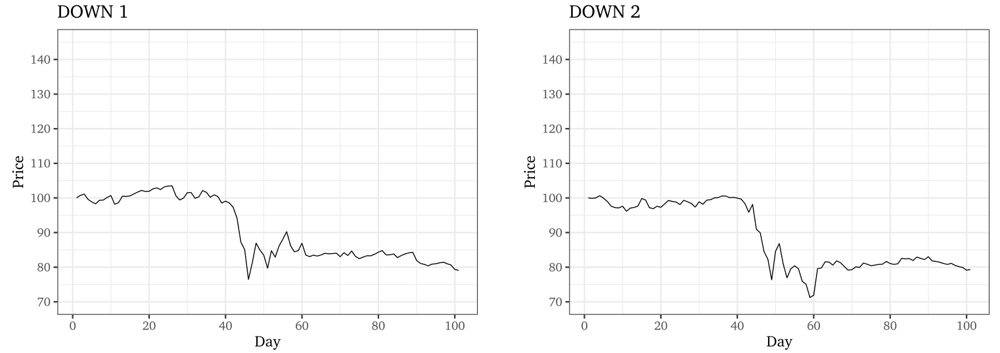
]

---

# Experiment 2

#### Your data

.left-column-reverse[
```{r, echo=FALSE, warning=FALSE, message=FALSE, fig.width=9, fig.height=5, , fig.retina = 3}
csv <- read.csv("../experiment_vsib/data/sampling_2024-11-05.csv")

data <- csv |> 
  group_by(
    subsession.round_number
  ) |> 
  summarise(
    Investment = mean(player.investment, na.rm=TRUE)
  ) |> 
  rename(
    Month = subsession.round_number
  )

ggplot() +  
  geom_line(
    data = data,
    aes(
      x = Month,
      y = Investment
    ),
    size = 1
  ) + 
  theme_minimal() + 
  scale_x_continuous(
    limits = c(0.5, 5.5),
    breaks = seq(1, 5, 1)
  ) + 
  scale_y_continuous(
    limits = c(0, 100),
    breaks = seq(0, 100, 20)
  ) + 
  geom_jitter(
    data = csv,
    aes(
      x = subsession.round_number,
      y = player.investment,
      color = factor(subsession.round_number)
    ),
    width=0.1,
    alpha=0.4
  ) + 
  theme_minimal() + 
  theme(
    legend.position = "off"
  )+  
  scale_x_continuous(
    limits = c(0.5, 5.5),
    breaks = seq(1, 5, 1)
  ) + 
  scale_y_continuous(
    limits = c(0, 100),
    breaks = seq(0, 100, 20)
  ) + 
  scale_color_vibrant() + 
  labs(
    title ="Average percentage invested"
  )
```
]

.right-column-reverse[
  $\rightarrow$ more risk-taking after crash

  Why?
  
  Belief in mean-reversion?
  
]


---

# Experiment 2

#### Huber et al. (2020, 2021)

__Research Question:__  How does _risk-taking behavior_ and the _perception of risk_ change during/after a market shock?

.small[
- Investment task: __1 risky stock__ over _5 rounds_
]

.small[
- Two waves: Wave 1 in December 2019; Wave 2 in April 2020 (during the Covid-19 crash) 
]

.pull-left[
.center[
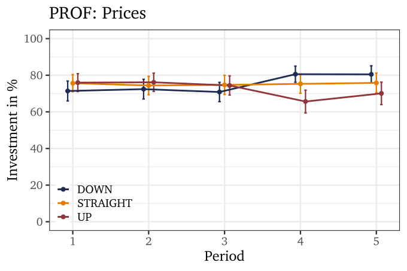
]
]

.pull-right[
.center[
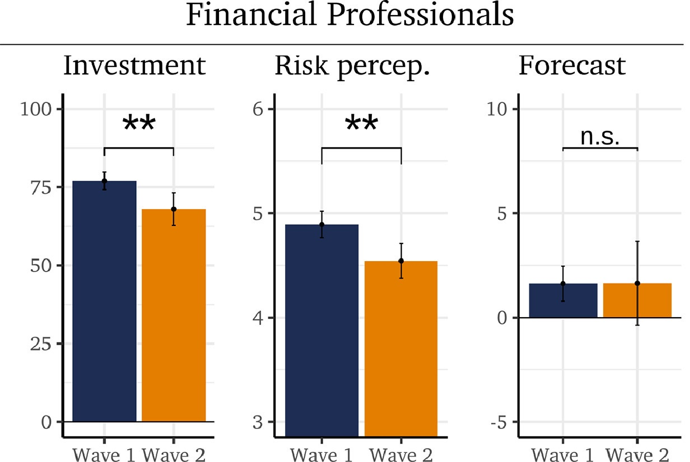
]
]

$\rightarrow$ countercyclical risk aversion?

---

# Another Experiment

#### Cohn et al. (2015, America Economic Review): Evidence for countercyclical risk aversion

Participants are _primed_ with a boom or with a bust scenario (simulation)

.center[
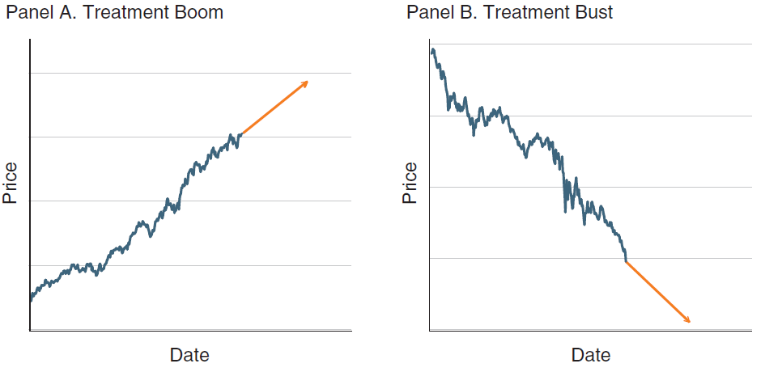
]

---

# Another Experiment

#### Cohn et al. (2015, America Economic Review): Evidence for countercyclical risk aversion

Countercyclical risk aversion: more risk-taking in a boom

.pull-left[
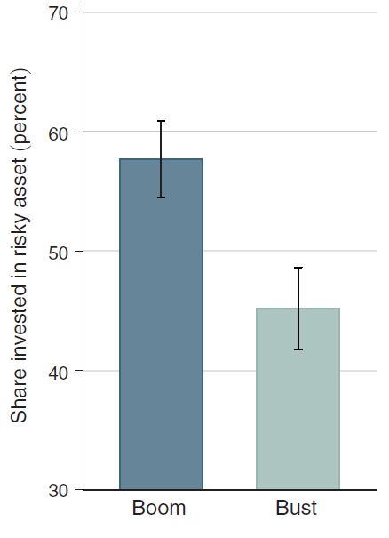
]

---

# Another Experiment

#### Cohn et al. (2015, America Economic Review): Evidence for countercyclical risk aversion

Countercyclical risk aversion: more risk-taking in a boom

.pull-left[
  $\rightarrow$ driven by emotions
]

.pull-right[
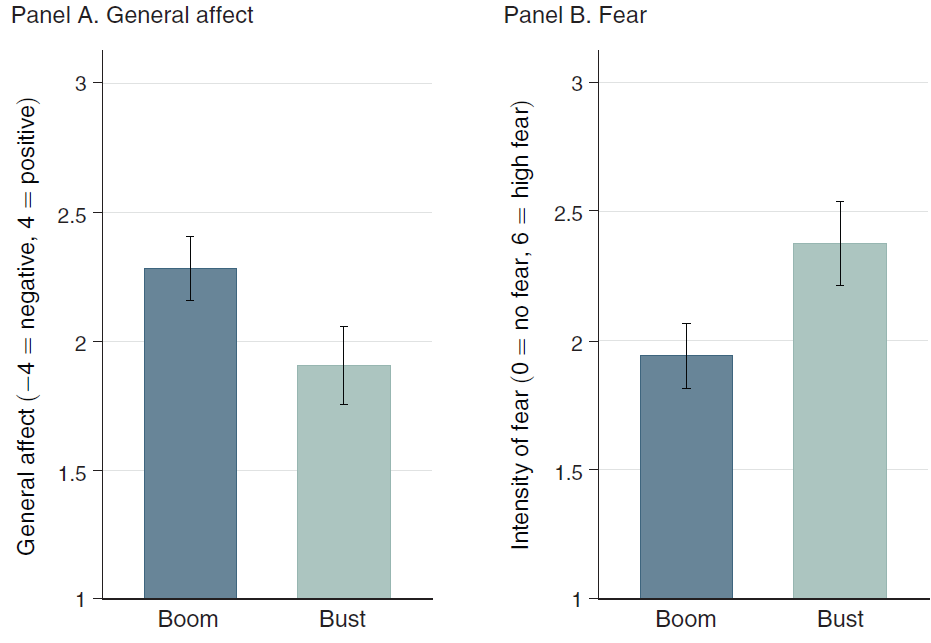
]

---

# Bubbles and crashes in financial markets

.pull-left[

<br>

```{r message=FALSE, echo=FALSE, fig.width=7, fig.height=5, fig.retina = 3}
library(ggplot2)
load('merge.RData')

merge %>% 
  filter(symbol == "^IXIC") %>% 
  ggplot(aes(x = t, y = price, color = name)) + 
  geom_line() + 
  facet_wrap(~name) + 
  theme_bw() + 
  theme(
    legend.position = "none"
  ) + 
  xlab("Days from peak") + 
  ylab("Price (index, peak = 100)") + 
  scale_color_manual(values = c(sequential_hcl(5, palette = "TealGrn")[3]))

```

]

---

# Bubbles and crashes in financial markets

.pull-left[

<br>

```{r message=FALSE, echo=FALSE, fig.width=7, fig.height=5, fig.retina = 3}
library(ggplot2)
load('merge.RData')

merge %>% 
  filter(symbol == "^IXIC") %>% 
  ggplot(aes(x = t, y = price, color = name)) + 
  geom_line() + 
  facet_wrap(~name) + 
  theme_bw() + 
  theme(
    legend.position = "none"
  ) + 
  xlab("Days from peak") + 
  ylab("Price (index, peak = 100)") + 
  scale_color_manual(values = c(sequential_hcl(5, palette = "TealGrn")[3])) 

```

]

.pull-right[

#### Dot-com bubble

.small[
- revolution in information technologies (Internet), 
- sharp declines in costs of communication

$\rightarrow$ __a new product / new world __

- a decline in interest rates
- lowered capital gains tax 

$\rightarrow$ __cheap money, lots of liquidity, leverage__

Also: 
- pro-cyclical credit supply
- counter-cyclical risk aversion
- fraud

]

]

---

# Bubbles and crashes in financial markets

.pull-left[

#### Bitcoin / Tesla

]

.pull-right[

```{r message=FALSE, echo=FALSE, fig.width=4.9, fig.height=3.5, fig.retina = 3}
library(ggplot2)
load('merge.RData')

merge %>% 
  filter(symbol == "BTC-USD", t <= 0) %>% 
  ggplot(aes(x = t, y = price, color = name)) + 
  geom_line() + 
  facet_wrap(~name) + 
  theme_bw() + 
  theme(
    legend.position = "none"
  ) + 
  xlab("Days from peak") + 
  ylab("Price (index, peak = 100)") + 
  scale_color_manual(values = c(diverging_hcl(3, palette = "Berlin")[3]))  + 
  scale_x_continuous(limits = c(-900, 750))
merge %>% 
  filter(symbol == "TSLA", t <= 0) %>% 
  ggplot(aes(x = t, y = price, color = name)) + 
  geom_line() + 
  facet_wrap(~name) + 
  theme_bw() + 
  theme(
    legend.position = "none"
  ) + 
  xlab("Days from peak") + 
  ylab("Price (index, peak = 100)") + 
  scale_color_manual(values = c(diverging_hcl(5, palette = "Berlin")[3])) + 
  scale_x_continuous(limits = c(-900, 750))

```

]

---

# Bubbles and crashes in financial markets

.pull-left[

#### Bitcoin / Tesla

]

.pull-right[

```{r message=FALSE, echo=FALSE, fig.width=4.9, fig.height=3.5, fig.retina = 3}
library(ggplot2)
load('merge.RData')

merge %>% 
  filter(symbol == "BTC-USD") %>% 
  ggplot(aes(x = t, y = price, color = name)) + 
  geom_line() + 
  facet_wrap(~name) + 
  theme_bw() + 
  theme(
    legend.position = "none"
  ) + 
  xlab("Days from peak") + 
  ylab("Price (index, peak = 100)") + 
  scale_color_manual(values = c(diverging_hcl(3, palette = "Berlin")[3]))  + 
  scale_x_continuous(limits = c(-900, 750))
merge %>% 
  filter(symbol == "TSLA") %>% 
  ggplot(aes(x = t, y = price, color = name)) + 
  geom_line() + 
  facet_wrap(~name) + 
  theme_bw() + 
  theme(
    legend.position = "none"
  ) + 
  xlab("Days from peak") + 
  ylab("Price (index, peak = 100)") + 
  scale_color_manual(values = c(diverging_hcl(5, palette = "Berlin")[3])) + 
  scale_x_continuous(limits = c(-900, 750))

```

]

---

# Bubbles and crashes in financial markets

.pull-left[

#### Bitcoin / Tesla

.small[

<br>

$\rightarrow$ __a new product / new world__?


$\rightarrow$ __cheap money, lots of liquidity, leverage__? 

]

]

.pull-right[

```{r message=FALSE, echo=FALSE, fig.width=4.9, fig.height=3.5, fig.retina = 3}
library(ggplot2)
load('merge.RData')

merge %>% 
  filter(symbol == "BTC-USD") %>% 
  ggplot(aes(x = t, y = price, color = name)) + 
  geom_line() + 
  facet_wrap(~name) + 
  theme_bw() + 
  theme(
    legend.position = "none"
  ) + 
  xlab("Days from peak") + 
  ylab("Price (index, peak = 100)") + 
  scale_color_manual(values = c(diverging_hcl(3, palette = "Berlin")[3]))  + 
  scale_x_continuous(limits = c(-900, 750))
merge %>% 
  filter(symbol == "TSLA") %>% 
  ggplot(aes(x = t, y = price, color = name)) + 
  geom_line() + 
  facet_wrap(~name) + 
  theme_bw() + 
  theme(
    legend.position = "none"
  ) + 
  xlab("Days from peak") + 
  ylab("Price (index, peak = 100)") + 
  scale_color_manual(values = c(diverging_hcl(5, palette = "Berlin")[3])) + 
  scale_x_continuous(limits = c(-900, 750))

```

]

---

# Bubbles and crashes in financial markets

.pull-left[

#### Zoom / Moderna

.small[

<br>

$\rightarrow$ __a new product / new world__?


$\rightarrow$ __cheap money, lots of liquidity, leverage__? 

]

]

.pull-right[

```{r message=FALSE, echo=FALSE, fig.width=4.9, fig.height=3.5, fig.retina = 3}
library(ggplot2)
load('merge.RData')

merge %>% 
  filter(symbol == "ZM", t<=0, t>=-500) %>% 
  ggplot(aes(x = t, y = price, color = name)) + 
  geom_line() + 
  facet_wrap(~name) + 
  theme_bw() + 
  theme(
    legend.position = "none"
  ) + 
  xlab("Days from peak") + 
  ylab("Price (index, peak = 100)") + 
  scale_color_manual(values = c(diverging_hcl(3, palette = "Berlin")[2]))  + 
  scale_x_continuous(limits = c(-500, 1113))
merge %>% 
  filter(symbol == "MRNA", t<= 0, t>=-500) %>% 
  ggplot(aes(x = t, y = price, color = name)) + 
  geom_line() + 
  facet_wrap(~name) + 
  theme_bw() + 
  theme(
    legend.position = "none"
  ) + 
  xlab("Days from peak") + 
  ylab("Price (index, peak = 100)") + 
  scale_color_manual(values = c(diverging_hcl(5, palette = "Berlin")[1])) + 
  scale_x_continuous(limits = c(-500, 1113))

```

]

---

# Bubbles and crashes in financial markets

.pull-left[

#### Zoom / Moderna

.small[

<br>

$\rightarrow$ __a new product / new world__?


$\rightarrow$ __cheap money, lots of liquidity, leverage__? 

]

]

.pull-right[

```{r message=FALSE, echo=FALSE, warning=FALSE, fig.width=4.9, fig.height=3.5, fig.retina = 3}
library(ggplot2)
load('merge.RData')

merge %>% 
  filter(symbol == "ZM", t>=-500) %>% 
  ggplot(aes(x = t, y = price, color = name)) + 
  geom_line() + 
  facet_wrap(~name) + 
  theme_bw() + 
  theme(
    legend.position = "none"
  ) + 
  xlab("Days from peak") + 
  ylab("Price (index, peak = 100)") + 
  scale_color_manual(values = c(diverging_hcl(3, palette = "Berlin")[2]))  + 
  scale_x_continuous(limits = c(-500, 1113))
merge %>% 
  filter(symbol == "MRNA", t>=-500) %>% 
  ggplot(aes(x = t, y = price, color = name)) + 
  geom_line() + 
  facet_wrap(~name) + 
  theme_bw() + 
  theme(
    legend.position = "none"
  ) + 
  xlab("Days from peak") + 
  ylab("Price (index, peak = 100)") + 
  scale_color_manual(values = c(diverging_hcl(5, palette = "Berlin")[1])) + 
  scale_x_continuous(limits = c(-500, 1113))

```

]

---

# Bubbles and crashes in financial markets

.pull-left[

#### Zoom / Moderna

.small[

<br>

$\rightarrow$ __a new product / new world__?


$\rightarrow$ __cheap money, lots of liquidity, leverage__? 

]

]

.pull-right[

```{r message=FALSE, echo=FALSE, warning=FALSE, fig.width=4.9, fig.height=3.5, fig.retina = 3}
library(ggplot2)
load('merge.RData')

merge %>% 
  filter(symbol == "MRNA" | symbol == "ZM", date >= "2019-06-07") %>% 
  ggplot(aes(x = date, y = price, color = name)) + 
  geom_line() + 
  theme_bw() + 
  theme(
    legend.position = "none"
  ) + 
  ylab("Price (index, peak = 100)") + 
  scale_color_manual(values = c(diverging_hcl(5, palette = "Berlin")[1], diverging_hcl(3, palette = "Berlin")[2])) 

```

]

---

class: center, middle, inverse

# Thanks!

#### christoph.huber@aalto.fi 
#### chr-huber.com

---

### Further Reading

- John K. Galbraith: A Short History of Financial Euphoria

- Robert Z. Aliber and Charles P. Kindleberger: Manias, Panics, and Crashes

- Robert J. Shiller: Irrational Exuberance


