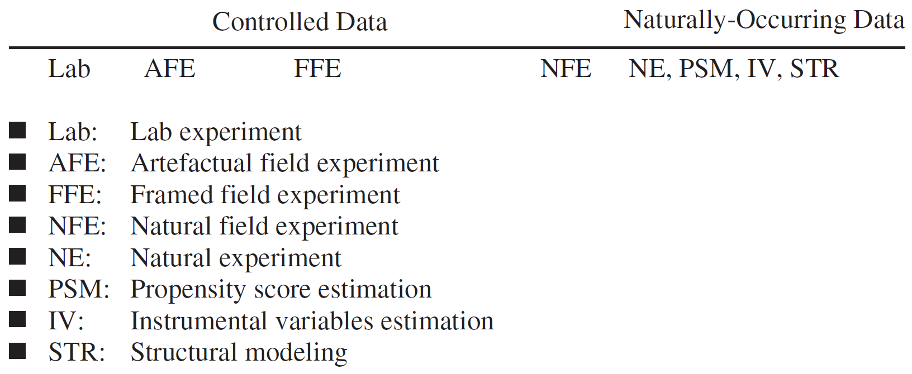
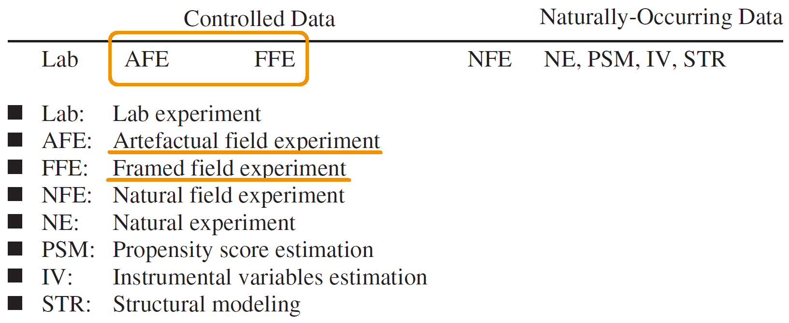
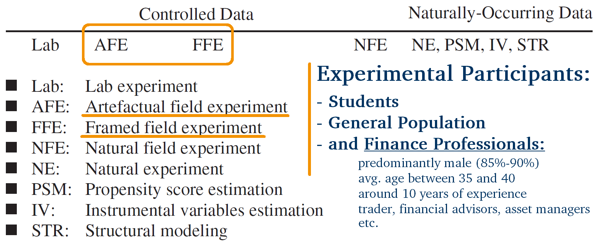
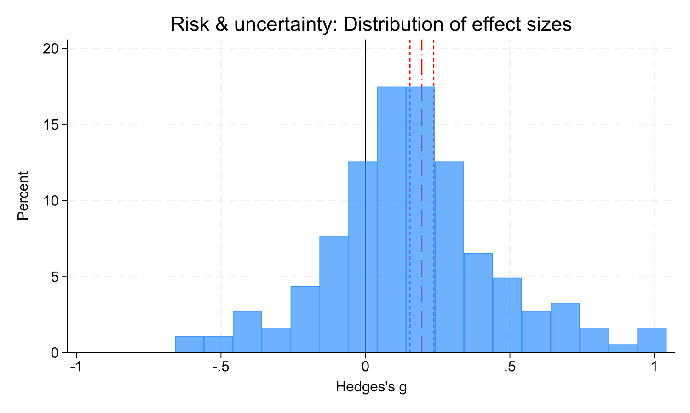
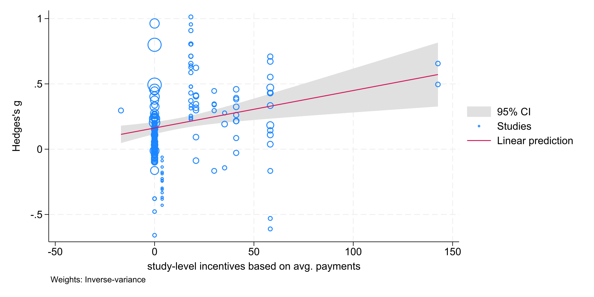
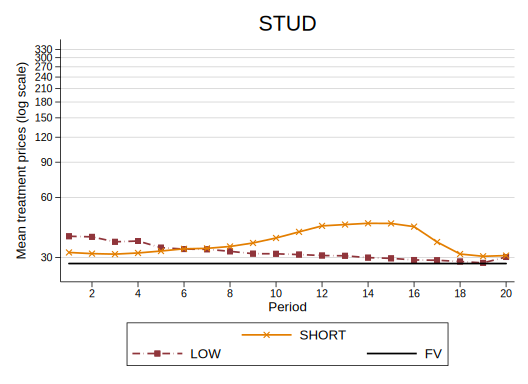
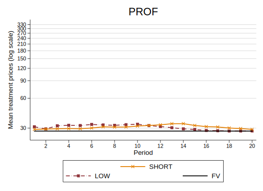
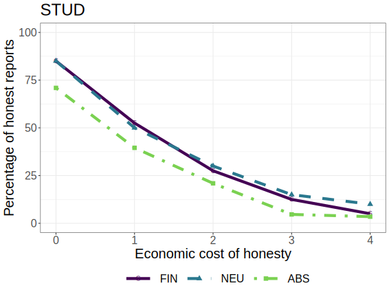
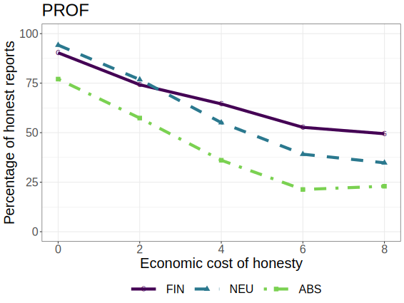
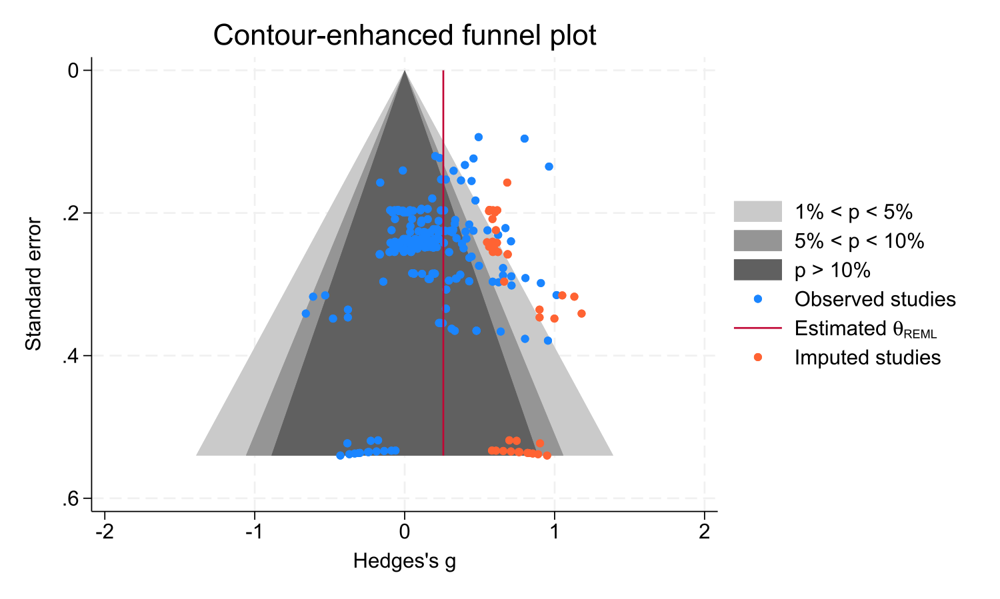

```{r}
library(dagitty)
library(ggdag)
library(ggplot2)
```


## Why Experiments?

. . .

::: columns
::: {.column width="50%"}
```{r}
dag <- dagify(
  Y ~ D,
  Y ~ U,
  D ~ U,
  coords = list(
    x = c(D=0, Y=2, U=1),
    y = c(D=0, Y=0, U=1)
  )
) 

tidy_dag <- tidy_dagitty(dag)

tidy_dag |> 
  ggplot(aes(x = x, y = y, xend = xend, yend = yend)) +
  geom_dag_point(color = "white") +
  geom_dag_text(color = "black", size = 14) + 
  geom_dag_edges_link(
    data = subset(tidy_dag$data, name == "U"), 
    edge_linetype="dashed",
    arrow = grid::arrow(length = grid::unit(14, "pt"), type = "closed"),
  ) +
  geom_dag_edges_link(
    data = subset(tidy_dag$data, !(name == "U")),
    arrow = grid::arrow(length = grid::unit(14, "pt"), type = "closed")  # Solid for others
  ) + 
  theme_dag() +
  scale_y_continuous(expand = c(0.005, 0.05))

```
:::

::: {.column width="50%"}
Consider this "typical" observational, **naturally-occurring setting:**

-   we want to estimate the *causal* effect <br> of $D$ on $Y$

-   but there are (unobserved) confounders ($U$)

-   $\rightarrow$ a naive estimate of the effect will be **biased**
:::
:::

## Why Experiments?

::: columns
::: {.column width="50%"}
```{r}
dag <- dagify(
  Y ~ D,
  Y ~ U,
  D ~ U,
  D ~ Randomization,
  coords = list(
    x = c(D=0, Y=2, U=1, Randomization=0),
    y = c(D=0, Y=0, U=1, Randomization=1.2)
  )
) 

tidy_dag <- tidy_dagitty(dag)

tidy_dag |> 
  ggplot(aes(x = x, y = y, xend = xend, yend = yend)) +
  geom_dag_point(color = "white") +
  geom_dag_text(
    data = subset(tidy_dag$data, name == "Randomization"),
    nudge_x = .35,
    color = "black", size = 14) +
  geom_dag_text(
    data = subset(tidy_dag$data, !(name == "Randomization")),
    color = "black", size = 14) + 
  geom_dag_edges_link(
    data = subset(tidy_dag$data, name == "Annoyance"), 
    edge_linetype="dashed",
    arrow = grid::arrow(length = grid::unit(14, "pt"), type = "closed"),
  ) +
  geom_dag_edges_link(
    data = subset(tidy_dag$data, !(name == "Annoyance")),
    arrow = grid::arrow(length = grid::unit(14, "pt"), type = "closed")  # Solid for others
  ) + 
  theme_dag() +
  scale_y_continuous(expand = c(0.005, 0.05))

```
:::

::: {.column width="50%"}
**Randomized experiment:**

-   treatment $D$ is *randomly assigned*

-   all other variables are held constant

-   all back doors are blocked

-   $\rightarrow$ one can identify the *causal* effect <br>of $D$ on $Y$
:::
:::

## Why Experiments?

In experiments, we have **controlled** data:

-   carefully designed, imposed set of rules

    -   incentive structure

    -   information

    -   timing

-   key variables can be deliberately manipulated (e.g., changing
    incentives, market institutions, or information conditions)

-   artificial and isolated environment to keep confounding variables
    constant, no external shocks

## Experiments in the "Empirical Spectrum"



::: aside
Levitt, S. D., & List, J. A. (2009). Field experiments in economics: The
past, the present, and the future. European Economic Review, 53(1),
1-18.
:::

## Experiments in the "Empirical Spectrum"

::: incremental
-   conventional lab experiment

    -   standard subject pool of students

    -   abstract framing<br><br>

-   artefactual field experiment

    -   nonstandard subject pool<br><br>

-   framed field experiment

    -   field context in commodity, task, or information set that
        subjects can use
:::

::: aside
Harrison, G. W., & List, J. A. (2004). Field experiments. Journal of
Economic literature, 42(4), 1009-1055.
:::

## Experiments in the "Empirical Spectrum"


## Experiments in the "Empirical Spectrum" {visibility="uncounted"}



## Experiments in the "Empirical Spectrum" {visibility="uncounted"}



## Lab and Lab-in-the-Field

::: columns
::: {.column width="50%"}
University Lab


:::

::: {.column width="50%"}
Lab-in-the-Field


:::
:::


## Why Experiments with (Financial) Professionals?

-   Early experimental literature (conventional lab experiments): mostly
    student participants

. . .

-   External validity concerns

    -   Is the behavior among students representative of the behavior of
        people in the "real world" situations we want to model?

. . .

-   $\rightarrow$ *Financial professionals* as experimental participants

    -   employees, managers, self-employed traders, brokers, financial
        advisors, and other entrepreneurs in the realm of financial
        markets <br>

. . .

Plott (1982): lab experiments are *"... real ... in the sense that real
people participate for real and substantial profits and follow real
rules in doing so. It is precisely because they are real that they are
interesting."* - if anything, this criticism is **"a hypothesis about
behavior in different subject pools ... \[and\] .. a call for more
experiments" !**

## Experiments with Financial Professionals

Three main categories of experimental studies involving financial
professionals as participants:

::: incremental
-   Experimental studies comparing financial professionals to other
    participant groups

-   Descriptive studies of financial professionals' preferences, traits
    or behavioral biases

-   Experimental studies exclusively using financial professisonals as
    participants
:::
    
::: aside
Füllbrunn, S., Huber, C., & König-Kersting, C. (2022). Experimental finance and financial professionals. In Handbook of Experimental Finance (pp. 64-72). Edward Elgar Publishing.
:::

## Experiments with Financial Professionals

-   Experimental studies comparing financial professionals to other
    participant groups since 1980s

-   **53 studies** covering many different research topics

{fig-align="center"}


------------------------------------------------------------------------

## Experiments with Financial Professionals

-   Professionals in experiments compared to non-professionals since
    1980s

-   **53 studies** covering many different research topics ... and
    finding **mixed results**

## Experiments with Financial Professionals {visibility="uncounted"}

-   Professionals in experiments compared to non-professionals since
    1980s

-   **53 studies** covering many different research topics ... and
    finding **mixed results**

    -   some identify differences between professionals and
        non-professionals <br> (Haigh & List 2005, Alevy et al. 2007,
        Kaustia et al. 2008, Cohn et al. 2014, Kirchler et al. 2018)

## Experiments with Financial Professionals {visibility="uncounted" auto-animate="true"}

-   Professionals in experiments compared to non-professionals since
    1980s

-   **53 studies** covering many different research topics ... and
    finding **mixed results**

    -   some identify differences between professionals and
        non-professionals <br> (Haigh & List 2005, Alevy et al. 2007,
        Kaustia et al. 2008, Cohn et al. 2014, Kirchler et al. 2018)

    -   some report little or no differences <br> (Rahwan et al. 2019,
        Holzmeister et al. 2020)

. . .

**This talk:**

. . .

::: incremental
-   $\rightarrow$ provide quantitative evidence $\rightarrow$
    **meta-analyses**

-   $\rightarrow$ discuss a small selection of (my) studies in this area
:::


## Experimenting with Financial Professionals: <br>A meta-analysis {.center background-color="#003366" style="text-align:center;"}


Huber, C., König-Kersting, C., & Marini, M. M. (2024). Experimenting with financial professionals. Journal of Banking & Finance, 107329.


## Inclusion criteria

**Lab, lab-in-the-field, or online experiments** with **at least two
different groups of participants**: a group of financial professionals
and a comparison sample of laypeople<br><br>

. . .

Inclusion criteria:

-   The study involves a laboratory, lab-in-the-field, or online
    experiment.

. . .

-   The study employs financial professionals as participants in
    comparison to at least another participant group of laypeople (e.g.,
    students, general population samples).

. . .

-   The experimental procedures for financial professionals and
    non-professionals are comparable in the sense that the only
    difference between treatments with professionals and
    non-professionals are the subject's profession and expertise.

------------------------------------------------------------------------

## Scope

**53 studies** covering many different research topics

Research topics:

::: fragment
-   Risk and uncertainty
:::

::: fragment
-   Forecasting
:::

::: fragment
-   Asset markets
:::

------------------------------------------------------------------------

## Scope {visibility="uncounted"}

**53 studies** covering many different research topics

Research topics:

::: {.fragment .highlight-blue}
-   Risk and uncertainty
:::

::: {.fragment .highlight-blue}
-   Forecasting
:::

<div>

-   Asset markets

</div>

<div>

-   Other topics

</div>

------------------------------------------------------------------------

## Literature search

-   Keyword searches on Google Scholar, EconLit, IDEAS databases up
    until January 2024

::: {style="text-align:center; width: 80%;"}
{fig-align="center"}
:::

------------------------------------------------------------------------

## Literature search {visibility="uncounted"}

-   Keyword searches on Google Scholar, EconLit, IDEAS databases up
    until January 2024

    -   Risk and uncertainty: 116, 21, and 52 studies identified
    -   Forecasting: 38, 21, and 111 studies identified<br><br>

. . .

-   After applying inclusion criteria: 22 unique studies

    -   15 for risk and uncertainty
    -   2 for forecasting
    -   5 eligible for both topics

------------------------------------------------------------------------

## Literature search

-   Manual search queries on relevant databases
-   Ancestry approach: screening references of identified studies
-   Posting a call for papers on the ESA mailing list

$\rightarrow$ total sample: **35 eligible studies**<br><br>

. . .

-   Next step: locate the data for meta-analyses

. . .

$\rightarrow$ **183 effects from 20 studies** for *risk and uncertainty*

$\rightarrow$ **76 effects from 4 studies** for *forecasting*

# Results {.center background-color="#003366" style="text-align:center;"}

## *Risk and uncertainty*: Meta-analysis {auto-animate="true"}

-   183 effects from 20 studies (17 published, 3 unpublished)
-   88,609 data points from 11 different countries<br>

. . .

  <table>
      <tr>
          <td>Haigh & List (2005)</td>
          <td>2</td>
          <td>Holzmeister et al. (2020)</td>
          <td>81</td>
          <td>Holmen et al. (2023)</td>
          <td>4</td>
      </tr>
      <tr>
          <td>List & Haigh (2005)</td>
          <td>3</td>
          <td>Huber et al. (2021, 2022)</td>
          <td>20</td>
          <td>Kirchler et al. (2020)</td>
          <td>2</td>
      </tr>
      <tr>
          <td>List & Haigh (2010)</td>
          <td>3</td>
          <td>Razen et al. (2020)</td>
          <td>6</td>
          <td>Stefan et al. (2022)</td>
          <td>2</td>
      </tr>
      <tr>
          <td>Roth & Voskort (2014)</td>
          <td>3</td>
          <td>Hanaki (2022)</td>
          <td>14</td>
          <td>Lambert et al. (2012)</td>
          <td>1</td>
      </tr>
      <tr>
          <td>Kirchler et al. (2018)</td>
          <td>9</td>
          <td>Weitzel et al. (2020)</td>
          <td>14</td>
          <td>Leuermann & Roth (2012)</td>
          <td>3</td>
      </tr>
      <tr>
          <td>Angrisani et al. (2020)</td>
          <td>2</td>
          <td>Huber et al. (2019)</td>
          <td>4</td>
          <td>Arnold et al. (2011)</td>
          <td>1</td>
      </tr>
      <tr>
          <td>Gajewski & Meunier (2020)</td>
          <td>1</td>
          <td>Hackethal et al. (2023)</td>
          <td>8</td>
          <td></td>
          <td></td>
      </tr>
  </table>

## *Risk and uncertainty*: Meta-analysis {auto-animate="true"}

-   183 effects from 20 studies (17 published, 3 unpublished)

-   88,609 data points from 11 different countries<br><br>

-   137 tests (75%) show a positive effect

-   45 tests (25%) show a negative effect

-   93 out of 183 effects are small in absolute values (Hedges's
    $g\leq0.2$) <br>

. . .

$\rightarrow$ mean effect size $g=0.195$ (95% confidence interval (CI):
$[0.154, 0.236]$; $p<0.001$) <br> $I^2=29.71$; $\tau^2=0.022$, robust to
WLS with clustered std. err.

## *Risk and uncertainty*: Meta-analysis {auto-animate="true"}

{fig-align="center"}

$\rightarrow$ mean effect size $g=0.195$ (95% confidence interval (CI):
$[0.154, 0.236]$; $p<0.001$) <br> $I^2=29.71$; $\tau^2=0.022$, robust to
WLS with clustered std. err.

. . .

### $\rightarrow$ **Professionals are, on average, more risk-loving than non-prof.**

## *Risk and uncertainty*: Meta-regressions {auto-animate="true"}

{fig-align="center"}

------------------------------------------------------------------------

## *Risk and uncertainty*: Incentives {auto-animate="true"}

{fig-align="center"}

## *Forecasting*: Meta-analysis {auto-animate="true"}

. . .

-   76 effects from 4 studies (all published)
-   25,622 data points from at least 3 different countries<br>

. . .

|                           |     |
|---------------------------|-----|
| Huber et al. (2021, 2022) | 12  |
| Hanaki (2022)             | 3   |
| Huber et al. (2019)       | 56  |
| Zaleskiewicz (2011)       | 5   |

. . .

-   31 tests (41%) show a positive effect; 45 tests (59%) show a
    negative effect
-   62 out of 76 effects (82%) are small in absolute values (Hedges's
    $g\leq0.2$)<br>

. . .

$\rightarrow$ random-effects meta analysis yields mean effect size
$g=-0.110$ <br> (95% confidence interval (CI): $[-0.194, -.027]$;
$p=0.010$)

------------------------------------------------------------------------

## *Forecasting*: Meta-analysis {auto-animate="true"}

{fig-align="center"}

$\rightarrow$ random-effects meta analysis yields mean effect size
$g=-0.110$ <br> (95% confidence interval (CI): $[-0.194, -.027]$;
$p=0.010$)

. . .

**BUT**: WLS with clustered std. err. at the study level: $g = −0.110$
($p = 0.295$)

. . .

### $\rightarrow$ **Professionals are, on average,** <i>not</i> better forecasters.

------------------------------------------------------------------------

## *Forecasting*: Meta-regressions {auto-animate="true"}

{fig-align="center"}

------------------------------------------------------------------------

## *Forecasting*: Incentives

{fig-align="center"}

------------------------------------------------------------------------

## Summary from Meta-Analyses {.reverse .center background-color="#335c85"}

-   Risk and uncertainty

    -   Professionals are, on average, more risk-loving than
        non-professionals.
    -   Larger diff. in incentives $\rightarrow$ larger diff. in risk
        preferences
    -   No moderating effect of *online* setting, *financial* framing,
        or *stated* preferences

-   Forecasting

    -   Professionals are, on average, <u>not</u> better forecasters
        than non-professionals.
    -   Larger diff. in incentives $\rightarrow$ larger diff. in
        forecasting accuracy

. . .

-   Asset markets?

. . .

-   Other topics?


## Bubbles and Financial Professionals {.center background-color="#003366" style="text-align:center;"}

Weitzel, U., Huber, C., Huber, J., Kirchler, M., Lindner, F., & Rose, J. (2020). Bubbles and financial professionals. The Review of Financial Studies, 33(6), 2659-2696.

## Motivation

-   Financial bubbles have been recurring phenomena in history, spanning
    across different time periods, economies, and asset classes

-   Conjecture that bubbles emerged with different investor classes
    being active (e.g.,professionals, inexperienced investors)

. . .

<br><br>

**Research Question:** How do financial professionals contribute to
price efficiency in asset markets?

## Experimental Design

-   Experimental asset market over 20 periods of 120s

    -   8 traders per market

    -   Final buyback price of 28 Taler

    -   Dividend and interest payments <br> $\rightarrow$ Fundamental
        value of the asset is 28 at each point in time

. . .

-   4 Treatments:

    -   2 Bubble Drivers: INCreasing cash, HIGH cash (in relation to
        assets)

    -   2 Bubble Moderators: increasing cash with SHORT selling, LOW
        cash

## Results

::: columns
::: {.column width="50%"}

:::

::: {.column width="50%"}
:::
:::

## Results

::: columns
::: {.column width="50%"}

:::

::: {.column width="50%"}
:::
:::

## Results

::: columns
::: {.column width="50%"}

:::

::: {.column width="50%"}

:::
:::

## Results

::: columns
::: {.column width="50%"}

:::

::: {.column width="50%"}

:::
:::

. . .

-   Bubble driver markets in PROF are significantly more efficient
    compared to student markets.

-   BUT: Similar treatment effects within the professional sample as
    with students.
    
## Meta-analysis

::: incremental
- Results only from a single study

- Broader meta-analysis not feasible for lack of data availability

  - 5 eligible studies, but data not available for 4 of them

- However: meta-analysis using the treatments from this study only

  -   5 effects on mispricing from 5 treatments (relative absolute deviation)
  
  -   all 5 effects (100%) negative, suggesting lower mispricing among financial professionals
  
  -   Random effects meta-regression: <br> $g = −0.559 (CI: [−0.936, −0.182]; 𝑝 = 0.004; I^2 = 0.00; \tau^2= 0.000)$
  

:::

. . .

### $\rightarrow$ **Professionals produce, on average, more efficient prices.**


## Bad bankers no more? Truth-telling and (dis)honesty in the finance industry {.center background-color="#003366" style="text-align:center;"}

Huber, C., & Huber, J. (2020). Bad bankers no more? Truth-telling and (dis) honesty in the finance industry. Journal of Economic Behavior & Organization, 180, 472-493.

## Motivation

-   Misconduct is prevalent in the finance industry

    -   e.g. 7% of financial advisors in the US have misconduct record
        (with 1/3 repeated offenders; Egan et al., 2019)

    -   Cohn et al. 2014: *banking culture* leads to more cheating
    
    -   Cohn's results not replicated by Rahwan et al. (2019)

. . .

<br>

**Research Questions:**

-   Is the finance industry particularly prone to dishonesty?

-   Do the situational *context* and its *norms* matter?

## Experimental Design

-   Task: *truthfully* report a pre-defined number (31) <br>
    $\rightarrow$ *individual* measure of dishonesty
    
. . .

Within-subjects variation: economic costs of honesty $\rightarrow$ choice list

. . .

Between-subjects variation: situational **context** by applying one of
three different **framings**:

. . .

-   **Abstract** context: two possible states, subjects report current
    state

. . .

-   **Neutral** context: security clerk, report \# of visitors

. . .

-   **Financial** context: CEO, report earnings to shareholders

## Results

::: columns
::: {.column width="50%"}

:::

::: {.column width="50%"}
:::
:::

## Results

::: columns
::: {.column width="50%"}

:::

::: {.column width="50%"}

:::
:::

## Results

::: columns
::: {.column width="50%"}
 - Do different situations (contexts)
evoke different honesty behavior? - *No* for students, *Yes* for
fin.prof.
:::

::: {.column width="50%"}
 - Are financial professionals more
prone to lying in a financial context? - *No*, they are *more honest*
:::
:::


## Methodological Considerations

::: incremental

- Sample definition: who counts as a financial professional?

- Recruitment: third-party services, professional associations, trade fares, government agencies, online labor markets ($\rightarrow$ selection?)

- Decision environment: lab, lab-in-the-field, online?

- Incentives: how much to pay financial professionals relative to other participants?
:::


## Conclusion {.center background-color="#335c85"}

::: incremental
- Financial professionals as experimental participants

  - $\rightarrow$ external validity, generalizability
  
- Fin. prof. are more risk-loving than others

- Maybe $\pm$ the only convincing result?

  - Forecasting? Mixed results
  
  - Almost all other research questions: only one study
  
  - Only one explicit direct replication (Cohn et al. 2014/Rahwan et al. 2019) - and it fails
    
  - Even for risk preferences: what is the role of selection?
  
- $\rightarrow$ still a lot of important work
:::


## Thanks {.center background-color="#003366" style="text-align:center;"}

christoph.huber\@aalto.fi

chr-huber.com

# Appendix {visibility="uncounted"}

## Publication bias {visibility="uncounted"}

{fig-align="center"}

## Publication bias {visibility="uncounted"}

{fig-align="center"}


