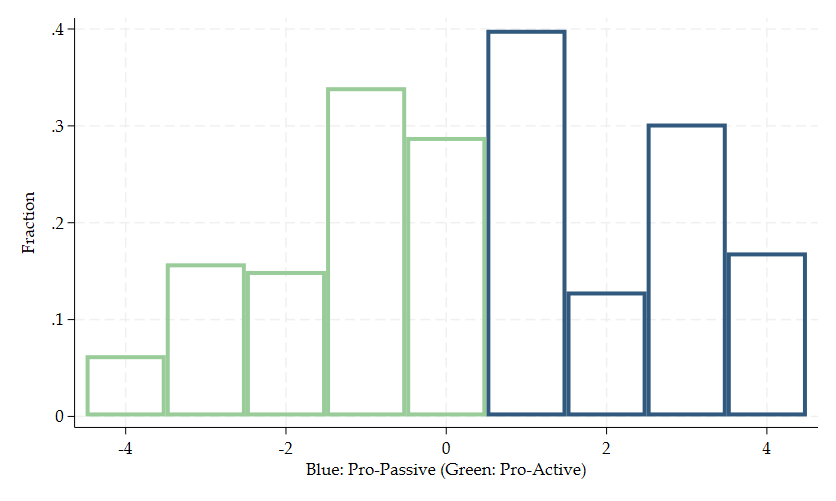

## Financial Advice and Investor Beliefs: Experimental Evidence on Active vs. Passive Strategies

Goal: investigate the *demand side* of *financial advice*

. . .

 

Method: lab experiment ("randomized control trial", "lab-in-the-field")

. . .

financial advice videos $\rightarrow$ *information treatments*:

-   active investment strategy

-   passive investment strategy

## Lab Experiment

-   subjects recruited from the larger Boston area

-   Three parts:

    -   pre-video survey, including "beliefs" about active vs. passive
        investment strategy

    -   random assignment to financial advice videos (active *or*
        passive)

    -   post-video survey

## Main Results

-   perception of financial advice is influenced by prior beliefs

    -   advice that contradicts one's prior beliefs is rated lower than
        when it aligns with one's prior beliefs

-   advice contradicting one's prior beliefs prompts more updating than
    advice aligned with one's prior beliefs

    -   advice affects participants' portfolio choice

    -   more financially literate participants positively revise beliefs
        after passive video, but not after active video

    -   less financially literate participants are strongly influenced
        by both video types

-   more confident individuals place less weight on advice

-   potentially misaligned incentives matter: participants react
    stronger to advice if advisor has flat fee

## Sample selection and generalizability

-   subjects recruited from the the larger Boston area

    -   "To attract residents, particularly employees in the greater
        Boston area, we contacted a number of local employers to
        advertise our recruiting materials via their internal email
        lists and blackboards in public areas such as workplace
        cafeterias. In addition, we circulated recruiting materials on
        Craigslist, the Harvard Decision Science Lab and the MIT
        Behavioral Research Lab websites, and school newsletters and
        emails."

 

-   Who are the people in the sample? How many are students?

-   Who should the people in the sample represent?

## Sample selection and generalizability

-   Who are the people in the sample? Who do they represent?

|                             | Active | Passive |
|-----------------------------|--------|---------|
| Gender                      | 0.50   | 0.56    |
| Age                         | 38.25  | 39.84   |
| Full-time job               | 0.45   | 0.45    |
| Income under 35k            | 0.43   | 0.43    |
| Invest in stocks            | 0.32   | 0.29    |
| Use financial advisor       | 0.21   | 0.22    |
| Prior Belief (1=pro-active) | 0.49   | 0.52    |

-   Sample: 43% with income under 35k

-   Population per capita income in Boston area: above 90k

-   Large sample of (Canadian) financial advice clients: 0% income under
    35k

## Sample selection and generalizability

-   Who are the people in the sample? Who do they represent?

|                             | Active | Passive |
|-----------------------------|--------|---------|
| Gender                      | 0.50   | 0.56    |
| Age                         | 38.25  | 39.84   |
| Full-time job               | 0.45   | 0.45    |
| Income under 35k            | 0.43   | 0.43    |
| Invest in stocks            | 0.32   | 0.29    |
| Use financial advisor       | 0.21   | 0.22    |
| Prior Belief (1=pro-active) | 0.49   | 0.52    |

-   Sample: only 45% have a full-time job - who are the others?
    Students?

-   There are at least two very different samples (students vs.
    non-students), and I'd be more cautious in pooling them!

## Sample selection and generalizability

-   Is the sample typical for people taking up financial advice?

:::::: columns
:::: {.column width="50%"}
::: incremental
-   Linnainmaa et al. (2020) - large sample of Canadian financial advice
    clients; data from 1999 to 2013:

    -   98.8% actively managed mutual funds
    -   Sample in *this* paper:   ca. 50% pro-passive funds beliefs!
:::
::::

::: {.column width="50%"}
:::
::::::

## Sample selection and generalizability {visibility="uncounted"}

-   Is the sample typical for people taking up financial advice?

::::: columns
::: {.column width="50%"}
-   Linnainmaa et al. (2020) - large sample of Canadian financial advice
    clients; data from 1999 to 2013:

    -   98.8% actively managed mutual funds
    -   Sample in *this* paper:   ca. 50% pro-passive funds beliefs!

Yes, the market share of index funds has increased, but ...
:::

::: {.column width="50%"}

:::
:::::

. . .

... are those who seek financial advice those who (want to) invest
passively?

## Sample selection and generalizability

... are those who seek financial advice those who (want to) invest
passively?

. . .

If *not*, then:

-   pro-passive people might not be receptive to advice

-   external validity of advice-effect on pro-passive advice is
    questionable

. . .

What to do?

-   Define a clear population of interest: retail investors *seeking
    advice*?

-   Relate your sample to this population of interest

-   Discuss the external validity of your results

::: aside
Figure on previous slide from:
<https://www.morningstar.com/columns/rekenthaler-report/index-funds-have-officially-won>
:::

## Pro-Passive Index

"Prior Beliefs" constructed question asking participants to rank seven
different components of investment strategy in the order of importance:

-   Diversification

-   Picking Good Stocks

-   Picking Good Fund Managers

-   Minimizing Risk

-   Minimizing Fees

-   Timing the Market

-   Selling Poorly Performed Stocks

$\rightarrow$ this is *the* **key variable** in this study

## Pro-Passive Index

::::: columns
::: {.column width="50%"}
-   Pro-Passive Index based on:

    -   Diversification (among Top-3)

    -   Minimizing Fees (among Top-3)

    -   Picking Good Stocks (among Bottom-3)

    -   Timing the Market (among Bottom-3)

-   Index ranges from -4 to +4
:::

::: {.column width="50%"}

:::
:::::

. . .

-   Is this a belief that characteristics of passive investment
    strategies are *important?*

-   ... a preference for these characteristics? ... a preference for
    passive investments?

## Pro-Passive Index

::::: columns
::: {.column width="50%"}
-   Pro-Passive Index based on:

    -   Diversification (among Top-3)

    -   Minimizing Fees (among Top-3)

    -   Picking Good Stocks (among Bottom-3)

    -   Timing the Market (among Bottom-3)

-   Index ranges from -4 to +4
:::

::: {.column width="50%"}

:::
:::::

::: incremental
-   What beliefs do the guys in the middle have?  e.g., the mode of 1
    could be: Diversification, Minimizing Fees, Picking Good Stocks

-   $\rightarrow$ how much do they believe in passive investments?
:::

## Pro-Passive Index

-   Is this a belief that characteristics of passive investment
    strategies are *important?*

-   ... a preference for these characteristics? ... a preference for
    passive investments?

-   What beliefs do the guys in the middle have?  e.g., the mode of 1
    could be: Diversification, Minimizing Fees, Picking Good Stocks

-   $\rightarrow$ how much do they believe in passive investments?

. . .

What you would probably like to have is a *clear*, reasonably
*granular*, and *monotonic* measure for how "good" passive investment
strategies are perceived to be

. . .

If that is *not* available, then you could argue that your index
approximates such a measure:

-   **Beliefs about beating the market**: "It is possible to always beat the
    market"

-   $\rightarrow$ how does that measure correlate with the (post-video)
    pro-passive index?

## No preregistration

Experiment seems not to be preregistered

. . .

$\rightarrow$ results are mostly *exploratory*

$\rightarrow$ one might question some analysis choices:

. . .

-   construction of pro-passive index

-   cut-off for "high" financial literacy dummy (instead of, a different
    cut-off or using the score)

-   etc.

. . .

Possible solutions: *multiverse* analysis; robustness checks

## Novelty of results

-   information treatments "work" in a financial advice context
    -   Info on passive investments $\rightarrow$ preference for passive
        investments
    -   Info on active investments $\rightarrow$ preference for active
        investments

. . .

What is new and surprising (apart from the financial advice context per
se)?

$\rightarrow$ fee structure matters!

. . .

-   shift in direction of advice is significantly smaller when there is
    a conflict of interest

$\rightarrow$ put a stronger focus on those results

## Other comments I

-   **Incentives**: chance to win \$ 3,000 as an investment portfolio
    depending on one's portfolio choice

-   How exactly does the incentivized portfolio choice look like?

    -   hypothetical index vs. actively managed portfolio

    -   same net-of-fee return and risk

-   People were informed that if they were selected to receive the \$
    3,000, then they would receive it in the fund portfolio which they
    picked in this question (but it is hypothetical?)

-   What information do participants get? What about the fees?

    -   Financial literacy questions suggest that about 40% of
        participants do not understand fees

    -   To what extent do they understand the portfolio choices?

## Other comments II

-   Provide experimental instructions

-   Provide precise wording of survey items (e..g., wording of key
    variable for pro-passive beliefs not clear!)

-   Be precise in interpreting measures and results:

    -   extent of *agreement* with advice is interpreted as *quality* of
        advice?

    -   answers to the question "It is possible to always beat the
        market." take on two different interpretations, none of them
        which match the survey item:

        -   to "consistently beat the market"

        -   to "beat the market in the long run"

    -   lab experiment vs. lab-in-the-field vs. randomized control trial

## Other comments III

-   Videos recorded by the two male advisors are watched by 101 and 161
    participants respectively; videos recorded by the two female
    advisors are watched by 97 and 162 participants respectively

    -   why not randomly allocated?

-   Baseline treatment would be interesting for portfolio choice and
    outperforming-the-market-beliefs

    -   neutral video, or no video

## Wrap-up

-   Very nice study!

-   Exploration of the *demand* side of financial advice using
    *information treatments* on *retail investors* (?)

    -   Info on passive investments $\rightarrow$ preference for passive
        investments

    -   Info on active investments $\rightarrow$ preference for active
        investments

    -   But: weaker shift with higher confidence and higher financial
        literacy

::: incremental
-   Big picture: what can we make of these results?

    -   information treatments "work" in a financial advice context
        $\rightarrow$ great, with potentially important policy
        implications
    -   ... but for whom? $\rightarrow$ be clear about who the target
        population is (external validity)
    -   ... what *matters*? financial literacy, conflicts of interest
        $\rightarrow$ focus on this
:::

## Wrap-up {visibility="uncounted"}

-   Very nice study!

-   Exploration of the *demand* side of financial advice using
    *information treatments* on *retail investors* (?)

-   Big picture: what can we make of these results?

    -   information treatments "work" in a financial advice context
        $\rightarrow$ great, with potentially important policy
        implications
    -   ... but for whom? $\rightarrow$ be clear about who the target
        population is (external validity)
    -   ... what *matters*? financial literacy, conflicts of interest
        $\rightarrow$ focus on this

 

-   **Good luck!**
