## Aim  {.center}

::: {.incremental}

- Estimate reproducibility in Management Science, overall and across different fields

:::

## Aim  {.center visibility="uncounted"}

::: {}
- Estimate reproducibility in Management Science, overall and across different fields
:::

::: {}
- Compare reproducibility before/since the introduction of a code and data disclosure policy
:::

## Aim  {.center visibility="uncounted"}

::: {}
- Estimate reproducibility in Management Science, overall and across different fields
:::

::: {}
- Compare reproducibility before/since the introduction of a code and data disclosure policy
:::

::: {}
- Identify covariates of reproducibility / non-reproducibility
:::

## Aim  {.center visibility="uncounted"}

::: {}
- Estimate reproducibility in Management Science, overall and across different fields
:::

::: {}
- Compare reproducibility before/since the introduction of a code and data disclosure policy
:::

::: {}
- Identify covariates of reproducibility / non-reproducibility
:::

::: {}
- Analyse predictions about reproducibility and replicability
:::

## Introduction

Scientific results need to be replicable, such that policies/actions can be based upon them (Ioannidis, 2005; Ioannidis et al., 2013).

:::: {.columns}

::: {.column width="50%"}

__Replication Crisis__

::: {.small}
- Open Science Collaboration (2015)
  - 36% of 97 psychology papers with significant effects replicated
  
- Camerer et al. (2016)
  - 61% of 18 economics lab experiments replicated (with 66\% of the original effect size, on average)
  
- Camerer et al. (2018)
  - 62% of 21 social science experiments in Nature/Science replicated

:::

::: 

::: {.column width="50%"}

:::

::::

## Introduction {visibility="uncounted"}

Scientific results need to be replicable, such that policies/actions can be based upon them (Ioannidis, 2005; Ioannidis et al., 2013).

:::: {.columns}

::: {.column width="50%"}

__Replication Crisis__

::: {.small}
- Open Science Collaboration (2015)
  - 36% of 97 psychology papers with significant effects replicated
  
- Camerer et al. (2016)
  - 61% of 18 economics lab experiments replicated (with 66\% of the original effect size, on average)
  
- Camerer et al. (2018)
  - 62% of 21 social science experiments in Nature/Science replicated

:::

::: 

::: {.column width="50%"}

__Replications__

- $f_R(data, code'(method')) \approx \beta$
- $f_R(data', code'(method)) \approx \beta$
- $f_R(data', code'(method')) \approx \beta$

   

  (notation from Perignon et al., 2024)

:::

::::

## Introduction {visibility="uncounted"}

Scientific results need to be replicable, such that policies/actions can be based upon them (Ioannidis, 2005; Ioannidis et al., 2013).

:::: {.columns}

::: {.column width="50%"}

__Replication Crisis__

::: {.small}
- <a style="color: #bfbfbf;">Open Science Collaboration (2015)</a>
  - <a style="color: #bfbfbf;">36% of 97 psychology papers with significant effects replicated</a>
  
- <a style="color: #bfbfbf;">Camerer et al. (2016)</a>
  - <a style="color: #bfbfbf;">61% of 18 economics lab experiments replicated (with 66\% of the original effect size, on average)</a>
  
- <a style="color: #bfbfbf;">Camerer et al. (2018)</a>
  - <a style="color: #bfbfbf;">62% of 21 social science experiments in Nature/Science replicated</a>

:::

::: 

::: {.column width="50%"}

__Replications__

- <a style="color: #bfbfbf;">$f_R(data, code'(method')) \approx \beta$</a>
- <a style="color: #bfbfbf;">$f_R(data', code'(method)) \approx \beta$</a>
- <a style="color: #bfbfbf;">$f_R(data', code'(method')) \approx \beta$</a>

This paper $\rightarrow$ __Reproductions__

::: {.incremental}
- $f_R(data, code) = \beta$
- $f_R(data, code) \approx \beta$
:::

:::

::::

::: {.notes}

- an antecedent of replicability/generalizability

- minimum criterion for scientific credibility (e.g., Christensen & Miguel, 2018)

- should <u>not</u> be affected by "questionable research practices":
  - publication bias
  - p-hacking
  - HARKing
  - under-powered sample sizes

If reproducibility is not possible (e.g. missing data, missing code, missing information, false reporting), then the replication crisis is partly also a reproducibility crisis.

This table displays several types of reanalyses used in empirical economics and finance. Each case pertains to a test of whether the original result β in a given article can be regenerated through the reanalysis process fR, mapping the data and the code, which is a function of the method, to the result βR. Reanalyses differ in that they use the same or different data (d vs. d′), the same or different codes (c vs. c′), and the same or different methods (m vs. m′). When the same code is used, we omit the method argument as it is, by definition, identical to the one used in the original study. Depending on the definition, the test is whether the original result (β) and the regenerated result (βR) are either equal (=) or similar (≈). Sources: National Academies of Sciences, Engineering, and Medicine, 2019; Harvey, 2019; Welch, 2019.

:::

## Management Science Code & Data Disclosure Policy

- Until June 2019 ("_Before 2019 policy_"): encouraged but did not require code/data disclosure

::: {.incremental}

- Since July 2019 ("_Since 2019 policy_"): new Data and Code Disclosure policy

  - _”Authors of accepted papers ... must provide ... the data, programs, and other details ... sufficient to permit replication.”_

  - Code and Data Editor (CDE) Code & Data Associate Editors (CDAEs)
    - review replication packages for completeness but <u>do not test reproducibility</u>

:::

::: {.notes}

  - In March 2020: data editor

  - Many exceptions:
    - Data with privacy issues (e.g., IRB does not allow sharing).
    - Data under NDA (e.g., field experiments with companies).
    - Proprietary (subscription) data (e.g., Comstat, CSRP, WRDS, etc.).

Current Code/Data Review at ManSci

1. Authors submit their paper to the journal and complete a ”code & data disclosure form.”

2. After acceptance, authors submit the final manuscript and the _replication package_.

3. _Code & Data Editor team_ checks all accepted papers for the completeness of the replication package and verify if the code runs, when possible. 
$\rightarrow$ Not a full check for reproducibility, but mostly for completeness

4. Replication package approval $\rightarrow$ production

5. Replication package is published on the INFORMS server next to the article.

2. The Decision Editor (DE) makes decisions about exceptions to the policy at
the acceptance stage.
:::

# Management Science Reproducibility Project {.center style="text-align:center; font-size:0.75em;" background-color="#F7E159"}
::: {style="text-align:center; font-size:1.33em;"}
__(ManSciReP)__
:::

. . .

 

::: {style="text-align:center; font-size:1.33em;"}

Large-scale project to assess the reproducibility of articles published in Management Science before and after 2019 policy change

:::

. . .

 

::: {style="text-align:left; font-size:1.33em;"}

$\rightarrow$ Crowd-science approach

:::

::: {style="text-align:left; font-size:1.33em;"}
927 reviewers matched with 489 articles based on 
1. software skills
2. field of research

:::

## Final Dataset: Reviewers and Reports

:::: {.columns}

::: {.column width="50%"}

Reviewers:

- 675 reviewer teams submitted valid report(s)

  - 597 reviewers 1 report 
  - 76 reviewers 2 reports 
  - 2 reviewers 3 reports
  
:::

::: {.column width="50%"}

Articles:

- 753 reports for 459 articles

<table>
<thead>
<tr>
  <th>Category</th>
  <th>Before 2019 policy</th>
  <th>After 2019 policy</th>
  <th>Total</th>
</tr>
</thead>
<tbody>
<tr>
  <td>Initial sample of articles</td>
  <td>334</td>
  <td>447</td>
  <td>781</td>
</tr>
<tr>
  <td>Replication package available</td>
  <td>42</td>
  <td>447</td>
  <td>489</td>
</tr>
<tr style="font-weight:bold; background-color: #adbece">
  <td>Package available and $\geq 1$ report</td>
  <td>40</td>
  <td>419</td>
  <td>459</td>
</tr>
<tr>
  <td>1 report</td>
  <td>16</td>
  <td>149</td>
  <td>165</td>
</tr>
<tr>
  <td>2 reports</td>
  <td>24</td>
  <td>270</td>
  <td>294</td>
</tr>
</tbody>
</table>

:::

::::

# Results {.center background-color="#46A5FF" style="text-align:center;"}

## Reproducibility assessment

__Assessment scale__

:::: {.columns}

::: {.column}

Not reproduced

:::

::: {.column}

Reproduced

:::

::::

## Reproducibility assessment {visibility="uncounted"}

__Assessment scale__

:::: {.columns}

::: {.column}

Not reproduced

:::

::: {.column}

Reproduced

  - <a style="color: #2f5597ff">Fully reproduced</a>
    - <a style="color: #2f5597ff">exact same results for the whole article</a>

  - <a style="color: #879fdbff">Largely reproduced, with minor issues</a>
    - <a style="color: #879fdbff">small differences, but the article’s conclusions and learnings hold</a>

:::

::::

## Reproducibility assessment {visibility="uncounted"}

__Assessment scale__

:::: {.columns}

::: {.column}

Not reproduced

  - <a style="color: #ff7011">Largely not reproduced</a>
    - <a style="color: #ff7011">major differences, conclusions of the original article not supported</a>

  - <a style="color: #ff0000">Not reproduced</a>
    - <a style="color: #ff0000">conclusions of the original article not supported, no results reproduced</a>
   

  - <a style="color: #ff0000">Not verifiable (data n/a, requirements n/a)</a>

  - <a style="color: #941100">Not verifiable (no package)</a>

:::

::: {.column}

Reproduced

  - <a style="color: #2f5597ff">Fully reproduced</a>
    - <a style="color: #2f5597ff">exact same results for the whole article</a>

  - <a style="color: #879fdbff">Largely reproduced, with minor issues</a>
    - <a style="color: #879fdbff">small differences, but the article’s conclusions and learnings hold</a>
    
:::

::::

## Overall reproducibility {visibility="uncounted"}

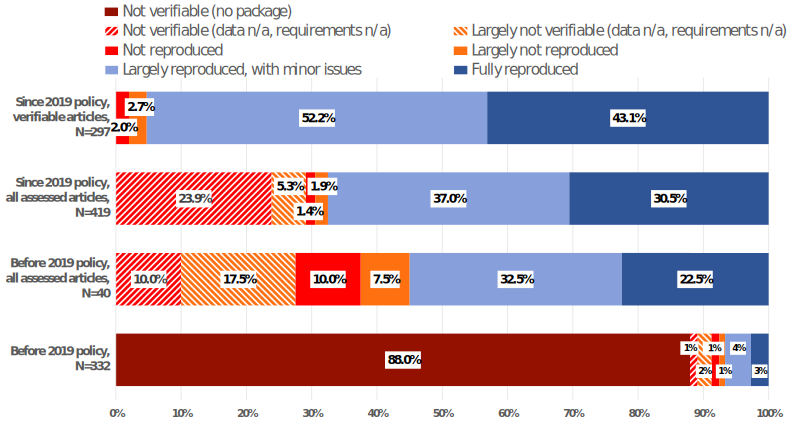{fig-align="center"}

## Overall reproducibility {visibility="uncounted"}

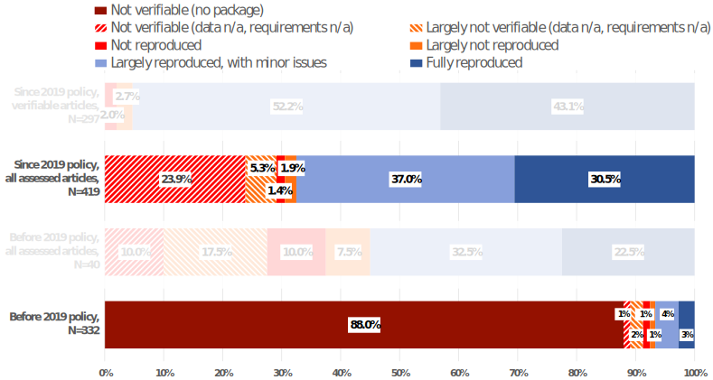{fig-align="center"}

## Overall reproducibility {visibility="uncounted"}

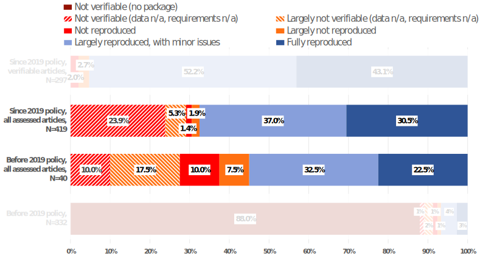{fig-align="center"}

## Overall reproducibility by journal department

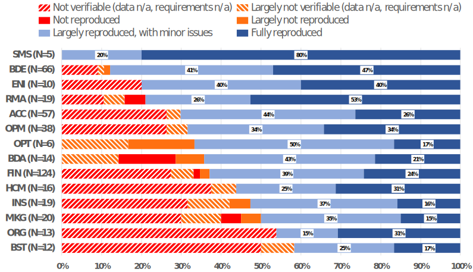{fig-align="center"}

## Overall reproducibility by journal department {visibility="uncounted"}

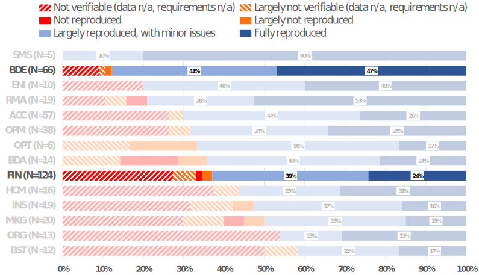{fig-align="center"}

## Overall reproducibility by study type / method

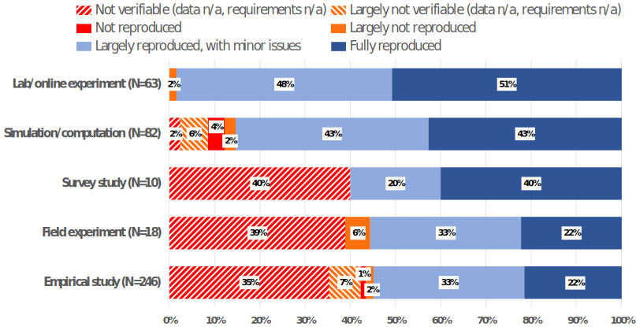{fig-align="center"}

## Variation in reproducibility

:::: {.columns}

::: {.column width="38%"}
Linear probability model:   **Largely or fully reproduced** (binary)
:::

::: {.column width="62%"}
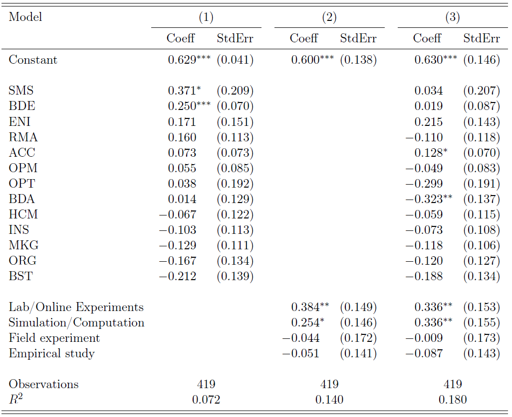{fig-align="center"}
:::

::::

## Variation in reproducibility {visibility="uncounted"}

:::: {.columns}

::: {.column width="38%"}
Linear probability model:   **Largely or fully reproduced** (binary)
:::

::: {.column width="62%"}
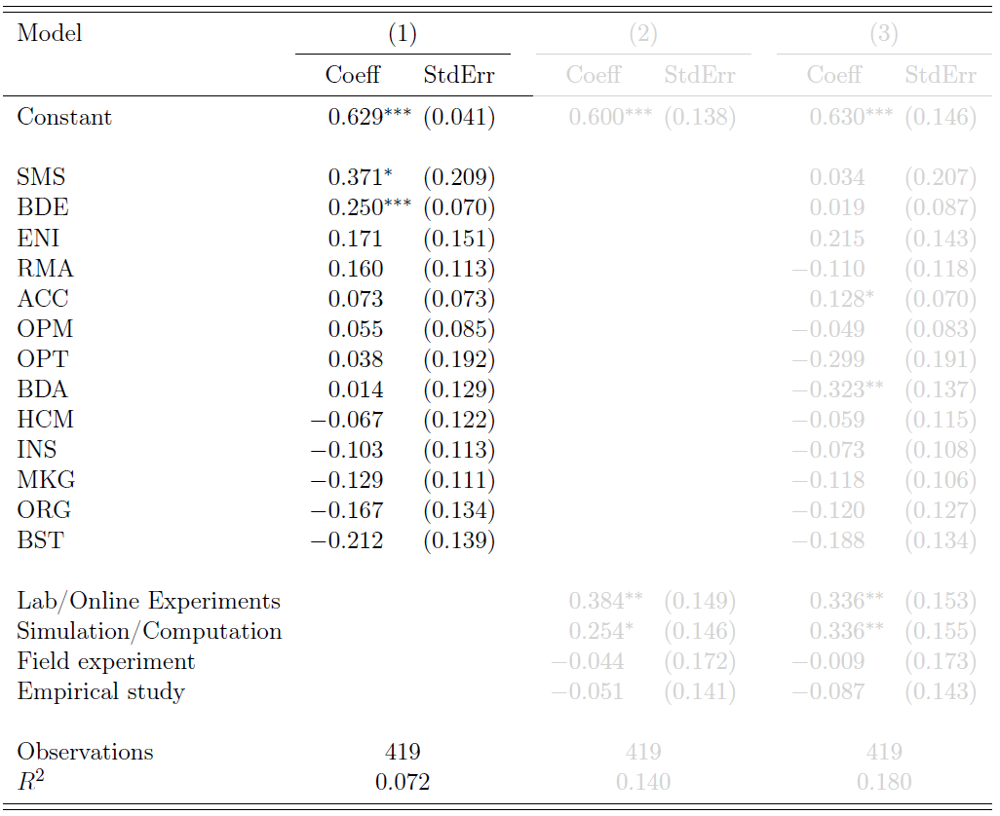{fig-align="center"}
:::

::::

## Variation in reproducibility {visibility="uncounted"}

:::: {.columns}

::: {.column width="38%"}
Linear probability model:   **Largely or fully reproduced** (binary)
:::

::: {.column width="62%"}
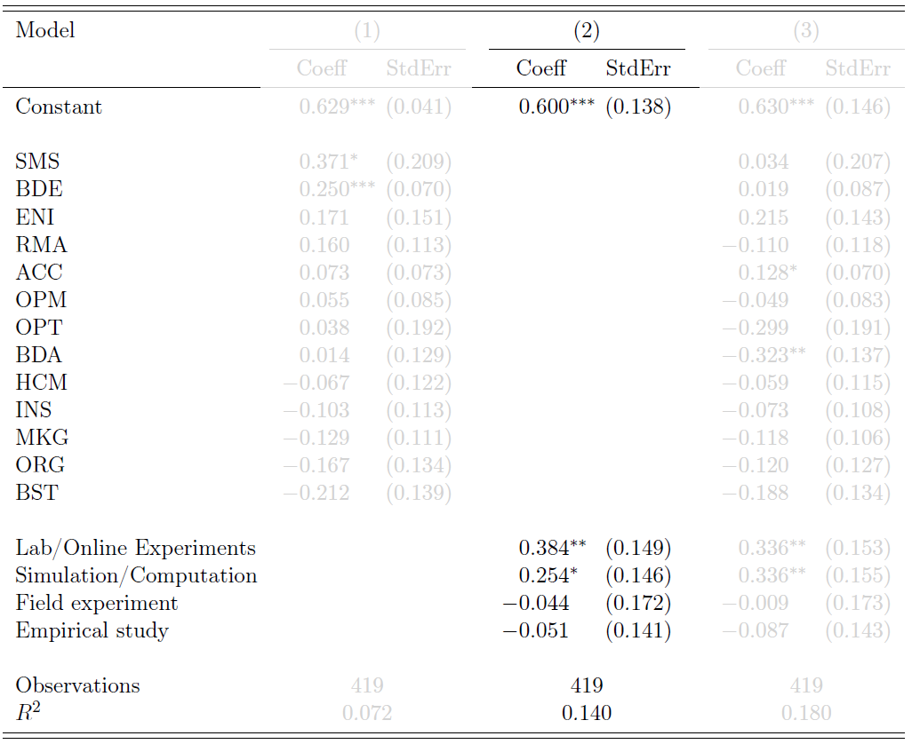{fig-align="center"}
:::

::::

## Variation in reproducibility {visibility="uncounted"}

:::: {.columns}

::: {.column width="38%"}
Linear probability model:   **Largely or fully reproduced** (binary)
:::

::: {.column width="62%"}
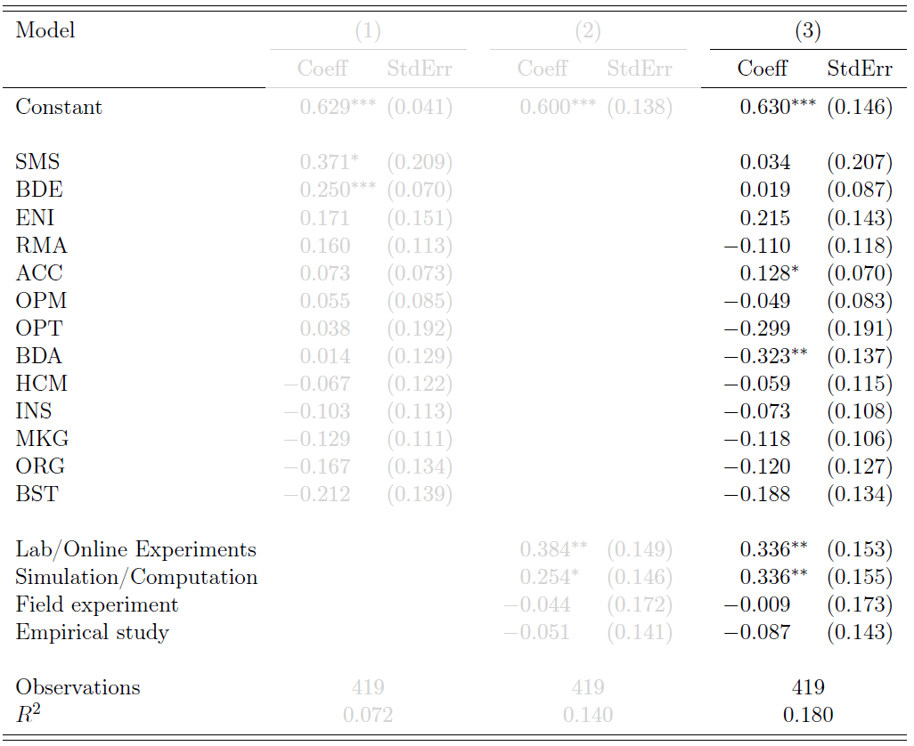{fig-align="center"}
:::

::::

## Variation in reproducibility {visibility="uncounted"}

:::: {.columns}

::: {.column width="38%"}
Linear probability model:   **Largely or fully reproduced** (binary)
:::

::: {.column width="62%"}
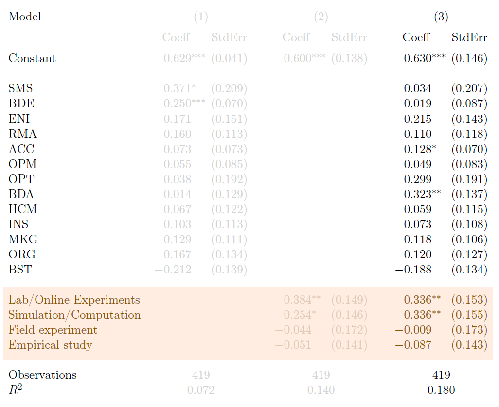{fig-align="center"}
:::

::::

## Determinants of (non)reproducibility

##  Determinants of (non)reproducibility {visibility="uncounted"}

{fig-align="center"}

## Determinants of (non)reproducibility {visibility="uncounted"}

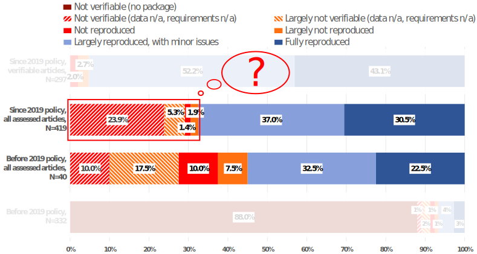{fig-align="center"}

## Determinants of (non)reproducibility

#### Main reasons identified from reproducibility reports

## Determinants of (non)reproducibility {visibility="uncounted"}

#### Main reasons identified from reproducibility reports

 

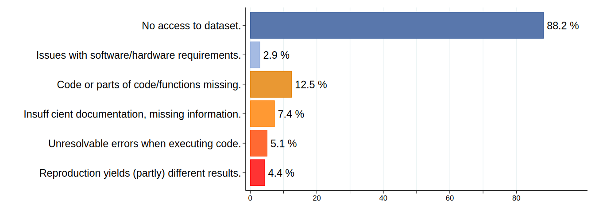{fig-align="center"}

# Exploratory results {visibility="hidden"}

- Author and article characteristics

- Reviewer characteristics

- <a href="#/estimating-reproducibility">Reviewer expectations</a>

- <a href="#/reproducibility-and-replicability">Reproducibility and replicability</a>

 

<a href="#/conclusion">Skip all</a>

## Determinants of (non)reproducibility

<b style="color: #5DD089;">Data availability</b>

:::: {.columns}

::: {.column width="32%"}

- No data:	14.87%   reproduced (n = 195)

- Partial data:	44.55%   reproduced (n = 110)

- All data:	92.11%   reproduced (n = 355)

:::

:::  {.column width="68%"}

:::

::::

## Determinants of (non)reproducibility {visibility="uncounted"}

<b style="color: #5DD089;">Data availability</b>

:::: {.columns}

::: {.column width="32%"}

- No data:	14.87%  reproduced (n = 195)

- Partial data:	44.55%  reproduced (n = 110)

- All data:	92.11%  reproduced (n = 355)

:::

:::  {.column width="68%"}

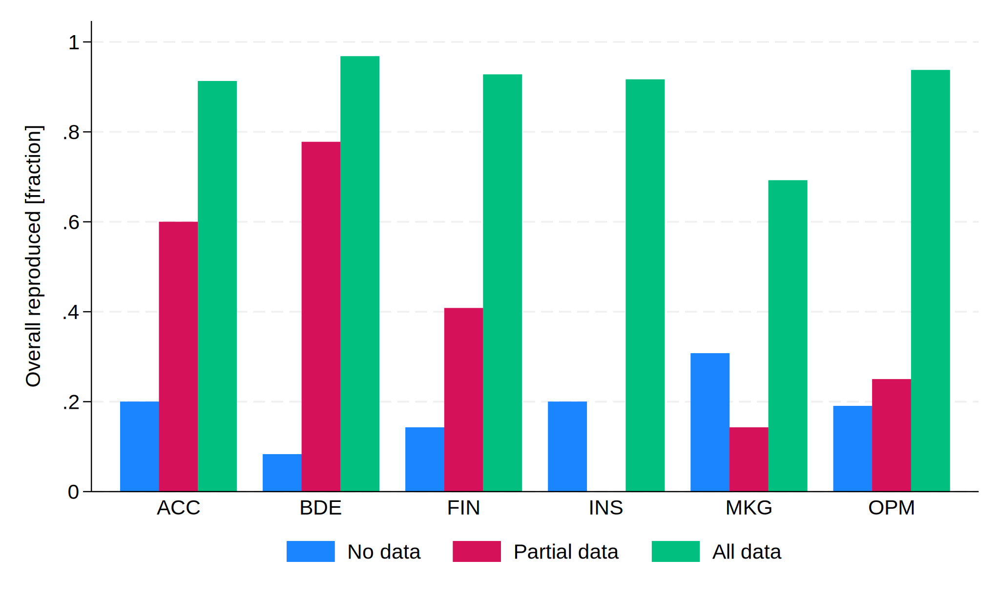{fig-align="center"}

:::

::::

## Determinants of (non)reproducibility

<b style="color: #5DD089;">Complexity</b>

. . .

- One software used:		70.43% reproducible (n = 301)
- More than one software used:	60.17% reproducible (n = 118)
 (t-test: p = 0.044, Fisher exact test: p = 0.049)

. . .

<b style="color: #5DD089;">Author affiliation Top 30</b>

. . .

- Top author affiliation: 		67.40% reproducible

- Non-top author affiliation: 	65.52% reproducible
 (t-test: p = 0.670, Fisher exact test: p = 0.693)

::: aside
Top 30 school according to UT Dallas list
:::

## Determinants of (non)reproducibility

::: {.columns}

::: {.column width=60%}

<b style="color: #FD6360;">Reviewer affiliation Top 30</b>

- Top reviewer affiliation: 61.3% reproduced 
- Non-top reviewer affiliation: 62.6% reproduced  
(t-test: p = 0.811, N = 689)
:::

::: {.column width=40%}
<b style="color: #FD6360;">Reviewer seniority</b>

| Position                     | Mean (%)  |
|------------------------------|-----------|
| PhD student (N=119)          | 63.9      |
| Assistant Prof (N=271)     | 63.5      |
| Associate Prof (N=173)       | 64.2      |
| Professor (N=95)             | 57.9      |
| Other (N=31)                 | 51.6      |
:::

:::

::: aside
only 14% of reviewers from Top 30 schools, but 50% of articles
:::

## Determinants of (non)reproducibility {visibility="uncounted"}

::: {.columns}

::: {.column width=60%}

<b style="color: #FD6360;">Reviewer affiliation Top 30</b>

- Top reviewer affiliation: 61.3% reproduced 
- Non-top reviewer affiliation: 62.6% reproduced   
(t-test: p = 0.811, N = 689)

 
<b style="color: #FD6360;">Reviewer skills</b>

:::

::: {.column width=40%}
<b style="color: #FD6360;">Reviewer seniority</b>

| Position                     | Mean (%)  |
|------------------------------|-----------|
| PhD student (N=119)          | 63.9      |
| Assistant Prof (N=271)     | 63.5      |
| Associate Prof (N=173)       | 64.2      |
| Professor (N=95)             | 57.9      |
| Other (N=31)                 | 51.6      |
:::

:::

- Reviewer matches article department: 64.4% vs. 48.9% reproduced (p = 0.005, N = 689, t-test)

- Self-reported topic expertise: regression coefficient < 0.1 pp. (p = 0.330)

- Self-reported method/software expertise: regression coefficient < 0.1 pp. (p = 0.605)

## Reviewer characteristics

<b style="color: #FD6360;">Time spent on reproduction</b>

Mean time spent (only if largely or fully reproduced): 

<table border="1">
    <tr>
        <th>ACC</th>
        <th>BDA</th>
        <th>BDE</th>
        <th>BST</th>
        <th>ENI</th>
        <th>FIN</th>
        <th>HCM</th>
        <th>INS</th>
        <th>MKG</th>
        <th>OPM</th>
        <th>OPT</th>
        <th>ORG</th>
        <th>RMA</th>
        <th>SMS</th>
        <th><b>Total</b></th>
    </tr>
    <tr>
        <td>12.2</td>
        <td>13.8</td>
        <td>6.5</td>
        <td>11.7</td>
        <td>5.2</td>
        <td>12.3</td>
        <td>9.1</td>
        <td>5.9</td>
        <td>3.7</td>
        <td>6.6</td>
        <td>13.2</td>
        <td>5.9</td>
        <td>8.0</td>
        <td>3.7</td>
        <td><b>9.0</b></td>
    </tr>
</table>

 

. . .

:::: {.columns}

::: {.column width="40%"}

<table border="1">
    <tr>
        <th>Study type / method</th>
        <th>Mean</th>
    </tr>
    <tr>
        <td>Lab/online exper.</td>
        <td>5.7</td>
    </tr>
    <tr>
        <td>Field experiment</td>
        <td>5.5</td>
    </tr>
    <tr>
        <td>Survey</td>
        <td>3.9</td>
    </tr>
    <tr>
        <td>Empirical data</td>
        <td>11.0</td>
    </tr>
    <tr>
        <td>Theory/Simulation</td>
        <td>11.2</td>
    </tr>
</table>

:::

::: {.column  width="60%"}
:::

::::

## Reviewer characteristics {visibility="uncounted}

<b style="color: #FD6360;">Time spent on reproduction</b>

Mean time spent (only if largely or fully reproduced): 

<table border="1">
    <tr>
        <th>ACC</th>
        <th>BDA</th>
        <th>BDE</th>
        <th>BST</th>
        <th>ENI</th>
        <th>FIN</th>
        <th>HCM</th>
        <th>INS</th>
        <th>MKG</th>
        <th>OPM</th>
        <th>OPT</th>
        <th>ORG</th>
        <th>RMA</th>
        <th>SMS</th>
        <th><b>Total</b></th>
    </tr>
    <tr>
        <td>12.2</td>
        <td>13.8</td>
        <td>6.5</td>
        <td>11.7</td>
        <td>5.2</td>
        <td>12.3</td>
        <td>9.1</td>
        <td>5.9</td>
        <td>3.7</td>
        <td>6.6</td>
        <td>13.2</td>
        <td>5.9</td>
        <td>8.0</td>
        <td>3.7</td>
        <td><b>9.0</b></td>
    </tr>
</table>

 

:::: {.columns}

::: {.column width="40%"}

<table border="1">
    <tr>
        <th>Study type / method</th>
        <th>Mean</th>
    </tr>
    <tr>
        <td>Lab/online exper.</td>
        <td>5.7</td>
    </tr>
    <tr>
        <td>Field experiment</td>
        <td>5.5</td>
    </tr>
    <tr>
        <td>Survey</td>
        <td>3.9</td>
    </tr>
    <tr>
        <td>Empirical data</td>
        <td>11.0</td>
    </tr>
    <tr>
        <td>Theory/Simulation</td>
        <td>11.2</td>
    </tr>
</table>

:::

::: {.column  width="60%"}

But: time spent has no sig. effect on overall reproducibility (OLS, p = 0.990)

:::

::::

## Reproducibility predictions

What proportion of Management Science articles _under the current Data & Code disclosure policy_ (...) can be fully reproduced with the available replication materials? 

. . .

:::: {.columns}

::: {.column width="70%"}
{fig-align="center"}
:::

::: {.column width=30%}
:::

::::

## Reproducibility predictions {visibility="uncounted"}

What proportion of Management Science articles _under the current Data & Code disclosure policy_ (...) can be fully reproduced with the available replication materials? 

:::: {.columns}

::: {.column width="70%"}
{fig-align="center"}
:::

::: {.column width="30%"}
$\rightarrow$ predicted reproducibility does   not explain actual reproducibility   (reviewer level)
:::

::::

## Reproducibility predictions {auto-animate=true}

What proportion of Management Science articles _under the current Data & Code disclosure policy_ (...) can be fully reproduced with the available replication materials? 

. . .

- Mean predicted reproducibility since 2019 policy:	__72.61%__ (StdDev: 19.40)

## Reproducibility predictions {auto-animate=true visibility="uncounted"}

What proportion of Management Science articles _under the previous policy_ (...) can be fully reproduced with the available replication materials? 

- Mean predicted reproducibility before 2019 policy:	__48.20%__ (StdDev: 22.52)
  

What proportion of Management Science articles _under the current Data & Code disclosure policy_ (...) can be fully reproduced with the available replication materials? 

- Mean predicted reproducibility since 2019 policy:	__72.61%__ (StdDev: 19.40)

## Reproducibility predictions

#### Predicted reproducibility before/since 2019 policy 

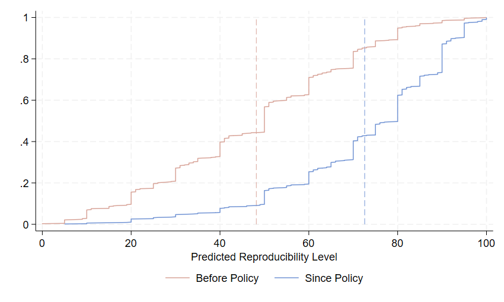{fig-align="center"}

## Reproducibility predictions

#### Predicted reproducibility before/since 2019 policy---by seniority

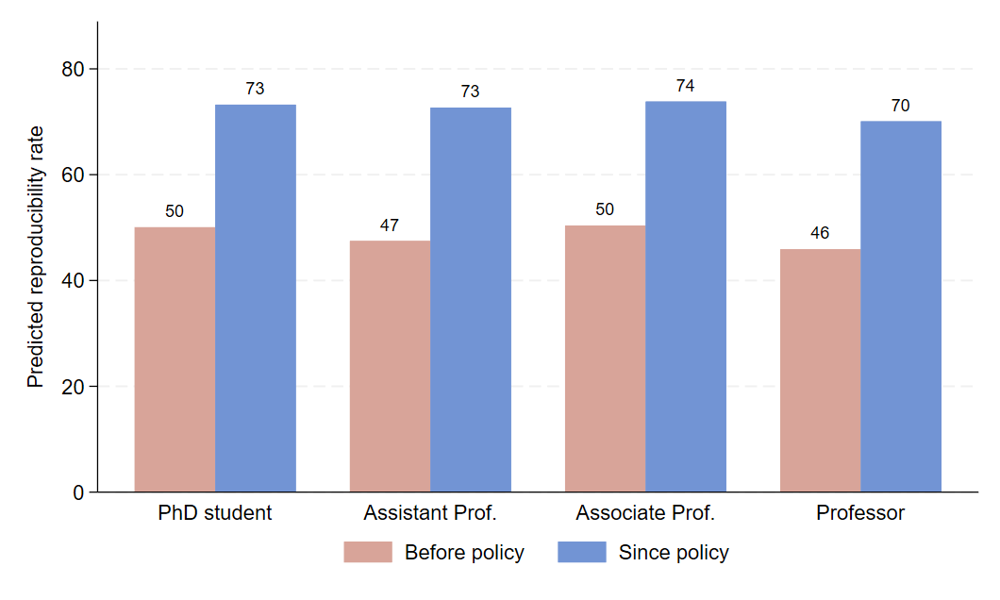{fig-align="center"}

## Reproducibility predictions

#### Predicted reproducibility before/since 2019 policy---by department

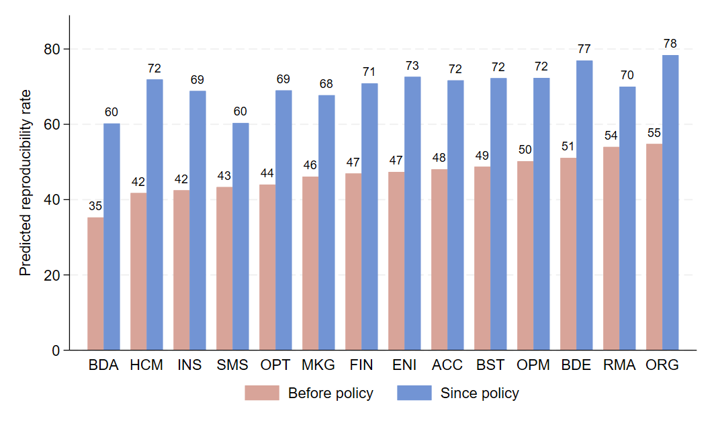{fig-align="center"}

## Reproducibility predictions

#### Prediction errors by department (since 2019 policy) 

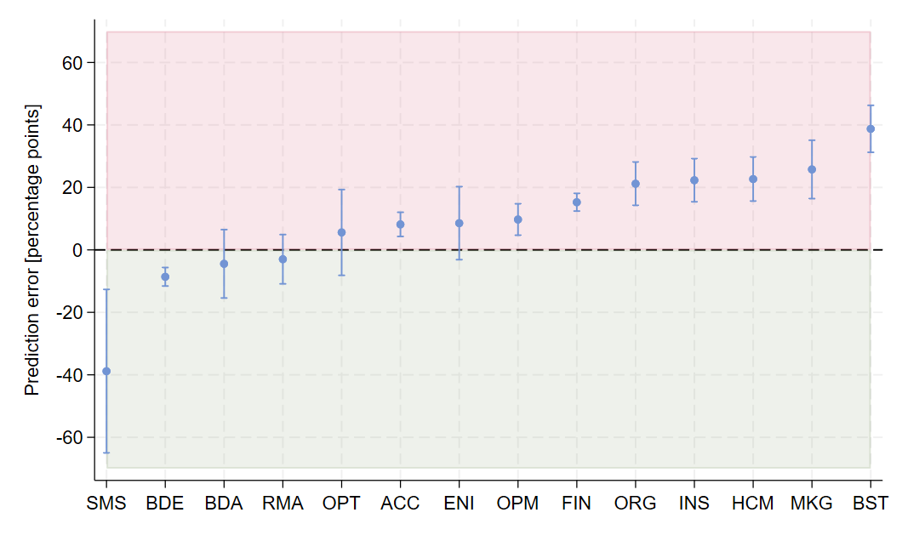{fig-align="center"}

## Does reproducibility imply replicability?

- $f_R(data, code) = \beta\;\;$ $\Longrightarrow\;\;$ $f_R(data', code'(method)) \approx \beta\;\;$ ? 

## Does reproducibility imply replicability? {auto-animate=true visibility="uncounted"}

- <a style="color: #bfbfbf;">$f_R(data, code) = \beta\;\;$ $\Longrightarrow\;\;$ $f_R(data', code'(method)) \approx \beta\;\;$ ?</a>

- $E(f_R(data', code'(method)) | f_R(data, code) = \beta)$  
vs. $\;\;\;\;\;\; E(f_R(data', code'(method)) | f_R(data, code) \neq \beta)$

## Does reproducibility imply replicability? {auto-animate=true visibility="uncounted"} 

- $E(f_R(data', code'(method)) | f_R(data, code) = \beta)$  
vs. $\;\;\;\;\;\; E(f_R(data', code'(method)) | f_R(data, code) \neq \beta)$

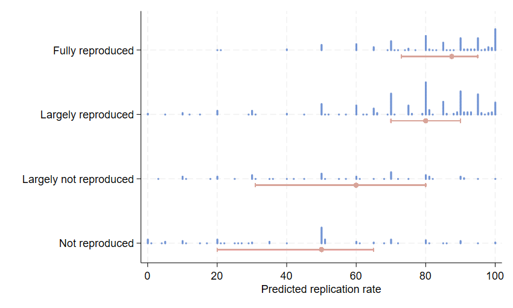{fig-align="center"}

## Does reproducibility imply replicability?

- $E(f_R(data', code'(method)) | f_R(data, code) = \beta)$  
vs. $\;\;\;\;\;\; E(f_R(data', code'(method)) | f_R(data, code) \neq \beta)$  

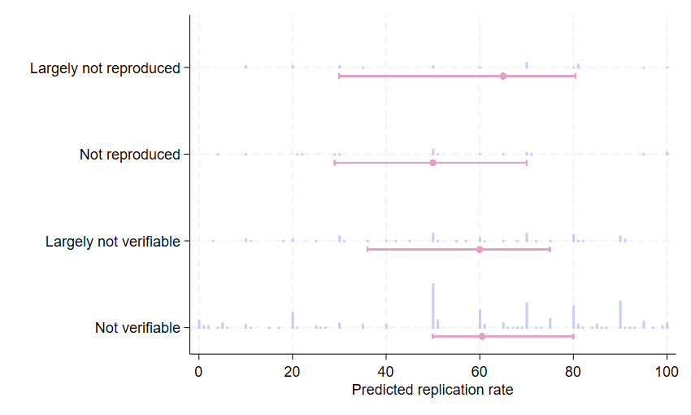{fig-align="center"}

# Conclusion {visibility="hidden"}

## {.center background-color="#A3D749" auto-animate=true}

<h2 class="thanks" style="margin:0; line-height:1em;">

Conclusion

</h2>

## {.reverse .center background-color="#A3D749" auto-animate=true visibility="uncounted"}

<h2 class="thanks" style="margin:0; line-height:1em;">

Conclusion

</h2>

- 68% of articles with enforced data and code policy fully or largely reproduced

## {.reverse .center background-color="#A3D749" auto-animate=true visibility="uncounted"}

<h2 class="thanks" style="margin:0; line-height:1em;">

Conclusion

</h2>

- 32% of articles with enforced data and code policy can (largely) <u>not</u> be reproduced

## {.reverse .center background-color="#A3D749" auto-animate=true visibility="uncounted"}

<h2 class="thanks" style="margin:0; line-height:1em;">

Conclusion

</h2>

- 32% of articles with enforced data and code policy can (largely) <u>not</u> be reproduced

- Covariates of non-reproducibility:
  - data availability and access (!)
  - package and code complexity (~; cf. Perignon et al., 2024)
  - documentation (?)

::: {.notes}
  - If ignoring articles with limited data access, then 43% of articles can be fully reproduced, and 53\% can be largely reproduced (with minor issues).
:::

::: {.notes}

- For articles submitted since June 2019 (after a policy change making replication packages mandatory), 95% could be fully or largely computationally reproduced when data access and software requirements were met.

- Before the introduction of the 2019 disclosure policy, only 12% of articles voluntarily provided replication materials, of which 55% could be (largely) reproduced. So the policy change seems to have been effective in boosting reproducibility.

- Substantial heterogeneity in reproducibility rates across journal departments is mainly due to variations in methods and dataset accessibility specific to the research fields.

- Reproduction does not guarantee replicability. But it allows other researchers to scrutinize robustness, conduct their own (meta-)analysis, reuse code and data, and explore limitations of original results. This promotes scientific discourse and decreases incentives for fraud.

:::

## Current and Future Challenges {.center background-color="#A3D749"}

- Sustainable organization/financing of reproducibility reviews
  - AEA model: Association creates position of paid (part-time) data editor, with RA support
  - Third-party reproducibility certification agency (e.g., Cascad)
  - Peer-review?
  
. . .

- Data availability
  - Data under NDA
  - Data from commercial providers
  - Privacy-relevant/sensitive data

## {.reverse .center background-image="thanks-background.png"}

:::: {.columns}

::: {.column width="40%"}

:::

::: {.column width="45%"}

<h2 class="thanks">

Thanks

</h2>

::: {style="border: none; border-top: 5px solid black; width: 100px; height: 1cm; text-align: left; margin: 0;"}
:::

christoph.huber\@aalto.fi

chr-huber.com

{fig-align="left" width="250"}

  
:::

::::

::: {.footer}
:::

# Appendix {visibility="uncounted"}

## Previous reproducibility estimates of in Economics {visibility="uncounted"}

- Dewald et al. (1986, J Money Credit Banking): could only examine <b>5 out of 154</b> articles.

- McCullough et al. (2006): despite policy at JMCB, for only 62 out of 193 papers reproduction could be attempted, and <b>14 (22.6%) could be reproduced</b>.

- Chang and Li (2016): 67 empirical papers in macroeconomics: <b>33% reproduced</b> independently of authors, 49% when excluding papers with confidential data/no software, and getting help from authors, 68% when only considering journals with data policy.

- Herbert et al. (2021): 303 studies AEJ Applied Economics 2009-2018. only 162 contained non-confidential/non-proprietary data. 68 of these could be reproduced (42.0%), and another 69 (42.6%) were ”partially successful” 

- Pérignon et al. (2023, empirical finance): Assess replication materials of 168 analyst teams independently testing the same six hypotheses on the same data (Menkveld et al., 2023). Out of 1008 tests, <b>524 (52.0%) were fully reproducible</b>, and 114 (11.3%) had results with small differences.

## Previous reproducibility estimates of in Economics {visibility="uncounted"}

- <a style="color: #bfbfbf">Dewald et al. (1986, J Money Credit Banking): could only examine <b>5 out of 154</b> articles.</a>

- <a style="color: #bfbfbf">McCullough et al. (2006): despite policy at JMCB, for only 62 out of 193 papers reproduction could be attempted, and <b>14 (22.6%) could be reproduced</b>.</a>

- <a style="color: #bfbfbf">Chang and Li (2016): 67 empirical papers in macroeconomics: <b>33% reproduced</b> independently of authors, 49% when excluding papers with confidential data/no software, and getting help from authors, 68% when only considering journals with data policy.</a>

- <a style="color: #335c85">Herbert et al. (2021): 303 studies AEJ Applied Economics 2009-2018. only 162 contained non-confidential/non-proprietary data. 68 of these could be reproduced (42.0%), and another 69 (42.6%) were ”partially successful” $\rightarrow$ overall, <b>84.6% reproduced</b></a>

- <a style="color: #bfbfbf">Pérignon et al. (2023, empirical finance): Assess replication materials of 168 analyst teams independently testing the same six hypotheses on the same data (Menkveld et al., 2023). Out of 1008 tests, <b>524 (52.0%) were fully reproducible</b>, and 114 (11.3%) had results with small differences.</a>

## Initial Sampling {visibility="uncounted"}

__Articles and Replication Packages__

- All articles in Management Science that fell under the 2019 policy and were reviewed between April 2020 and January 2023:
  - 447 articles accepted/published, all of them with a replication package.

. . .

- As a comparison set, all articles that were accepted between January 2018 and April 2019 (before the new policy) would have fallen under the disclosure policy:
  - 334 articles, of which 42 voluntarily provided a replication package.
  
. . .

::: {style="text-align:center;"}
$\rightarrow$ 781 articles in total
:::

. . .

::: {style="text-align:center;"}
$\rightarrow$ 489 articles with a replication package
:::

## Initial Sampling {visibility="uncounted"}

__Reviewers__

- Crowd-science approach

- Volunteers, recruited after sending emails to ManSci reviewers/mailing lists

. . .

::: {style="text-align:center;"}
$\rightarrow$ 927 researchers registered
:::

::: {.notes}
- Information collected on the typical department, software skills, and data access.
:::

## Article-Reviewer Matching {visibility="uncounted"}

Matching of the 927 reviewers with 489 articles based on:

- software skills
- field of research

. . .

- Optimization algorithm in two automated matching rounds with random resolution of ties to solve assignment problem

- Manual assignment after screening for conflicts of interest, etc. 

::: {.notes}

- Round 1 (Early Feb 2023)

  - Solve assignment problem with optimization algorithm (Hungarian method (Kuhn, 1955; Hornik, 2005)) with random resolution of ties
  
  - Screen matches for potential conflicts of interest

- Round 2 (Mid-Feb 2023): same as Round 1

- Round 3 (from March 2023): manual matching in several waves

:::

## Reproducibility Assessment {visibility="uncounted"}

- Reviewers were asked to:

  - make an “honest attempt” to reproduce the article’s main results (figures, tables, other)

  - provide a reproducibility report within 5 weeks
  
  - (not to contact the original authors of the articles)

. . .

- Structured reproducibility report:

  - overall assessment
  
  - individual reproducibility assessment of all results, tables, and figures
  
  - documentation of their analysis (log files and screenshots)

::: {.notes}
- Throughout the process, reviewers were advised by email in case of questions.

- After submission, reports were screened for completeness and consistency.

:::

## Disclosure Policies {visibility="uncounted"}

::: {.incremental}
- AEA since 2004, JPE & Econometrica followed; QJE since 2016

- Code/data disclosure mandatory in:
  - 10 out of 24 journals for UT Dallas business school ranking (2 have a data editor)
  - 17 of Top-25 Economics journals (SCimago) (6 have a data editor)
  - 4 of Top-6 Finance Journals (data only mandatory in 1, 1 has data editor)

:::

. . .

- Mandatory internal (e.g., AEA) or external (e.g., AJPS) verification

. . .

- Articles in journals with reproducibility policies more often cited (Höffler, 2017, AER)

. . .

- Journal data sharing policies in economics have reduced statistical significance/t-values in papers, and (suggestive evidence) decreased publication bias. (Askarov et al., 2023, JEEA)

::: {.notes}

Management Science

- Top5 in management (Q1 in economic and operation research)

  - 14 different departments: Finance, Behavioral Economics and Decision Sciences, Accounting, Operations Management, Marketing, Entrepreneurship/Innovation, Organization, etc.
  
- Receives >4000 submissions per year, publishes about 350 articles per year

:::

## Final Dataset: Reviewed articles {visibility="uncounted"}

<table style="font-size: 16pt; text-align: center; width: 100%; border-collapse: collapse;">
    <tr>
        <th><em>Management Science</em> Department</th>
        <th>Abbr.</th>
        <th style="text-align: center;">Share of Articles (N=489)</th>
        <th>Share of Reviewers (N=675)</th>
    </tr>
    <tr>
        <td>Finance</td>
        <td>FIN</td>
        <td>27.4%</td>
        <td>24.3%</td>
    </tr>
    <tr>
        <td>Behavioral Economics and Decision Analysis</td>
        <td>BDE</td>
        <td>18.4%</td>
        <td>30.1%</td>
    </tr>
    <tr>
        <td>Accounting</td>
        <td>ACC</td>
        <td>12.5%</td>
        <td>8.2%</td>
    </tr>
    <tr>
        <td>Operations Management</td>
        <td>OPM</td>
        <td>9.2%</td>
        <td>7.1%</td>
    </tr>
    <tr>
        <td>Marketing</td>
        <td>MKG</td>
        <td>5.7%</td>
        <td>6.5%</td>
    </tr>
    <tr>
        <td>Revenue Management and Market Analytics</td>
        <td>RMA</td>
        <td>4.7%</td>
        <td>0.7%</td>
    </tr>
    <tr>
        <td>Information Systems</td>
        <td>INS</td>
        <td>4.3%</td>
        <td>4.0%</td>
    </tr>
    <tr>
        <td>Business Strategy</td>
        <td>BST</td>
        <td>3.3%</td>
        <td>4.6%</td>
    </tr>
    <tr>
        <td>Healthcare Management</td>
        <td>HCM</td>
        <td>3.3%</td>
        <td>1.9%</td>
    </tr>
    <tr>
        <td>Big Data Analytics/Data Science</td>
        <td>BDA</td>
        <td>3.1%</td>
        <td>3.4%</td>
    </tr>
    <tr>
        <td>Organizations</td>
        <td>ORG</td>
        <td>3.1%</td>
        <td>3.6%</td>
    </tr>
    <tr>
        <td>Entrepreneurship and Innovation</td>
        <td>ENI</td>
        <td>2.3%</td>
        <td>4.0%</td>
    </tr>
    <tr>
        <td>Optimization</td>
        <td>OPT</td>
        <td>1.4%</td>
        <td>1.2%</td>
    </tr>
    <tr>
        <td>Stochastic Models and Simulations</td>
        <td>SMS</td>
        <td>1.4%</td>
        <td>0.4%</td>
    </tr>
</table>

## Final Dataset: Reviewers {visibility="uncounted"}

<table style="text-align: center; border-collapse: collapse;">
    <tr>
        <th>N=675</th>
        <th>Share</th>
        <th>Enlisted</th>
        <th>Avg. Hours</th>
        <th>Avg. Expertise Method (0-100)</th>
        <th>Avg. Expertise Topic (0-100)</th>
    </tr>
    <tr>
        <td>Professor</td>
        <td>14%</td>
        <td>21%</td>
        <td>13.1</td>
        <td>84.3</td>
        <td>60.8</td>
    </tr>
    <tr>
        <td>Assoc. Prof.</td>
        <td>26%</td>
        <td>11%</td>
        <td>8.3</td>
        <td>83.2</td>
        <td>61.5</td>
    </tr>
    <tr>
        <td>Assist. Prof.</td>
        <td>40%</td>
        <td>6%</td>
        <td>8.4</td>
        <td>84.1</td>
        <td>58.7</td>
    </tr>
    <tr>
        <td>PhD student</td>
        <td>16%</td>
        <td>1%</td>
        <td>9.0</td>
        <td>83.8</td>
        <td>59.2</td>
    </tr>
    <tr>
        <td>Other</td>
        <td>4%</td>
        <td>3%</td>
        <td>6.1</td>
        <td>82.8</td>
        <td>52.7</td>
    </tr>
</table>

## Overall reproducibility {visibility="uncounted"}

{fig-align="center"}

## Overall reproducibility {visibility="uncounted"}

{fig-align="center"}

## Overall reproducibility {visibility="uncounted"}

{fig-align="center"}

## Overall reproducibility {visibility="uncounted"}

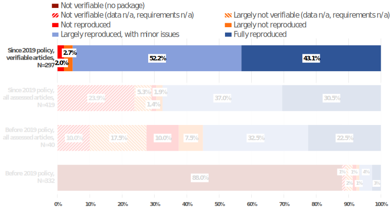{fig-align="center"}

## Reviewer consistency {visibility="uncounted"}

<table>
    <tr>
        <td></td>
        <td>Fully</td>
        <td>Largely, minor</td>
        <td>Largely not r.</td>
        <td>Not r. but log</td>
        <td>Not r.</td>
    </tr>
    <tr>
        <td>Fully reproduced</td>
        <td>31</td>
        <td></td>
        <td></td>
        <td></td>
        <td></td>
    </tr>
    <tr>
        <td>Largely reproduced, minor issues</td>
        <td>64</td>
        <td>64</td>
        <td></td>
        <td></td>
        <td></td>
    </tr>
    <tr>
        <td>Largely not reproduced, major issues</td>
        <td>6</td>
        <td>22</td>
        <td>7</td>
        <td></td>
        <td></td>
    </tr>
    <tr>
        <td>Not rep. but consistent w/log</td>
        <td>1</td>
        <td>8</td>
        <td>3</td>
        <td>37</td>
        <td></td>
    </tr>
    <tr>
        <td>Not reproduced.</td>
        <td>2</td>
        <td>6</td>
        <td>14</td>
        <td>13</td>
        <td>18</td>
    </tr>
</table>

. . .

  
- Overall, no significant differences in self-assessed expertise in methods and topics between weakly more positive and weakly more negative reviewers.

## Overall reproducibility {visibility="uncounted"}

Linear probability model: **Largely or fully reproduced** (binary)

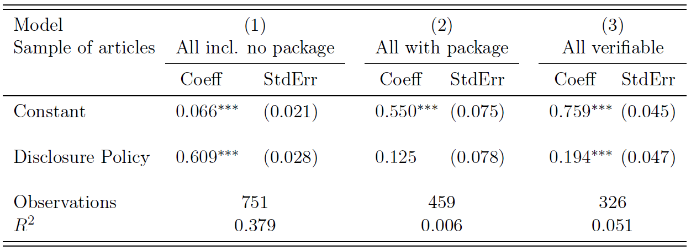{fig-align="center"}

## Overall reproducibility {visibility="uncounted"}

Linear probability model: **Largely or fully reproduced** (binary)

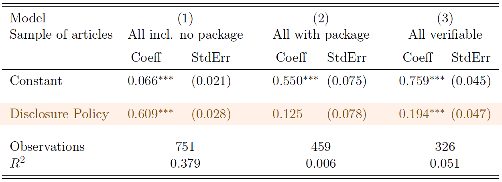{fig-align="center"}

## Reproducibility of tables {visibility="uncounted"}

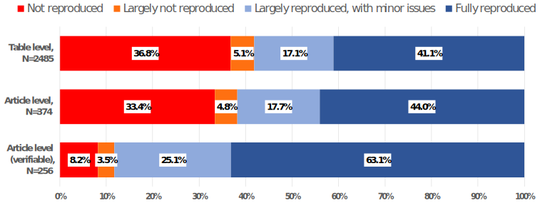{fig-align="center"}

## Reproducibility of figures {visibility="uncounted"}

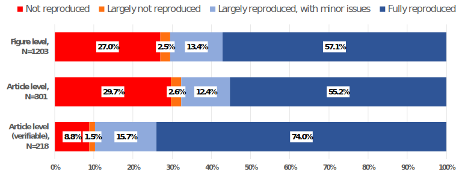{fig-align="center"}

## Reproducibility of other results {visibility="uncounted"}

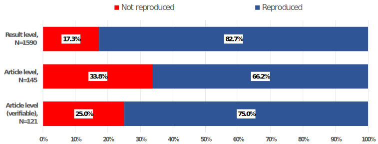{fig-align="center"}

## Software {visibility="uncounted"}

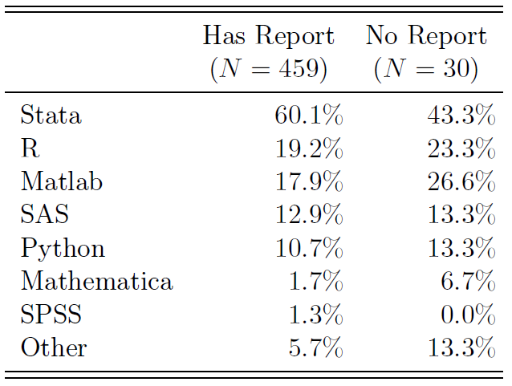{fig-align="center"}

## Reasons for non-reproducibility {visibility="uncounted"}

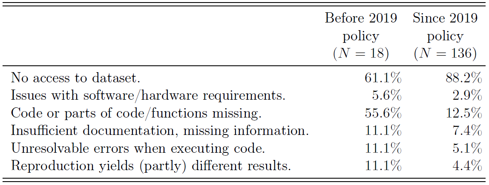{fig-align="center"}

## Article type / method by journal department {visibility="uncounted"}

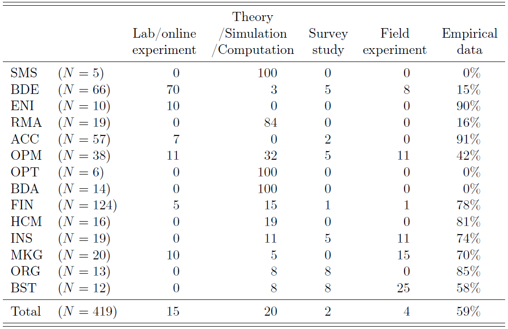{fig-align="center"}

## Robustness {visibility="uncounted"}
 
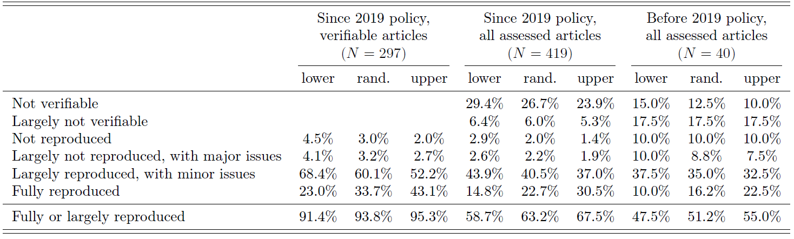{fig-align="center"}

## Robustness {visibility="uncounted"}

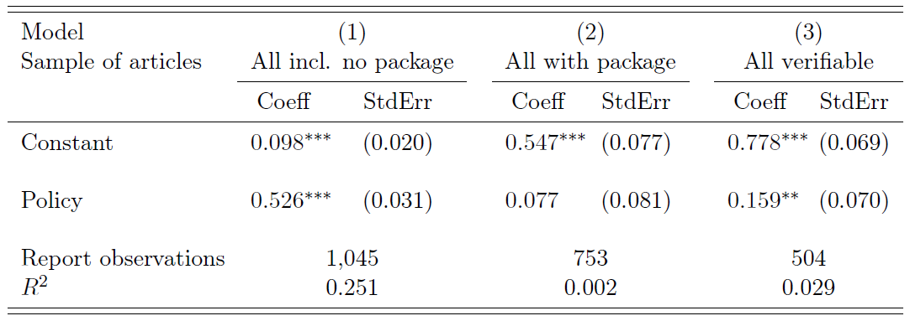{fig-align="center"}

## Robustness {visibility="uncounted"}

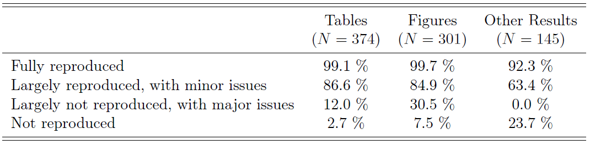{fig-align="center"}

