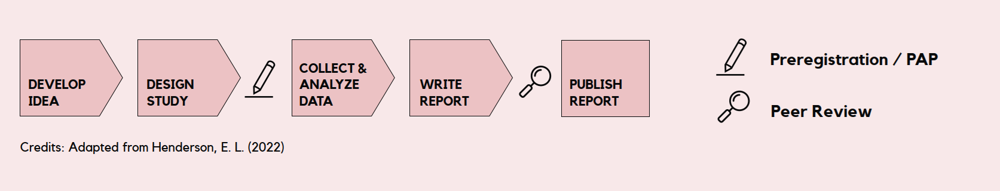
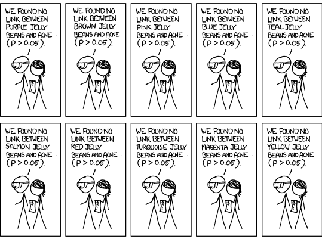
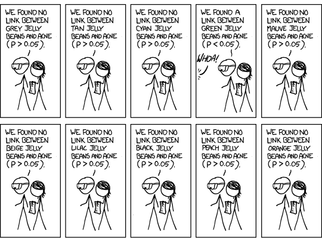
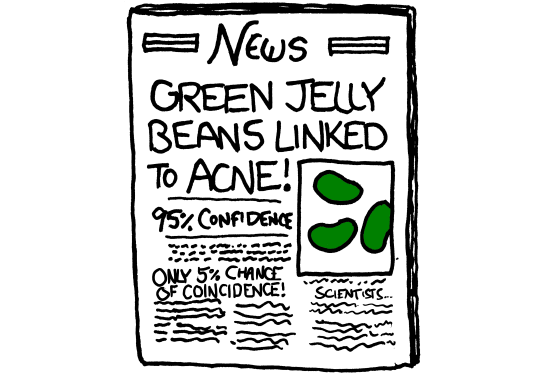
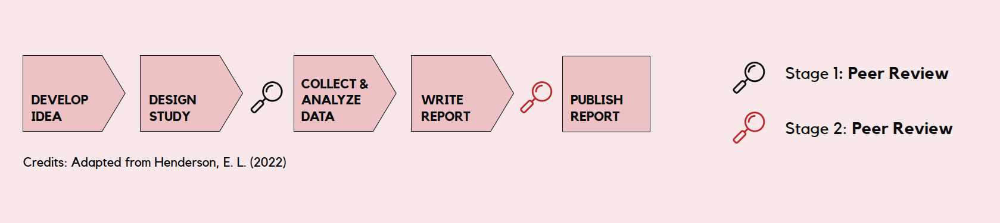
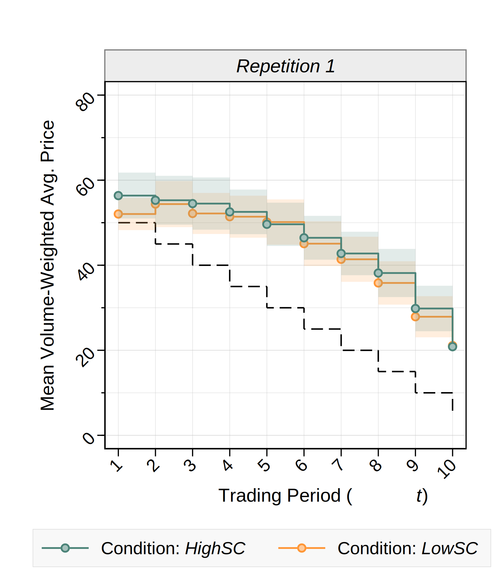
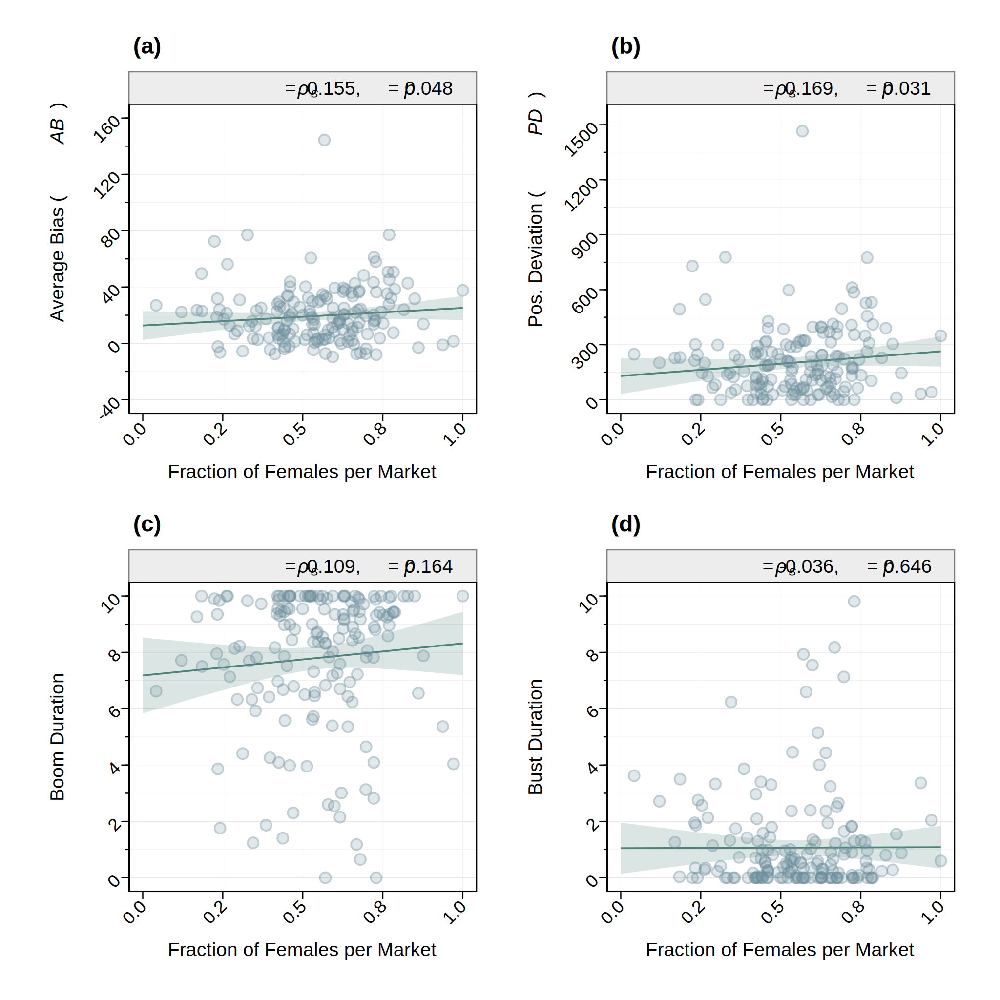
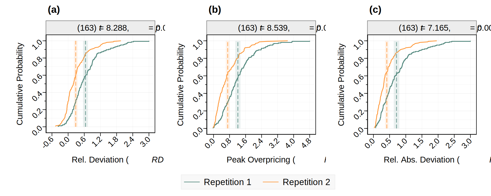

# Introduction

## Navigating Pre-Registration and Reproducibility

### Goals of this talk

- Recognize common questionable research practices 

- Understand the role of pre-registration and reproducibility in improving scientific credibility

- Learn how to pre-register studies and write pre-analysis plans

- Navigate the current publishing norms w.r.t pre-registration and reproducibility

## Navigating Pre-Registration and Reproducibility

### Outline

# Why Preregistration Matters {.center background-color="#9BD84C"}

## What is Preregistration?

Preregistration means writing down your study plan --- including hypotheses, methods, and analyses --- before you collect or look at the data.

. . .

Key Idea:

::: incremental
-   You commit in advance to what you plan to test and how you will test it.

    -   **pre-** ... You commit *in advance* ... $\rightarrow$ *before* data collection

    -   **-registration** ... You *commit* ... $\rightarrow$ plan is *registered* on a public repository

 

-   Prevents flexible decisions that bias results ("p-hacking").

-   Makes it clear what was planned vs. what was discovered later.
:::

## What is Preregistration?

Preregistration means writing down your study plan --- including hypotheses, methods, and analyses --- before you collect or look at the data.

  

Path for a preregistered study:

{fig-align="center"}

## Why Preregistration Matters?

Simmons et al. (2021): A scientist's job consists of two parts:

::: incremental
-   discover true facts about the world

-   interpret those facts

    -   ideally in the service of building theories that allow us to better predict the future
:::

. . .

You cannot competently do the second part without doing the first part. You cannot generate correct theories on a foundation of incorrect facts.

::: aside
Simmons, J. P., D Nelson, L., & Simonsohn, U. (2021). Pre‐registration: Why and how. Journal of Consumer Psychology, 31(1), 151-162.
:::

## Why Preregistration Matters?

$\rightarrow$ Scientific results need to be replicable, such that policies/actions can be based upon them (Ioannidis, 2005; Ioannidis et al., 2013).

. . .

**Replication Crisis**

::: columns
::: {.column width="50%"}
-   Open Science Collaboration (2015)

    -   36% of 97 psychology papers with significant effects replicated

-   Camerer et al. (2016)

    -   61% of 18 economics lab experiments replicated (with 66% of the original effect size, on average)
:::

::: {.column width="50%"}
-   Camerer et al. (2018)

    -   62% of 21 social science experiments in Nature/Science replicated

-   Davis et al. (2023)

    -   80% of 10 behavioral operations management studies published in Management Science replicated
:::
:::

## Why Preregistration Matters?

Simmons et al. (2021): A scientist's job consists of two parts:

-   discover true facts about the world

-   interpret those facts

. . .

$\rightarrow$ unfortunately, many of the *facts* in the social sciences are wrong!

. . .

But why?

Many published findings *"... are false precisely because it is easy for moral, competent researchers to generate false findings. ...*

## Why Preregistration Matters? {visibility="uncounted"}

Simmons et al. (2021): A scientist's job consists of two parts:

-   discover true facts about the world

-   interpret those facts

$\rightarrow$ unfortunately, many of the *facts* in the social sciences are wrong!

But why?

Many published findings *"... are false precisely because it is easy for moral, competent researchers to generate false findings. ... The bulk of the problem is not caused by immorality or incompetence. It is caused by the selective reporting of analyses that generate desirable results.*" (p. 153)

. . .

$\rightarrow$ more generally: **questionable research practices**

## Questionable Research Practices

-   research practices that are increase the risk of false-positive results, often without clear disclosure

-   not misconduct, but more of a *gray area*

. . .

Examples:

::: incremental
-   **p-hacking:** Trying many analyses and reporting only the significant ones.

-   **HARKing** (Hypothesizing After the Results are Known): Presenting a post hoc explanation as if it were planned all along.

-   **Selective Reporting:** Only reporting outcomes that "worked" and ignoring others.

-   **Flexible Data Exclusions:** Dropping participants or data points without a pre-specified rule.

-   **Outcome Switching:** Changing the primary outcome based on what looks best.
:::

## Researcher Degrees of Freedom

Questionable Research Practices can arise when there are **Researcher Degrees of Freedom**  $\rightarrow$ to test a hypothesis, a researcher often has to make many analytic decisions

. . .

For example:

::: incremental
-   which measures to analyze (and how to code and combine them)

-   which controls to use (and how to code and combine them)

-   which observations to exclude

-   which moderators to test

-   which subgroups to analyze

-   ...
:::

## p-hacking

Null Hypothesis Significance Testing: in social sciences, we often use $p<0.05$ to determine whether a result is *significant*, i.e., whether we reject the null hypothesis

. . .

$\rightarrow$ we usually accept a false-positive rate of 5%

. . .

 

However, this hinges on an important assumption!

. . .

**Assumption:** *Researchers will run exactly* one *analysis on their data!*  *(or correct for how many analyses they are willing to run)*

## Multiple Hypothesis Testing

{fig-align="center"}

## Multiple Hypothesis Testing

{fig-align="center"}

## Multiple Hypothesis Testing

::: columns
::: {.column width="50%"}

:::

::: {.column width="50%"}
:::
:::

::: aside
From https://xkcd.com/882/
:::

## Multiple Hypothesis Testing {visibility="uncounted"}

::: columns
::: {.column width="50%"}

:::

::: {.column width="50%"}
Null Hypothesis Significance Testing

Standard approach: correct for multiple hypothesis tests, i.e., for how many analyses you are willing to run (e.g., Bonferroni)
:::
:::

::: aside
From https://xkcd.com/882/
:::

## p-hacking

::: columns
::: {.column width="50%"}

:::

::: {.column width="50%"}
Null Hypothesis Significance Testing

**If you run enough analyses, some will look 'significant' even if there's no real effect.**
:::
:::

::: aside
From https://xkcd.com/882/
:::

## p-hacking {visibility="uncounted"}

::: columns
::: {.column width="50%"}

:::

::: {.column width="50%"}
**If you run enough analyses, some will look 'significant' even if there's no real effect.**

Problem with p-hacking: you do not know how many analyses the researcher actually ran!

 

$\rightarrow$ researchers are necessarily increasing the false-positive rate they accept to a level above 5%!
:::
:::

::: aside
From https://xkcd.com/882/

How much does the accepted false-positive rate increase? $\rightarrow$ depends on how many analyses researchers are willing to run and on how correlated they are
:::

## p-hacking

**If you run enough analyses, some will look 'significant' even if there's no real effect.**

Problem with p-hacking: you do not know how many analyses the researcher actually ran!

 

$\rightarrow$ researchers are necessarily increasing the false-positive rate they accept to a level above 5%!

**P-hacking can make it easy to repeatedly find statistically significant support for any hypothesis**

## How Preregistration Improves Credibility

<b><u>Without pre-registration</u>, p-hacking is not just easy to <u>do</u>, but actually hard to <u>avoid</u>!</b>

. . .

To *not* p-hack, researchers have to

::: incremental
1.  perfectly plan out, in advance, all of the key details of their critical analysis,

2.  conduct that analysis, and

3.  remember to report that analysis, rather than a different analysis, as the one that "counts" (with other analyses being reported as "exploratory" or "tentative").
:::

. . .

Researchers must decide exactly how they will conduct their key analysis before they collect their data.

. . .

And then they must commit to it.

## How Preregistration Improves Credibility {visibility="uncounted"}

<b><u>Without pre-registration</u>, p-hacking is not just easy to <u>do</u>, but actually hard to <u>avoid</u>!</b>

To *not* p-hack, researchers have to

1.  perfectly plan out, in advance, all of the key details of their critical analysis,

2.  conduct that analysis, and

3.  remember to report that analysis, rather than a different analysis, as the one that "counts" (with other analyses being reported as "exploratory" or "tentative").

Researchers must decide exactly how they will conduct their key analysis before they collect their data.

And then they must commit to it. $\rightarrow$ **PRE-REGISTRATION**

::: aside
Simmons et al. (2021)
:::

## "Is Preregistration Only for RCTs?"

Preregistration is well-suited to be applied for experimental studies, surveys, etc.

. . .

But what about studies using *observational* (secondary) *data*?

. . .

- None of what I said so far *only* applies to experimental research

    - If anything, questionable research practices in observational research are even more common
    
. . .

$\rightarrow$ **Almost any type of empirical study can benefit from a preregistration, especially if the authors did not have access to the final dataset before the study began!**

## Preregistration vs. Registered Reports

**Preregistration** is a time-stamped, read-only plan:

{style="width:60%"}

. . .

**Registered Report:** extended plan that undergoes formal peer review ahead of the research

. . .

{style="width:60%"}

# How to Preregister {.center background-color="#9BD84C"}

## Preregistrations and Pre-analysis Plans

<u>Goal of preregistration:</u> distinguish between what was **planned** (confirmatory, hypothesis-testing) vs. what was **discovered later** (exploratory, hypothesis, generating)

. . .

$\rightarrow$ requirements very small: can be minimal, just needs to time-stamp your basic plan

. . .

<u>More generally: </u> we want to prevent flexible decisions that can bias results ("p-hacking")

. . .

$\rightarrow$ specify exactly how the analysis will be conducted, step-by-step $\rightarrow$ **Pre-analysis Plan (PAP)**

. . .

 

Recent evidence from 15 leading economics journals:

::: incremental
-   pre-registration in itself does not reduce p-hacking and publication bias

-   pre-registration *including* PAP $\rightarrow$ reduced p-hacking and publication bias
:::

::: aside
Brodeur et al. (2024) Do Pre-Registration and Pre-Analysis Plans Reduce p-Hacking and Publication Bias?
:::

## Preregistrations and Pre-analysis Plans

<u>Goal of preregistration:</u> distinguish between what was **planned** (confirmatory, hypothesis-testing) vs. what was **discovered later** (exploratory, hypothesis, generating)

$\rightarrow$ requirements very small: can be minimal, just needs to time-stamp your basic plan

<u>More generally: </u> we want to prevent flexible decisions that can bias results ("p-hacking")

$\rightarrow$ specify exactly how the analysis will be conducted, step-by-step $\rightarrow$ **Pre-analysis Plan (PAP)**

 

In economics: \~50% of pre-registration have no PAP!

. . .

In this lecture (= what I believe you should do): pre-registrations *with* PAP

## Where to Preregister

You can preregister your study on a public repository for preregistrations; for example:

-   **AsPredicted.org** [https://aspredicted.org](https://aspredicted.org)

    -   Simple, standardized template

-   **AEA RCT Registry** [https://www.socialscienceregistry.org/](https://www.socialscienceregistry.org/)

    -   Mainy for RCTs but can also be used more generally

-   **Open Science Framework** (OSF, [https://osf.io](https://osf.io))

    -   Different templates or free-form registration

. . .

Templates differ greatly in level of detail required!

::: aside
There are many more, but these three are the ones most commonly used on economics, finance, and related fields.
:::

## Resources

- Center for Open Science / OSF: [https://www.cos.io/initiatives/prereg](https://www.cos.io/initiatives/prereg)

- Registration Forms and Templates: [https://osf.io/zab38/wiki/home/](https://osf.io/zab38/wiki/home/)

- Example preregistrations: [https://osf.io/e6auq/wiki/Example%20Preregistrations/](https://osf.io/e6auq/wiki/Example%20Preregistrations/)

- Lab2 Materials: [https://labsquare.net/materials/educational](https://labsquare.net/materials/educational)

## Basic Elements

The structure of your preregistration and the specific headings will differ depending on the template. However, at least the following **basic elements** are (or should be!) *part of every preregistration*:

::: incremental
-   Research Questions & Hypotheses

-   Study design: survey design / experimental design

    -   Precise measures of all relevant variables

    -   Treatments and assignment mechanism

-   Sample size you intend to collect

-   Detailed pre-analysis plan

    -   Explicitly states all statistical analysis you plan to conduct
:::

## Hypotheses

Example:  *"We explore various relationships between management practices and employee outcomes."*

. . .

Why is this a bad example?

::: incremental
-   vague

-   not falsifiable

-   "exploring" does not commit to any test
:::

. . .

$\rightarrow$ better: **"Offering flexible working hours increases self-reported employee productivity."**

## Outcome Measures

Example: *"We measure various aspects of employee performance."*

. . .

Why is this a bad example?

::: incremental
-   no clear primary outcome

-   "various aspects" allows to cherry-pick which aspect to focus on (i.e., which one's results you like the most)
:::

. . .

$\rightarrow$ better:  **"Primary outcome: average self-reported productivity, measured weekly on a 5-point Likert scale."**

## Sample Size and Power Analysis

Example: *"We aim to get as many participants as possible."*

. . .

Why bad?

::: incremental
-   no target or limit

-   no justification

-   allows you to look at the data and choose when to stop data collection (potentially depending on the results)
:::

. . .

$\rightarrow$ better:  "**We plan to recruit 300 participants to achieve 80% power for detecting an effect d = 0.3 at** $\alpha=0.05$."

## Analysis Plan

Example: *"We will analyse our hypotheses using OLS regressions."*

. . .

-   far too vague $\rightarrow$ massive potential for p-hacking

. . .

Another example: "We will use OLS regression of productivity on treatment, controlling for baseline productivity."

. . .

$\rightarrow$ better: "**We will estimate the following regression model using OLS, with clustered standard errors at the firm level:** $P_i = \beta_0 + \beta_1 T_i + \beta_2 \text{Prod}_i + \varepsilon_i$"

. . .

What is maybe still missing?

. . .

How to deal with outliers? How to deal with missing values? Are variables transformed? Etc.

## Analysis Plan

The **best** way to pre-register an analysis plan -- although I've almost never seen this (yet) -- is ... ?

. . .

... to already pre-register the **analysis code**!

. . .

 

Example: [PAP for ManyDesigns project (Huber et al., 2023)](https://osf.io/qpdu3)

. . .

 

$\rightarrow$ We can think of a pre-registration as front-loading part of the work for what you will do in preparing your replication package

# Let's try this! {.center background-color="#9BD84C"}

## Mini-Exercise: Draft a Quick Preregistration

Take a few minutes to think about a research project you are currently working on — or an idea you've been considering (can also be hypothetical). Write down: 

  - Main Hypothesis

      -   What effect are you trying to test?
      
  - Primary Outcome
  
      -   What exactly would you measure?
      
  - Basic Analysis Plan
  
      -   What is your analysis plan? 
      -   What statistical method will you use? And how?
      
- Don’t overthink — just draft!

- Focus on being clear, not complete

...

# Pre-registration and PAP: Recap {.center background-color="#9BD84C"}

## What to include in your PAP? (1)

To enhance transparency and limit researcher degrees of freedom, the following elements should be included in your PAP:

::: columns
::: {.column width="50%"}
-   Research Questions & Hypotheses

-   Sample

    -   Sample selection, a priori power calculation, justification of sample size, population, and key mediation paths

-   Sequencing of Analyses

    -   Order of analyses (e.g., primary vs. secondary tests), including subgroup analyses, heterogeneity, and robustness checks
:::

::: {.column width="50%"}
-   Design Details

    -   Balance tests (if applicable), data cleaning steps, handling of outliers, and transformations

-   Data Sources & Variables

    -   Outcomes, the target sample size, data collection methods, stopping rules (i.e. opportunistic stopping of data collection in experiments), and variable construction

:::
:::

## What to include in your PAP? (2)

To enhance transparency and limit researcher degrees of freedom, the following elements should be included in your PAP:

::: columns
::: {.column width="50%"}
-   Statistical Approach - Outcomes

    -   Define variable construction and scoring methods, and the significance threshold used to evaluate test results
  
-   Pilot and existing data

    -   Performed and planned pilot data collections, and existing data (e.g., use of secondary data, existing panel studies)
    
:::

::: {.column width="50%"}
-   Ethics

    -   Address consent, data governance, and ethical principles such as Beneficence and Justice
    
-   Statistical Methods

    -   Explain the statistical models and methods. Include details of estimators and their implementation. Specify any control variables, moderators, or adjustments.
    

:::
:::

## Increasing the Quality of your PAPs

PAPs especially effective if they are **specific**, **precise**, and 
**exhaustive** (Bakker, Marjan, et al., 2020) $\rightarrow$  researchers can reduce unintended flexibility, supporting the credibility of their findings

 

. . .

Example: *“We will use the general risk question (Dohmen et al., 2011) to measure risk preferences.”* $\rightarrow$ **specific, but not precise and exhaustive**

. . .

Example: *“We will use the general risk question (Dohmen et al., 2011), which asks respondents to state their willingness to take risks on an 11-point Likert scale, to measure risk preferences.”*  $\rightarrow$ **specific and precise, but not exhaustive**

## Increasing the Quality of your PAPs

PAPs especially effective if they are **specific**, **precise**, and 
**exhaustive** (Bakker, Marjan, et al., 2020) $\rightarrow$  researchers can reduce unintended flexibility, supporting the credibility of their findings

 

Example: *“We will use the general risk question (Dohmen et al., 2011), which asks respondents to state their willingness to take risks on an 11-point Likert scale, and treat the chosen value as the continuous measure of risk preferences (i.e., the response ranges from 0 to 10, with higher values indicating higher risk tolerance).”* $\rightarrow$ **specific, precise, and exhaustive** $\checkmark$

## Challenges / Common questions

**What should I do if unforeseen issues occur before, during, or after data collection?**

- More generally: can I *change* my Preregistration / PAP?

. . .

Yes, but ... 

**Any deviations from the original plan must be reported in the paper!**

. . .

 

$\rightarrow$ Transparent Changes Template: [https://osf.io/yrvcg](https://osf.io/yrvcg)

$\rightarrow$ Example: Haushofer & Shapiro (2016 QJE): [https://doi.org/10.1093/qje/qjw025](https://doi.org/10.1093/qje/qjw025)

$\rightarrow$ Pre-registering of pilot or ex-ante manipulation check? Sure: Huber et al. (2024) [https://osf.io/8wka2](https://osf.io/8wka2)

## Challenges / Common questions

**Can I still run exploratory analyses or robustness checks?**

. . .

Yes, but ...

- pre-registered hypotheses have to remain intact

- any unregistered tests have to be explicitly reported as such

. . .

$\rightarrow$ Example: [Huber et al. (2023)](https://www.pnas.org/doi/10.1073/pnas.2215572120): preregistered vs. not preregistered results

$\rightarrow$ Another solution: add something like "This analysis is not preregistered."

::: aside
Adding exploratory, non-preregistered analyses often become necessary due to reviewer requests. However, the pre-registration can also help you to push back!
:::

# Navigating the Journal Landscape {.center background-color="#9BD84C"}

## What do I *really* need to do?

. . .

Well, it depends ... 

. . .

- Journal policies differ a lot (both between and within fields)

- TOP Factor can be a useful metric (and look-up tool), however, it is not updated anymore 

    -   [https://topfactor.org](https://topfactor.org)
    
    -   Factor descriptions: [https://topfactor.org/summary](https://topfactor.org/summary)
    
    -   Journal finder: [https://topfactor.org/journals](https://topfactor.org/journals)
    
. . .

- Check journal or publisher pages for their current policies

## Do I really need to pre-register my study?

::: incremental
- From a purely scientific standpoint: **YES!** (of course)

- From a journal standpoint: Well ... 

    - On paper, no economics / finance / management journal requires pre-registration 
    
    - BUT: rejection (at least partly) based on the lack of a pre-registration is common for experimental/survey studies (at least in top journals)
    
    - I expect policies to adapt $\rightarrow$ pre-registrations *and* PAPs will be required in the future, so why not start doing it now?
    
- From a selfish standpoint: also **YES** (see  Wagenmakers and Dutilh, 2016)

:::

::: aside
 Eric-Jan Wagenmakers and Gilles Dutilh: Seven Selfish Reasons for Preregistration: https://www.psychologicalscience.org/observer/seven-selfish-reasons-for-preregistration
:::

## Do I really need to prepare a replication package?

#### What we do at *Management Science*

::: incremental
- *”Authors of accepted papers … must provide … the data, programs, and other details … sufficient to permit replication.”*

    -   $\rightarrow$ reproducibility
    
- Code and Data Editor (CDE) Code & Data Associate Editors (CDAEs)

    -   review replication packages for completeness but <u>do not (necessarily) test reproducibility</u>
    
- Requirements essentially the same as for top journals in economics
:::

## Do I really need to prepare a replication package?

#### What we do at *Management Science*

::: incremental
- Before introduction of policy: 95% of papers could not be reproduced!

    -   main reason for non-reproducibility: there is no replication package
    
- Since introduction: 68% of papers *could* be reproduced

    -   main reason for non-reproducibility: data is not shared
    
    -   nevertheless: large differences between fields
:::

::: aside
Fišar, M., Greiner, B., Huber, C., Katok, E., Ozkes, A. I., & Management Science Reproducibility Collaboration. (2024). Reproducibility in management science. Management Science, 70(3), 1343-1356.
:::

## Do I really need to prepare a replication package?

**YES, YES, YES!**

::: incremental
- From a purely scientific standpoint: YES ($\rightarrow$ reproducibility!)

- From a journal standpoint: YES

    -  20 of the 24 journals used for the UT Dallas Business School rankings have a code/data disclosure policy; in 10 of them, code/data sharing is compulsory 
    
    - 23 out of top 25 jourmals in the 2022 Scimago ranking in Economics and Econometrics have a code/data disclosure policy; in 17 of them, code/data sharing is compulsory
  

- From a selfish standpoint: Yes 

    -   is it *more* work? probably not, *if you do it from Day 1*
    
    -   but: it helps to structure and think through the research design

:::

## Wrap-up {background-color="#9BD84C"}

- Pre-registration is about **transparency** (confirmatory vs. exploratory)

- Pre-registration is about the **credibility** of your work

- Pre-registration is **a plan, not a prison**

- Editors and reviewers do require this (and look at it!) and will require this even more in the future  

- Goal: *reduce* researcher degrees of freedom  $\rightarrow$ pre-register as many decisions you anticipate as possible

- Workflow: Pre-registering your study and analysis plan can be the first step to reproducible (and replicable!) research

# Example: Do Experimental Asset Markets Replicate?

## Introduction

::: columns
::: {.column .incremental width="65%"}
-   asset prices bubbles and crashes are at the heart of financial markets

-   joint hypothesis problem in empirical data as FV not observable

-   $\rightarrow$ **asset market experiments**  (Smith, Suchanek, Williams, 1988)

-   {width="60%"}
:::

::: {.column width="35%"}
{style="margin:0;"} {style="margin:0;"}
:::
:::

::: notes
costs to individuals, households, and society
:::

## Introduction

::: columns
::: {.column width="65%"}
Limitations of this literature:
:::

::: {.column width="35%"}
{style="margin:0;"} {style="margin:0;"}
:::
:::

## Introduction {visibility="uncounted"}

::: columns
::: {.column width="65%"}
Limitations of this literature:

-   many results rely on a single study
-   most results rely on <u>very few independent observations</u>
    -   groups of 6, 8, 10 traders  $\rightarrow$ only 1 independent market price per group
    -   rarely more than 10 groups, often fewer
-   lack of randomization
:::

::: {.column width="35%"}
{style="margin:0;"} {style="margin:0;"}
:::
:::

## Introduction {visibility="uncounted"}

::: columns
::: {.column width="65%"}
Limitations of this literature:

-   many results rely on a single study
-   most results rely on <u>very few independent observations</u>
    -   groups of 6, 8, 10 traders  $\rightarrow$ only 1 independent market price per group
    -   rarely more than 10 groups, often fewer
-   lack of randomization

$\rightarrow$ limited statistical power, weakened causal inference
:::

::: {.column width="35%"}
{style="margin:0;"} {style="margin:0;"}
:::
:::

## Introduction {visibility="uncounted"}

::: columns
::: {.column width="65%"}
Limitations of this literature:

-   many results rely on a single study
-   most results rely on <u>very few independent observations</u>
    -   groups of 6, 8, 10 traders  $\rightarrow$ only 1 independent market price per group
    -   rarely more than 10 groups, often fewer
-   lack of randomization

$\rightarrow$ limited statistical power, weakened causal inference

$\rightarrow$ important to assess the credibility of reported findings   $\rightarrow$ **replications**
:::

::: {.column width="35%"}
{style="margin:0;"} {style="margin:0;"}
:::
:::

## This paper

::: columns
::: {.column width="65%"}
High-powered preregistered replications of 17 key results

-   results taken from four prominent papers published in Am Econ Rev, J Finance, Rev Financ Stud, Rev Financ

    -   Kocher et al. (2019): Unleashing animal spirits: Self-control and overpricing in experimental asset markets

    -   Andrade et al. (2016): Bubbling with excitement: An experiment

    -   Eckel et al. (2015): Thar she blows? Gender, competition, and bubbles in experimental asset markets

    -   Corgnet et al. (2018): What makes a good trader? On the role of intuition and reflection on trader performance
:::

::: {.column width="35%"}
:::
:::

## This paper {visibility="uncounted"}

::: columns
::: {.column width="65%"}
High-powered preregistered replications of 17 key results

-   results taken from four prominent papers published in Am Econ Rev, J Finance, Rev Financ Stud, Rev Financ

    -   Kocher et al. (2019): Unleashing animal spirits: Self-control and overpricing in experimental asset markets

    -   Andrade et al. (2016): Bubbling with excitement: An experiment

    -   Eckel et al. (2015): Thar she blows? Gender, competition, and bubbles in experimental asset markets

    -   Corgnet et al. (2018): What makes a good trader? On the role of intuition and reflection on trader performance
:::

::: {.column width="35%"}
{width="60%" style="margin:0;"} emotions
:::
:::

## This paper {visibility="uncounted"}

::: columns
::: {.column width="65%"}
High-powered preregistered replications of 17 key results

-   results taken from four prominent papers published in Am Econ Rev, J Finance, Rev Financ Stud, Rev Financ

    -   Kocher et al. (2019): Unleashing animal spirits: Self-control and overpricing in experimental asset markets

    -   Andrade et al. (2016): Bubbling with excitement: An experiment

    -   Eckel et al. (2015): Thar she blows? Gender, competition, and bubbles in experimental asset markets

    -   Corgnet et al. (2018): What makes a good trader? On the role of intuition and reflection on trader performance
:::

::: {.column width="35%"}
{width="60%" style="margin:0;"} emotions

{width="60%" style="margin:0;"} self-control
:::
:::

## This paper {visibility="uncounted"}

::: columns
::: {.column width="65%"}
High-powered preregistered replications of 17 key results

-   results taken from four prominent papers published in Am Econ Rev, J Finance, Rev Financ Stud, Rev Financ

    -   Kocher et al. (2019): Unleashing animal spirits: Self-control and overpricing in experimental asset markets

    -   Andrade et al. (2016): Bubbling with excitement: An experiment

    -   Eckel et al. (2015): Thar she blows? Gender, competition, and bubbles in experimental asset markets

    -   Corgnet et al. (2018): What makes a good trader? On the role of intuition and reflection on trader performance
:::

::: {.column width="35%"}
{width="60%" style="margin:0;"} emotions

{width="60%" style="margin:0;"} self-control

{width="60%" style="margin:0;"}   behavioral/cognitive factors
:::
:::

::: notes
--\> relationship between asset market prices and emotions, self-control, experience, and gender\
--\> what characteristics - cognitive reflection, fluid intelligence, and theory of mind - can explain trading success

-   replication sample sizes between 1.6x and 9x original sample size\
    (average: 7.2x original)
:::

## Replication protocol

### Treatments

Laboratory asset market experiment with 4 conditions:

::: columns
::: {.column width="50%"}
From Andrade et al. (2016):  induce emotions with 5min movie clip

{width="20%" fig-align="center" style="margin:0"}

-   Excitement treatment

-   Calm treatment
:::

::: {.column width="50%"}
:::
:::

## Replication protocol {visibility="uncounted"}

### Treatments

Laboratory asset market experiment with 4 conditions:

::: columns
::: {.column width="50%"}
From Andrade et al. (2016):  induce emotions with 5min movie clip

{width="20%" fig-align="center" style="margin:0"}

-   Excitement treatment

-   Calm treatment
:::

::: {.column width="50%"}
From Kocher et al. (2019):  exhaust self-control with Stroop task

{width="80%" fig-align="center" style="margin:0"}

-   Low Self-Control (LowSC) treatment

-   High Self-Control (HighSC) treatment
:::
:::

## Replication protocol

### Market settings

Continuous double-auction markets resembling Smith et al. (1988, SSW):

-   long-lived asset with risky dividend payments

-   8 or 10 traders per market

-   Ten 2-minute periods

-   Dividends: 0 or 10 ECUs (50% prob.)

-   Endowments: (60; 1,000) or (20; 3,000)

## Replication protocol {visibility="uncounted"}

### Market settings

Continuous double-auction markets resembling Smith et al. (1988, SSW):

-   long-lived asset with risky dividend payments

-   8 or 10 traders per market

-   Ten 2-minute periods

-   Dividends: 0 or 10 ECUs (50% prob.)

-   Endowments: (60; 1,000) or (20; 3,000)

-   *New element:* 2 repetitions of each market

## Data collection

Preregistered to collect 166 markets in 83 sessions:

-   31 markets per condition in replication of AOL

-   52 markets per condition in replication of KLS

$\rightarrow$ 1.6x to 9x original sample size   $\rightarrow$ **at least 90% power to detect 2/3 of the original effect sizes at the 5% level**

## Data collection {visibility="uncounted"}

Preregistered to collect 166 markets in 83 sessions:

-   31 markets per condition in replication of AOL

-   52 markets per condition in replication of KLS

$\rightarrow$ 1.6x to 9x original sample size   $\rightarrow$ **at least 90% power to detect 2/3 of the original effect sizes at the 5% level**

  **83 sessions** with **1,544 participants**

-   Each session: either 2 conditions from AOL or 2 conditions from KLS $\rightarrow$ randomization

::: aside
-   Average time: 1h 50min
-   Average payments: € 30.28 in AOL-treatments; € 37.08 in KLS-treatments
:::

# Results {visibility="hidden"}

##  {.center background-color="#9BD84C"}

<h1>Results</h1>

## Emotions and market efficiency

::: columns
::: {.column width="50%"}
<strong> </strong>

-   overpricing (RD) is higher in the Excitement condition than in the Calm condition\
    p \< 0.001, n = 39
-   peak overpricing (RD_MAX) is higher in the Excitement condition than in the Calm condition\
    p \< 0.001, n = 39
:::

::: {.column width="50%"}
**Original study (Andrade et al., 2016)**

:::
:::

## Emotions and market efficiency {visibility="uncounted"}

::: columns
::: {.column width="50%"}
**Direct Replication** {fig-align="center" width="80%" style="margin-top:0;"}
:::

::: {.column width="50%"}
**Original study (Andrade et al., 2016)**

:::
:::

## Emotions and market efficiency

::: columns
::: {.column width="50%"}
**Direct Replication** {fig-align="center" width="80%" style="margin-top:0;"}
:::

::: {.column .incremental width="50%"}
<strong> </strong>

-   overpricing (RD) is <u>not</u> higher in the Excitement condition than in the Calm condition\
    p = 0.369, n = 62

-   peak overpricing (RD_MAX) is <u>not</u> higher in the Excitement condition than in the Calm condition\
    p = 0.483, n = 62
:::
:::

## Emotions and market efficiency {visibility="uncounted"}

::: columns
::: {.column width="50%"}
**Direct Replication** {fig-align="center" width="80%" style="margin-top:0;"}
:::

::: {.column width="50%"}
<strong> </strong>

-   overpricing (RD) is <u>not</u> higher in the Excitement condition than in the Calm condition\
    p = 0.369, n = 62

-   peak overpricing (RD_MAX) is <u>not</u> higher in the Excitement condition than in the Calm condition\
    p = 0.483, n = 62

::: {.alert-box .warning}
$\rightarrow$ **Replication fails**   effect not significant   effect in opposite direction
:::
:::
:::

## Self-control and market efficiency

::: columns
::: {.column width="50%"}
<strong> </strong>

-   overpricing (RD) is higher in the LowSC than in the HighSC condition\
    p = 0.0742, n = 16 (Mann-Whitney U-test)\
    p = 0.0580 (re-estimated t-test)
-   mispricing (RAD) is higher in the LowSC condition than in the HighSC condition\
    p = 0.0460, n = 16 (Mann-Whitey U-test)\
    p = 0.0317 (re-estimated t-test)
:::

::: {.column width="50%"}
**Original study (Kocher et al., 2019)**

:::
:::

## Self-control and market efficiency {visibility="uncounted"}

::: columns
::: {.column width="50%"}
**Direct Replication** {fig-align="center" width="80%" style="margin-top:0;"}
:::

::: {.column width="50%"}
**Original study (Kocher et al., 2019)**

:::
:::

## Self-control and market efficiency

::: columns
::: {.column width="50%"}
**Direct Replication** {fig-align="center" width="80%" style="margin-top:0;"}
:::

::: {.column .incremental width="50%"}
<strong> </strong>

-   overpricing (RD) is <u>not</u> higher in the LowSC than in the HighSC condition\
    p = 0.512, n = 104

-   mispricing (RAD) is <u>not</u> higher in the LowSC condition than in the HighSC condition\
    p = 0.452, n = 104
:::
:::

## Self-control and market efficiency {visibility="uncounted"}

::: columns
::: {.column width="50%"}
**Direct Replication** {fig-align="center" width="80%" style="margin-top:0;"}
:::

::: {.column width="50%"}
<strong> </strong>

-   overpricing (RD) is <u>not</u> higher in the LowSC than in the HighSC condition\
    p = 0.512, n = 104

-   mispricing (RAD) is <u>not</u> higher in the LowSC condition than in the HighSC condition\
    p = 0.452, n = 104

::: {.alert-box .warning}
$\rightarrow$ **Replication fails**   effect not significant   effect in opposite direction
:::
:::
:::

## Gender composition and market efficiency

::: columns
::: {.column width="45%"}
**Original study (Eckel/Füllbrunn, 2015)**

-   fraction of female traders is negatively associated with "bubble measures":
    -   average bias (AB): Spearman correlation −0.477 (p = 0.004, n = 35)
    -   positive deviation (PD): Spearman correlation −0.351 (p = 0.039, n = 35)
    -   boom duration: Spearman correlation −0.390 (p = 0.021, n = 35)
    -   bust duration: Spearman correlation 0.529 (p = 0.001, n = 35)
:::

::: {.column widt="55%"}
:::
:::

## Gender composition and market efficiency {visibility="uncounted"}

::: columns
::: {.column width="45%"}
**Original study (Eckel/Füllbrunn, 2015)**

-   fraction of female traders is negatively associated with "bubble measures":
    -   average bias (AB): Spearman correlation −0.477 (p = 0.004, n = 35)
    -   positive deviation (PD): Spearman correlation −0.351 (p = 0.039, n = 35)
    -   boom duration: Spearman correlation −0.390 (p = 0.021, n = 35)
    -   bust duration: Spearman correlation 0.529 (p = 0.001, n = 35)
:::

::: {.column widt="55%"}
{fig-align="center"}
:::
:::

## Gender composition and market efficiency {visibility="uncounted"}

::: columns
::: {.column width="45%"}
**Original study (Eckel/Füllbrunn, 2015)**

-   fraction of female traders is negatively associated with "bubble measures":
    -   average bias (AB): Spearman correlation −0.477 (p = 0.004, n = 35)
    -   positive deviation (PD): Spearman correlation −0.351 (p = 0.039, n = 35)
    -   boom duration: Spearman correlation −0.390 (p = 0.021, n = 35)
    -   bust duration: Spearman correlation 0.529 (p = 0.001, n = 35)
:::

::: {.column widt="55%"}
::: {.alert-box .warning}
$\rightarrow$ **Replication fails**
:::

-   fraction of female traders is <u>not</u> negatively associated with "bubble measures":
    -   average bias (AB): Spearman correlation 0.139 (p = 0.075, n = 166)
    -   positive deviation (PD): Spearman correlation 0.153 (p = 0.049, n = 166)
    -   boom duration: Spearman correlation 0.093 (p = 0.234, n = 166)
    -   bust duration: Spearman correlation −0.023 (p = 0.765, n = 166)
:::
:::

## Trading success

**Original study (Corgnet et al., 2018)**

Relationship trading success $\longleftrightarrow$ cognitive reflection, fluid intelligence, theory of mind

1.  𝝁 = 𝜶 + \[CRT, APM, TOM\] 𝜷 + 𝛀 𝝎 + 𝝐

2.  𝝁 = 𝜶 + \[CRT, APM, TOM\] 𝜷 + \[CRT 𝗑 TOM, APM 𝗑 TOM\] 𝜸 + 𝛀 𝝎 + 𝝐

3.  𝝁 = 𝜶 + \[SI\] 𝜷1 + \[HET\] 𝜷2 + \[SI 𝗑 HET\] 𝜼 + 𝛀 𝝎 + 𝝐

4.  𝝁 = 𝜶 + \[CRT, APM, TOM\] 𝜷1 + \[HET\] 𝜷2 + \[CRT 𝗑 HET, APM 𝗑 HET, TOM 𝗑 HET\] 𝜻 + 𝛀 𝝎 + 𝝐

## Trading success

**Conceptual Replication**

::: columns
::: {.column width="60%"}
{fig-align="center"}
:::

::: {.column width="40%"}
Main effects:

::: {.alert-box .success}
$\rightarrow$ **Replication successful**  
:::

  Interaction effects:

::: {.alert-box .info}
$\rightarrow$ **Partly successful**   significant effects not replicated  non-significant effects replicated
:::
:::
:::

## Experience reduces mispricing

::: columns
::: {.column width="42%"}
{fig-align="center" width="100%" style="margin:0;"} {fig-align="center" width="100%" style="margin:0;"}
:::

::: {.column width="58%"}
:::
:::

## Experience reduces mispricing {visibility="uncounted"}

::: columns
::: {.column width="42%"}
{fig-align="center" width="100%" style="margin:0;"} {fig-align="center" width="100%" style="margin:0;"}
:::

::: {.column width="58%"}
:::
:::

## Experience reduces mispricing {visibility="uncounted"}

::: columns
::: {.column width="42%"}
{fig-align="center" width="100%" style="margin:0;"} {fig-align="center" width="100%" style="margin:0;"}
:::

::: {.column width="58%"}
Two repetitions of each market

{fig-align="center"}

$\rightarrow$ sig. lower Relative Deviation, Peak Overpricing, and Relative Abs. Deviation in 2nd repetition

$\rightarrow$ <b>stylized fact confirmed</b>
:::
:::

# Do Experimental Asset Markets Replicate? {visibility="hidden"}

##  {background-image="thanks-background1.png"}

::: columns
::: {.column width="37%"}
<h2 class="thanks" style="margin:0; line-height:1em;">

Do Experimental Asset Markets Replicate?

</h2>
:::

::: {.column width="63%"}
:::
:::

##  {background-image="thanks-background1.png" visibility="uncounted"}

::: columns
::: {.column width="37%"}
<h2 class="thanks" style="margin:0; line-height:1em;">

Do Experimental Asset Markets Replicate?

</h2>
:::

::: {.column width="63%"}
-   High-powered, preregistered experiment with 1,544 participants to replicate 17 key results on experimental asset markets   
:::
:::

##  {background-image="thanks-background1.png" visibility="uncounted"}

::: columns
::: {.column width="37%"}
<h2 class="thanks" style="margin:0; line-height:1em;">

Do Experimental Asset Markets Replicate?

</h2>
:::

::: {.column width="63%"}
-   High-powered, preregistered experiment with 1,544 participants to replicate 17 key results on experimental asset markets   
:::
:::

##  {background-image="thanks-background1.png" visibility="uncounted"}

::: columns
::: {.column width="37%"}
<h2 class="thanks" style="margin:0; line-height:1em;">

Do Experimental Asset Markets Replicate?

</h2>
:::

::: {.column width="63%"}
-   High-powered, preregistered experiment with 1,544 participants to replicate 17 key results on experimental asset markets   

-   emotions do not affect market efficiency
:::
:::

##  {background-image="thanks-background1.png" visibility="uncounted"}

::: columns
::: {.column width="37%"}
<h2 class="thanks" style="margin:0; line-height:1em;">

Do Experimental Asset Markets Replicate?

</h2>
:::

::: {.column width="63%"}
-   High-powered, preregistered experiment with 1,544 participants to replicate 17 key results on experimental asset markets   

-   emotions do not affect market efficiency

-   self-control does not affect market efficiency
:::
:::

##  {background-image="thanks-background1.png" visibility="uncounted"}

::: columns
::: {.column width="37%"}
<h2 class="thanks" style="margin:0; line-height:1em;">

Do Experimental Asset Markets Replicate?

</h2>
:::

::: {.column width="63%"}
-   High-powered, preregistered experiment with 1,544 participants to replicate 17 key results on experimental asset markets   

-   emotions do not affect market efficiency

-   self-control does not affect market efficiency

-   gender composition does not affect market efficiency   
:::
:::

##  {background-image="thanks-background1.png" visibility="uncounted"}

::: columns
::: {.column width="37%"}
<h2 class="thanks" style="margin:0; line-height:1em;">

Do Experimental Asset Markets Replicate?

</h2>

{width="90%" style="margin:0;"}
:::

::: {.column width="63%"}
-   High-powered, preregistered experiment with 1,544 participants to replicate 17 key results on experimental asset markets   

-   emotions do not affect market efficiency

-   self-control does not affect market efficiency

-   gender composition does not affect market efficiency   

-   only 3 out of 14 original results reported as statistically significant successfully replicated
:::
:::

##  {background-image="thanks-background1.png" visibility="uncounted"}

::: columns
::: {.column width="37%"}
<h2 class="thanks" style="margin:0; line-height:1em;">

Do Experimental Asset Markets Replicate?

</h2>

{width="90%" style="margin:0;"}
:::

::: {.column width="63%"}
-   High-powered, preregistered experiment with 1,544 participants to replicate 17 key results on experimental asset markets   

-   emotions do not affect market efficiency

-   self-control does not affect market efficiency

-   gender composition does not affect market efficiency   

-   only 3 out of 14 original results reported as statistically significant successfully replicated

-   average replication effect size:  2.4% of the original estimates
:::
:::

##  {background-image="thanks-background1.png" visibility="uncounted"}

::: columns
::: {.column width="37%"}
<h2 class="thanks" style="margin:0; line-height:1em;">

Do Experimental Asset Markets Replicate?

</h2>

{width="90%" style="margin:0;"}
:::

::: {.column width="63%"}
-   High-powered, preregistered experiment with 1,544 participants to replicate 17 key results on experimental asset markets   

-   emotions do not affect market efficiency

-   self-control does not affect market efficiency

-   gender composition does not affect market efficiency   

-   only 3 out of 14 original results reported as statistically significant successfully replicated

-   average replication effect size:  2.4% of the original estimates
:::
:::

# Thanks {visibility="hidden"}

##  {.center background-image="thanks-background.png" visibility="uncounted"}

::: columns
::: {.column width="45%"}
:::

::: {.column width="55%"}
<h2 class="thanks">

Thanks

</h2>

::: {style="border: none; border-top: 5px solid black; width: 100px; height: 1cm; text-align: left; margin: 0;"}
:::

christoph.huber\@aalto.fi

chr-huber.com

{fig-align="left" width="250"}

:::
:::

::: footer
:::

## Replications Projects {visibility="uncounted"}

Reproducibility Project: Psychology (RPP; Open Science Collaboration, 2015):

-   97 studies published in three psychology journals --\> 36% successfully replicated

Experimental Economics Replication Project (EERP; Camerer et al., 2016):

-   18 studies published in AER and QJE --\> 61% successfully replicated

Social Sciences Replication Project (SSRP; Camerer et al. 2018):

-   21 social science experiments published in Nature and Science --\> 62% successfully replicated

Management Science Replication Project (MSRP; Davis et al.. 2023):

-   10 operations management experiments published in Management Science --\> 70% successfully replicated

## Direct replication of Andrade, Odean, Liu (2016) {visibility="uncounted"}

**Ex-ante manipulation check on Prolific**

\~200 participants randomized into two conditions: Excitement and Calm

67.4% describe their emotions as "excited/eager/enthusiastic" in Excitement\
2.9% in Calm (p \< 0.001)

4.2% describe their emotions as "calm/relaxed/peaceful" in Excitement\
68.0% in Calm (p \< 0.001)

## Direct replication of Andrade, Odean, Liu (2016) {visibility="uncounted"}

{fig-align="center"}

## Direct replication of Kocher, Lucks, Schindler (2019) {visibility="uncounted"}

## Relevance of chosen studies {visibility="uncounted"}

-   Andrade et al. (2016):
    -   Review of Finance (IF: 5.6)
    -   cited 149 citations
-   Kocher et al. (2019):
    -   Review of Financial Studies (IF: 6.8)
    -   cited 53 times
-   Eckel & Füllbrunn (2015):
    -   American Economic Review (IF: 10.3)
    -   cited 272 times
-   Corgnet et al. (2018)
    -   Journal of Finance (IF: 7.6)
    -   cited 108 times
