## Introduction

::: columns
::: {.column .incremental width="65%"}

-   Asset price bubbles: positive price deviations from an asset’s fundamental value
    -   Recurring phenomena
    -   Follow common patterns
    -   Occur across different financial and non-financial asset classes

-   They lie are at the heart of financial markets

  
:::

::: {.column width="35%"}
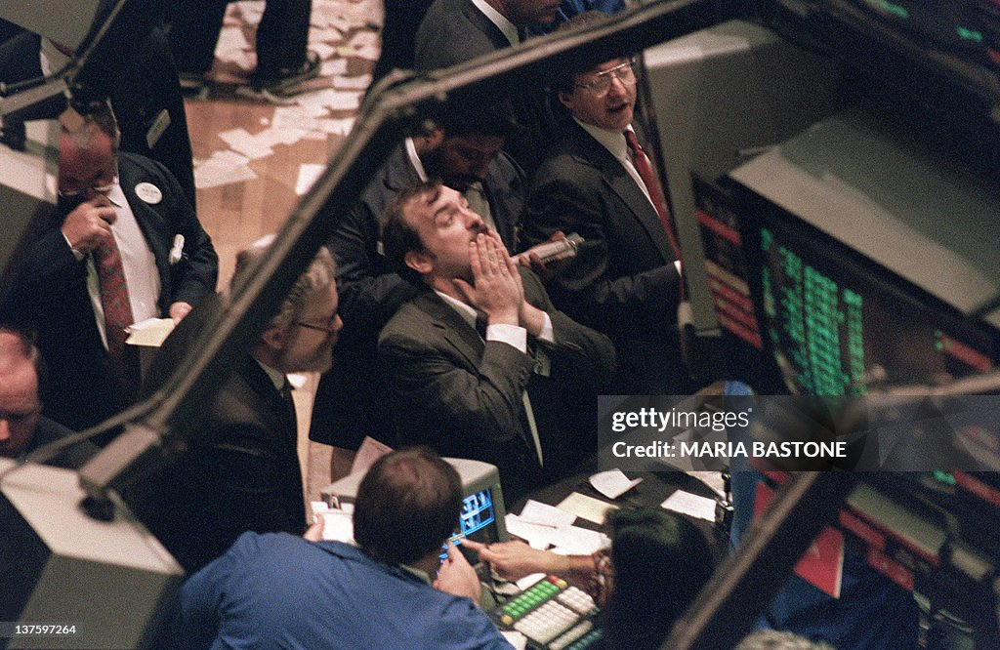{style="margin:0;"}
{style="margin:0;"}
:::
:::

## Introduction

::: columns
::: {.column .incremental width="65%"}

-   Asset price bubbles: positive price deviations from an asset’s fundamental value

-   Joint hypothesis problem in empirical data as FV not observable

-   $\rightarrow$ **Asset market experiments**, in which FV can be induced  (Smith, Suchanek, Williams, 1988)

-   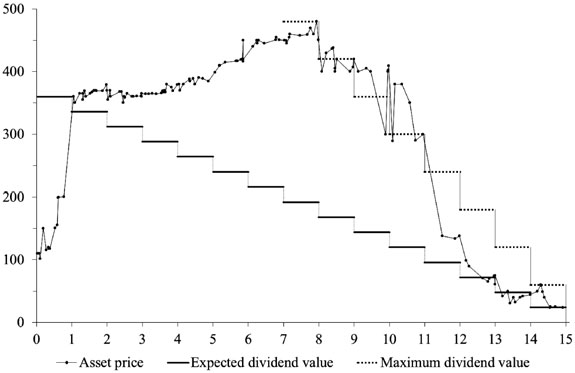{width="60%"}
:::

::: {.column width="35%"}
{style="margin:0;"}
{style="margin:0;"}
:::
:::

::: notes
costs to individuals, households, and society
:::

## Introduction

::: columns
::: {.column width="65%"}
Limitations of this literature:
:::

::: {.column width="35%"}
{style="margin:0;"}
{style="margin:0;"}
:::
:::

## Introduction {visibility="uncounted"}

::: columns
::: {.column .incremental width="65%"}
Limitations of this literature:

-   Many results rely on a single study
-   Most results rely on <u>very few independent observations</u>
    - Groups of 6, 8, 10 traders  $\rightarrow$ only 1 independent market price per group
    - Rarely more than 10 groups, often fewer
-   Lack of randomization
:::

::: {.column width="35%"}
{style="margin:0;"}
{style="margin:0;"}
:::
:::

## Introduction {visibility="uncounted"}

::: columns
::: {.column width="65%"}
Limitations of this literature:

-   Many results rely on a single study
-   Most results rely on <u>very few independent observations</u>
    - Groups of 6, 8, 10 traders  $\rightarrow$ only 1 independent market price per group
    - Rarely more than 10 groups, often fewer
-   Lack of randomization

$\rightarrow$ Limited statistical power, weakened causal inference
:::

::: {.column width="35%"}
{style="margin:0;"} {style="margin:0;"}
:::
:::

## Introduction {visibility="uncounted"}

::: columns
::: {.column width="65%"}
Limitations of this literature:

-   Many results rely on a single study
-   Most results rely on <u>very few independent observations</u>
    - Groups of 6, 8, 10 traders  $\rightarrow$ only 1 independent market price per group
    - Rarely more than 10 groups, often fewer
-   Lack of randomization

$\rightarrow$ Limited statistical power, weakened causal inference

$\rightarrow$ Important to assess the credibility of reported findings   $\rightarrow$ **Replications**
:::

::: {.column width="35%"}
{style="margin:0;"} {style="margin:0;"}
:::
:::

## Other prominent replications projects

- <b>Reproducibility Project: Psychology</b> (RPP; Open Science Collaboration, 2015):
    - 97 studies published in three psychology journals --\> 36% successfully replicated

- <b>Experimental Economics Replication Project</b> (EERP; Camerer et al., 2016):
    - 18 studies published in AER and QJE --\> 61% successfully replicated

- <b>Social Sciences Replication Project</b> (SSRP; Camerer et al. 2018):
    - 21 social science experiments published in Nature and Science --\> 62% successfully replicated

- <b>Management Science Replication Project</b> (MSRP; Davis et al. 2023):
    - 10 operations management experiments published in Management Science --\> 70% successfully replicated

- <b>Mechanical Turk Replication Project</b> (Holzmeister et al. 2024):
    - 41 social science experiments published in PNAS using MTurk --\> 54% successfully replicated

## Experimental asset market literature

- Which results in the experimental asset market literature should we / can we replicate?

    - Palan (2013) reviews over 60 experimental studies employing the SSW paradigm
    
    - Powell and Shestakova (2016) surveying more recent developments
    
    - Noussair (2022): "sustained academic interest in this literature"

. . .

- Systematic replication attempt of many studies not feasible

. . .

- $\rightarrow$ focus on *recent* studies in *top journals* examining *behavioral* motives for mispricing

## This paper

::: columns
::: {.column width="65%"}
High-powered preregistered replications of 17 key results

-   results taken from four prominent papers published in Am Econ Rev, J Finance, Rev Financ Stud, Rev Financ

    -   Kocher et al. (2019): Unleashing animal spirits: Self-control and overpricing in experimental asset markets

    -   Andrade et al. (2016): Bubbling with excitement: An experiment

    -   Eckel & Füllbrunn (2015): Thar she blows? Gender, competition, and bubbles in experimental asset markets

    -   Corgnet et al. (2018): What makes a good trader? On the role of intuition and reflection on trader performance
:::

::: {.column width="35%"}
:::
:::

## This paper {visibility="uncounted"}

::: columns
::: {.column width="65%"}
High-powered preregistered replications of 17 key results

-   results taken from four prominent papers published in Am Econ Rev, J Finance, Rev Financ Stud, Rev Financ

    -   Kocher et al. (2019): Unleashing animal spirits: Self-control and overpricing in experimental asset markets

    -   Andrade et al. (2016): Bubbling with excitement: An experiment

    -   Eckel & Füllbrunn (2015): Thar she blows? Gender, competition, and bubbles in experimental asset markets

    -   Corgnet et al. (2018): What makes a good trader? On the role of intuition and reflection on trader performance
:::

::: {.column width="35%"}
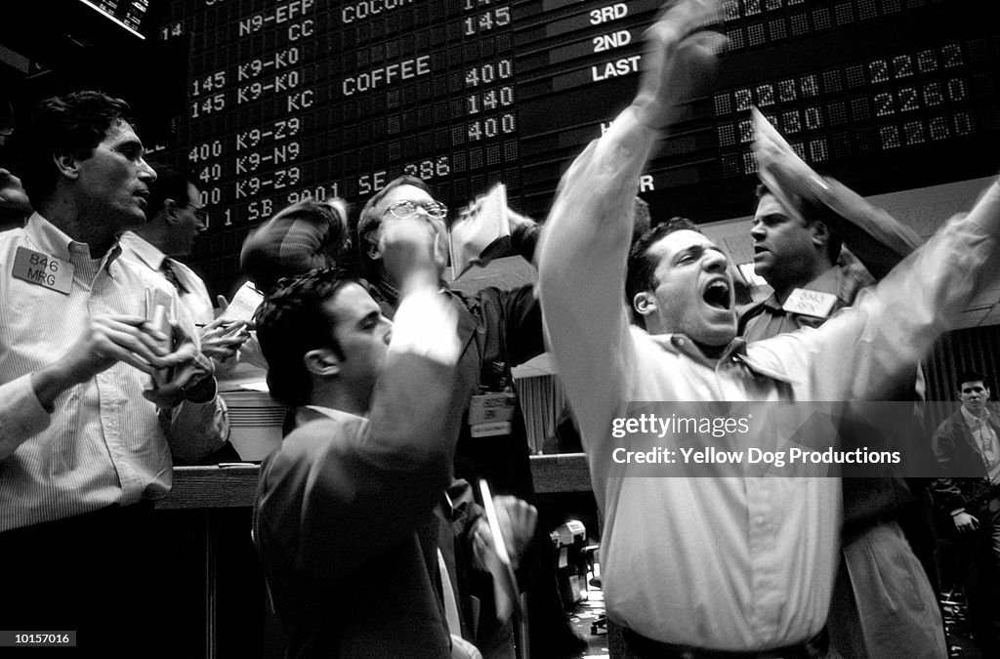{width="60%" style="margin:0;"} emotions
:::
:::

## This paper {visibility="uncounted"}

::: columns
::: {.column width="65%"}
High-powered preregistered replications of 17 key results

-   results taken from four prominent papers published in Am Econ Rev, J Finance, Rev Financ Stud, Rev Financ

    -   Kocher et al. (2019): Unleashing animal spirits: Self-control and overpricing in experimental asset markets

    -   Andrade et al. (2016): Bubbling with excitement: An experiment

    -   Eckel & Füllbrunn (2015): Thar she blows? Gender, competition, and bubbles in experimental asset markets

    -   Corgnet et al. (2018): What makes a good trader? On the role of intuition and reflection on trader performance
:::

::: {.column width="35%"}
{width="60%" style="margin:0;"} emotions

{width="60%" style="margin:0;"} self-control
:::
:::

## This paper {visibility="uncounted"}

::: columns
::: {.column width="65%"}
High-powered preregistered replications of 17 key results

-   results taken from four prominent papers published in Am Econ Rev, J Finance, Rev Financ Stud, Rev Financ

    -   Kocher et al. (2019): Unleashing animal spirits: Self-control and overpricing in experimental asset markets

    -   Andrade et al. (2016): Bubbling with excitement: An experiment

    -   Eckel & Füllbrunn (2015): Thar she blows? Gender, competition, and bubbles in experimental asset markets

    -   Corgnet et al. (2018): What makes a good trader? On the role of intuition and reflection on trader performance
:::

::: {.column width="35%"}
{width="60%" style="margin:0;"} emotions

{width="60%" style="margin:0;"} self-control

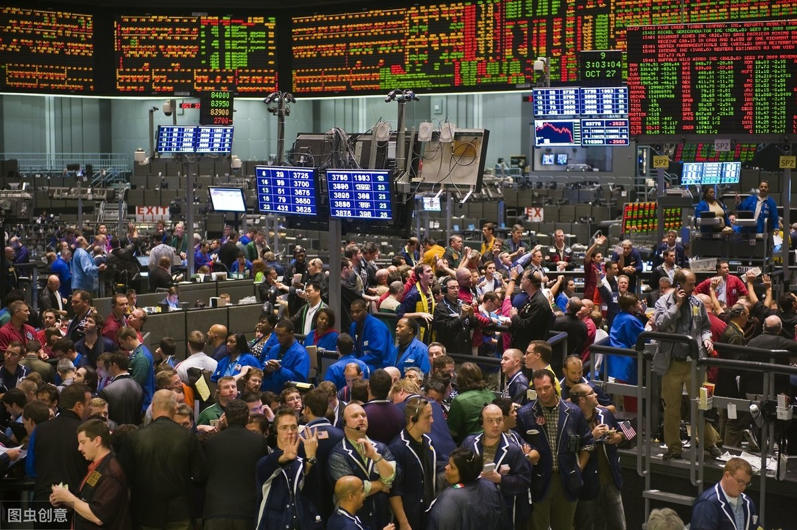{width="60%" style="margin:0;"}   behavioral factors / individual traits
:::
:::

::: notes
--\> relationship between asset market prices and emotions, self-control, experience, and gender\
--\> what characteristics - cognitive reflection, fluid intelligence, and theory of mind - can explain trading success

-   replication sample sizes between 1.6x and 9x original sample size\
    (average: 7.2x original)
:::

## This paper {visibility="uncounted"}

::: columns
::: {.column width="65%"}
High-powered preregistered replications of 17 key results

-   results taken from four prominent papers published in Am Econ Rev, J Finance, Rev Financ Stud, Rev Financ

    -   Kocher et al. (2019): Unleashing animal spirits: Self-control and overpricing in experimental asset markets

    -   Andrade et al. (2016): Bubbling with excitement: An experiment

    -   Eckel & Füllbrunn (2015): Thar she blows? Gender, competition, and bubbles in experimental asset markets

    -   Corgnet et al. (2018): What makes a good trader? On the role of intuition and reflection on trader performance
:::

::: {.column width="35%"}
{width="60%" style="margin:0;"} emotions

{width="60%" style="margin:0;"} self-control

{width="60%" style="margin:0;"}   behavioral factors / individual traits
:::
:::

## Replication protocol

### Market settings

Continuous double-auction markets resembling Smith et al. (1988, SSW):

-   long-lived asset with risky dividend payments; decreasing fundamental value

-   8 or 10 traders per market

-   Ten 2-minute periods

-   Dividends: 0 or 10 ECUs (50% prob.)

-   Endowments: (60; 1,000) or (20; 3,000); C/A ratio from 1 to 19

## Replication protocol {visibility="uncounted"}

### Market settings

Continuous double-auction markets resembling Smith et al. (1988, SSW):

-   long-lived asset with risky dividend payments; decreasing fundamental value

-   8 or 10 traders per market

-   Ten 2-minute periods

-   Dividends: 0 or 10 ECUs (50% prob.)

-   Endowments: (60; 1,000) or (20; 3,000); C/A ratio from 1 to 19

-   *New element:* 2 repetitions of each market

::: aside
Identical parameters as Kocher et al. (2019), based on Kirchler et al. (2012)  
Andrade et al. (2016): 9 traders, 15 periods à 3.5 minutes, C/A ratio 2-44 
:::

## Replication protocol

### Market settings

## Replication protocol

### Treatments

Laboratory asset market experiment with 4 conditions:

::: columns
::: {.column width="50%"}
From Andrade et al. (2016):  induce emotions with 5min movie clip



-   <b>Excitement treatment</b>

-   Calm treatment
:::

::: {.column width="50%"}
:::
:::

## Replication protocol {visibility="uncounted"}

### Treatments

Laboratory asset market experiment with 4 conditions:

::: columns
::: {.column width="50%"}
From Andrade et al. (2016):  induce emotions with 5min movie clip



-   Excitement treatment 

-   <b>Calm treatment</b>
:::

::: {.column width="50%"}
:::
:::

## Replication protocol {visibility="uncounted"}

### Treatments

Laboratory asset market experiment with 4 conditions:

::: columns
::: {.column width="50%"}
From Andrade et al. (2016):  induce emotions with 5min movie clip

{width="20%" fig-align="center" style="margin:0"}

-   Excitement treatment

-   Calm treatment
:::

::: {.column width="50%"}
From Kocher et al. (2019):  exhaust self-control with <a href="figures/stroop.png">Stroop</a> task

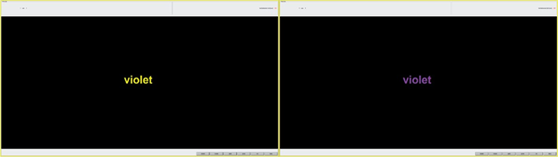{width="80%" fig-align="center" style="margin:0"}

-   Low Self-Control (LowSC) treatment

-   High Self-Control (HighSC) treatment

:::
:::

## Replication protocol

### Tasks for replication of Corgnet et al. (2018)

- Cognitive Reflection Test 

- Raven's Advanced Progressive Matrices $\rightarrow$ fluid intelligence 

- "Reading the Mind in the Eyes" test $\rightarrow$ Theory of Mind 

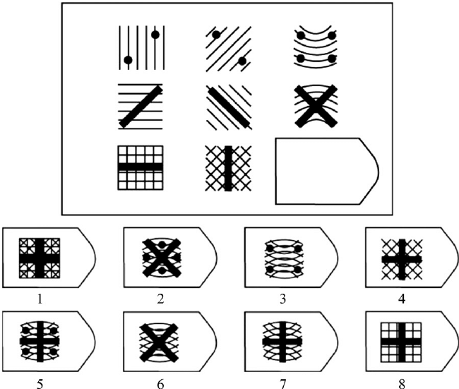{width="30%" fig-align="center" style="margin:0"}
{width="30%" fig-align="center" style="margin:0"}

## Data collection

Preregistered to collect 166 markets in 83 sessions:

-   31 markets per condition in replication of AOL

-   52 markets per condition in replication of KLS

$\rightarrow$ 1.6x to 9x original sample size   $\rightarrow$ **at least 90% power to detect 2/3 of the original effect sizes at the 5% level**

## Data collection {visibility="uncounted"}

Preregistered to collect 166 markets in 83 sessions:

-   31 markets per condition in replication of AOL

-   52 markets per condition in replication of KLS

$\rightarrow$ 1.6x to 9x original sample size   $\rightarrow$ **at least 90% power to detect 2/3 of the original effect sizes at the 5% level**

  **83 sessions** with **1,544 participants**

- Each session: either 2 conditions from AOL or 2 conditions from KLS
$\rightarrow$ randomization

::: aside
-   Average time: 1h 50min
-   Average payments: € 30.28 in AOL-treatments; € 37.08 in KLS-treatments
:::

# Results {visibility="hidden"}

##  {.center background-color="#9BD84C"}

<h1>Results</h1>

## Key variables

Key outcome variables used in the original studies by AOL and KLS:

- Relative deviation (RD): average difference between the market price and its fundamental value across trading periods

- Relative absolute deviation (RAD)

- Peak overpricing (RD_max)

(measured on the market level and separately for each of the two repetitions)

. . .

Key variables in meta-analytical results bz EF:

- Average bias (AB), positive deviation (PD), boom duration, and bust duration

## Replicaton indicators

When do we consider a replication attempt as "*successful*"?

. . .

Two indicators (based on Dreber and Johannesson, 2024): 

- <b>Statistical significance indicator</b>
    - a statistically significant effect (p < 0.05;two-tailed test) in the same direction as in the original study

. . .

- <b>Relative effect size indicator</b>
    - ratio of the effect size estimate in the replication study to that of the original study

## Emotions and market efficiency

**Ex-ante manipulation check on Prolific**

\~200 participants randomized into two conditions: Excitement and Calm

. . .

Same four emotion outcome variables as used in the original manipulation check in Andrade et al. (2016):

. . .

::: {.incremental}
- 67.4% describe their emotions as "excited/eager/enthusiastic" in Excitement\
2.9% in Calm (p \< 0.001)

- 4.2% describe their emotions as "calm/relaxed/peaceful" in Excitement\
68.0% in Calm (p \< 0.001)

- Valence (“The overall emotional experience I felt while watching the video clip was…”, 1-5): 
    -  3.72 in "Excitement"; 3.89 in "Calm" (1 = "clearly positive", 5 = "clearly negative")
    
- Intensity (1-5): 3.75 in "Excitement"; 2.92 in "Calm"

:::

## Emotions and market efficiency

::: columns
::: {.column width="50%"}
<strong> </strong>

-   overpricing (RD) is higher in the Excitement condition than in the Calm condition\
    p \< 0.001, n = 39
-   peak overpricing (RD_MAX) is higher in the Excitement condition than in the Calm condition\
    p \< 0.001, n = 39
:::

::: {.column width="50%"}
**Original study (Andrade et al., 2016)**

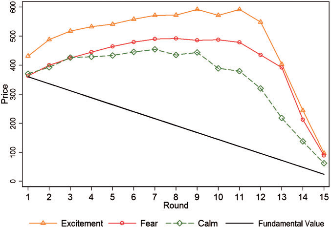
:::
:::

## Emotions and market efficiency {visibility="uncounted"}

::: columns
::: {.column width="50%"}
**Replication** {fig-align="center" width="80%" style="margin-top:0;"}
:::

::: {.column width="50%"}
**Original study (Andrade et al., 2016)**

:::
:::

## Emotions and market efficiency

::: columns
::: {.column width="50%"}
**Replication** {fig-align="center" width="80%" style="margin-top:0;"}
:::

::: {.column .incremental width="50%"}
<strong> </strong>

-   overpricing (RD) is <u>not</u> higher in the Excitement condition than in the Calm condition\
    p = 0.369, n = 62

-   peak overpricing (RD_MAX) is <u>not</u> higher in the Excitement condition than in the Calm condition\
    p = 0.483, n = 62
:::
:::

## Emotions and market efficiency {visibility="uncounted"}

::: columns
::: {.column width="50%"}
**Replication** {fig-align="center" width="80%" style="margin-top:0;"}
:::

::: {.column width="50%"}
<strong> </strong>

-   overpricing (RD) is <u>not</u> higher in the Excitement condition than in the Calm condition\
    p = 0.369, n = 62

-   peak overpricing (RD_MAX) is <u>not</u> higher in the Excitement condition than in the Calm condition\
    p = 0.483, n = 62

::: {.alert-box .warning}
$\rightarrow$ **Replication fails**   effect not significant   effect in opposite direction
:::
:::
:::

## Emotions and market efficiency 

::: columns
::: {.column width="65%"}
**Replication** 

{fig-align="center" width="100%" style="margin-top:0;"}
:::

::: {.column width="35%"}

- Replication rate: 0%

- Relative effect sizes:   -13.3% and -13.9%

:::

:::

## Self-control and market efficiency

::: columns
::: {.column width="50%"}
<strong> </strong>

-   overpricing (RD) is higher in the LowSC than in the HighSC condition\
    p = 0.0742, n = 16 (Mann-Whitney U-test)\
    p = 0.0580 (re-estimated t-test)
-   mispricing (RAD) is higher in the LowSC condition than in the HighSC condition\
    p = 0.0460, n = 16 (Mann-Whitey U-test)\
    p = 0.0317 (re-estimated t-test)
:::

::: {.column width="50%"}
**Original study (Kocher et al., 2019)**

:::
:::

## Self-control and market efficiency {visibility="uncounted"}

::: columns
::: {.column width="50%"}
**Replication** {fig-align="center" width="80%" style="margin-top:0;"}
:::

::: {.column width="50%"}
**Original study (Kocher et al., 2019)**

:::
:::

## Self-control and market efficiency

::: columns
::: {.column width="50%"}
**Replication** {fig-align="center" width="80%" style="margin-top:0;"}
:::

::: {.column .incremental width="50%"}
<strong> </strong>

-   overpricing (RD) is <u>not</u> higher in the LowSC than in the HighSC condition\
    p = 0.512, n = 104

-   mispricing (RAD) is <u>not</u> higher in the LowSC condition than in the HighSC condition\
    p = 0.452, n = 104
:::
:::

## Self-control and market efficiency {visibility="uncounted"}

::: columns
::: {.column width="50%"}
**Replication** {fig-align="center" width="80%" style="margin-top:0;"}
:::

::: {.column width="50%"}
<strong> </strong>

-   overpricing (RD) is <u>not</u> higher in the LowSC than in the HighSC condition\
    p = 0.512, n = 104

-   mispricing (RAD) is <u>not</u> higher in the LowSC condition than in the HighSC condition\
    p = 0.452, n = 104

::: {.alert-box .warning}
$\rightarrow$ **Replication fails**   effect not significant   effect in opposite direction
:::
:::
:::

## Self-control and market efficiency

::: columns
::: {.column width="65%"}
**Replication** 

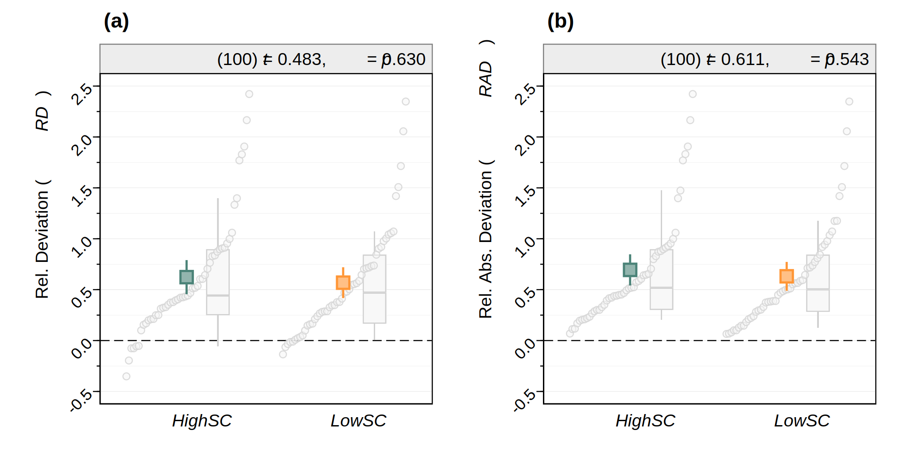{fig-align="center" width="100%" style="margin-top:0;"}
:::

::: {.column width="35%"}

- Replication rate: 0%

- Relative effect sizes:   -12.5% and -12.4%

:::

:::

## Gender composition and market efficiency

::: columns
::: {.column width="100%"}

**Original study (Eckel/Füllbrunn, 2015)**

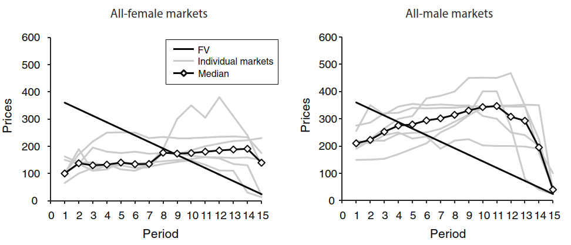{fig-align="center" width="60%" style="margin-top:0;"}

We do **not** attempt to replicate this $\rightarrow$ we *only* attempt to replicate their meta-analytical results!
:::

::: {.column widt="0%"}
:::
:::

## Gender composition and market efficiency

::: columns
::: {.column width="45%"}
**Original study (Eckel/Füllbrunn, 2015)**

-   Fraction of female traders is negatively associated with "bubble measures":
    -   Average bias (AB): Spearman correlation −0.477 (p = 0.004, n = 35)
    -   Positive deviation (PD): Spearman correlation −0.351 (p = 0.039, n = 35)
    -   Boom duration: Spearman correlation −0.390 (p = 0.021, n = 35)
    -   Bust duration: Spearman correlation 0.529 (p = 0.001, n = 35)
:::

::: {.column widt="55%"}
:::
:::

## Gender composition and market efficiency {visibility="uncounted"}

::: columns
::: {.column width="45%"}
**Original study (Eckel/Füllbrunn, 2015)**

-   Fraction of female traders is negatively associated with "bubble measures":
    -   Average bias (AB): Spearman correlation −0.477 (p = 0.004, n = 35)
    -   Positive deviation (PD): Spearman correlation −0.351 (p = 0.039, n = 35)
    -   Boom duration: Spearman correlation −0.390 (p = 0.021, n = 35)
    -   Bust duration: Spearman correlation 0.529 (p = 0.001, n = 35)
:::

::: {.column widt="55%"}
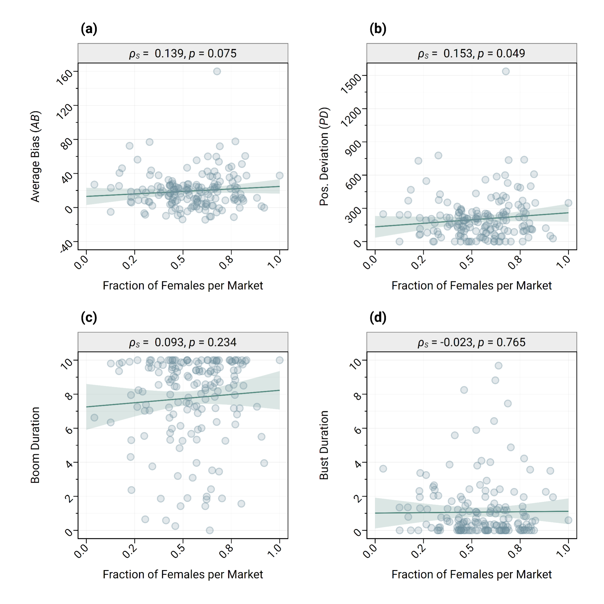{fig-align="center"}
:::
:::

## Gender composition and market efficiency {visibility="uncounted"}

::: columns
::: {.column width="45%"}
**Original study (Eckel/Füllbrunn, 2015)**

-   Fraction of female traders is negatively associated with "bubble measures":
    -   Average bias (AB): Spearman correlation −0.477 (p = 0.004, n = 35)
    -   Positive deviation (PD): Spearman correlation −0.351 (p = 0.039, n = 35)
    -   Boom duration: Spearman correlation −0.390 (p = 0.021, n = 35)
    -   Bust duration: Spearman correlation 0.529 (p = 0.001, n = 35)
:::

::: {.column widt="55%"}
::: {.alert-box .warning}
$\rightarrow$ **Replication fails**
:::

-   Fraction of female traders is <u>not</u> negatively associated with "bubble measures":
    -   Average bias (AB): Spearman correlation 0.139 (p = 0.075, n = 166)
    -   Positive deviation (PD): Spearman correlation 0.153 (p = 0.049, n = 166)
    -   Boom duration: Spearman correlation 0.093 (p = 0.234, n = 166)
    -   Bust duration: Spearman correlation −0.023 (p = 0.765, n = 166)
:::
:::

## Trading success

**Original study (Corgnet et al., 2018)**

Relationship trading success $\longleftrightarrow$ cognitive reflection, fluid intelligence, theory of mind

1.  𝝁 = 𝜶 + \[CRT, APM, TOM\] 𝜷 + 𝛀 𝝎 + 𝝐

2.  𝝁 = 𝜶 + \[CRT, APM, TOM\] 𝜷 + \[CRT 𝗑 TOM, APM 𝗑 TOM\] 𝜸 + 𝛀 𝝎 + 𝝐

3.  𝝁 = 𝜶 + \[SI\] 𝜷1 + \[HET\] 𝜷2 + \[SI 𝗑 HET\] 𝜼 + 𝛀 𝝎 + 𝝐

4.  𝝁 = 𝜶 + \[CRT, APM, TOM\] 𝜷1 + \[HET\] 𝜷2 + \[CRT 𝗑 HET, APM 𝗑 HET, TOM 𝗑 HET\] 𝜻 + 𝛀 𝝎 + 𝝐

## Trading success

**Replication**

::: columns
::: {.column width="60%"}
{fig-align="center"}
:::

::: {.column width="40%"}
Main effects:

::: {.alert-box .success}
$\rightarrow$ **Replication successful**  
:::

  Interaction effects:

::: {.alert-box .info}
$\rightarrow$ **Partly successful**   significant effects not replicated  non-significant effects replicated
:::
:::
:::

## Does experience reduce mispricing?

::: columns
::: {.column width="50%"}
{fig-align="center" width="100%" style="margin:0;"} {fig-align="center" width="100%" style="margin:0;"}
:::

::: {.column width="50%"}
:::
:::

## Does experience reduce mispricing? {visibility="uncounted"}

::: columns
::: {.column width="50%"}
{fig-align="center" width="100%" style="margin:0;"} {fig-align="center" width="100%" style="margin:0;"}
:::

::: {.column width="50%"}
:::
:::

## Experience reduces mispricing {visibility="uncounted"}

::: columns
::: {.column width="50%"}
{fig-align="center" width="100%" style="margin:0;"} {fig-align="center" width="100%" style="margin:0;"}
:::

::: {.column width="50%"}
Two repetitions of each market

{fig-align="center"}

$\rightarrow$ sig. lower Relative Deviation, Peak Overpricing, and Relative Abs. Deviation in 2nd repetition

$\rightarrow$ <b>stylized fact confirmed</b>
:::
:::

## Do Experimental Asset Markets Replicate?

::: {.columns}
::: {.column width="50%"}

:::

::: {.column width="50%"}

:::
:::

## Do Experimental Asset Markets Replicate? {visibility="uncounted"}

::: {.columns}
::: {.column width="50%"}
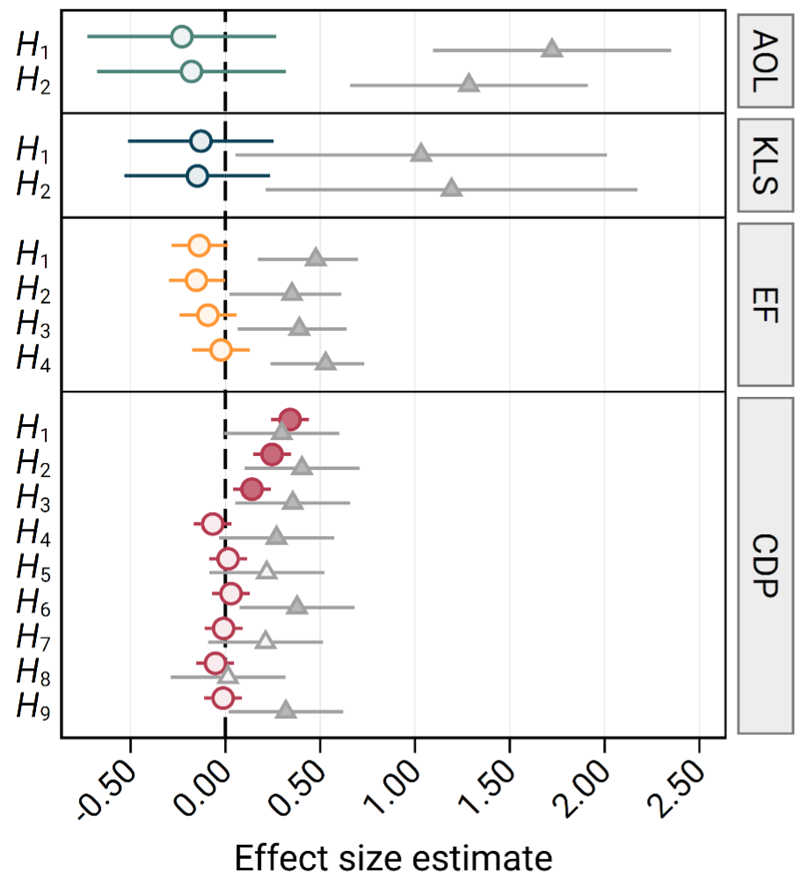{width="90%" style="margin:0;"}
:::

::: {.column width="50%"}

:::
:::

## Do Experimental Asset Markets Replicate? {visibility="uncounted"}

::: {.columns}
::: {.column width="50%"}
{width="90%" style="margin:0;"}
:::

::: {.column width="50%"}
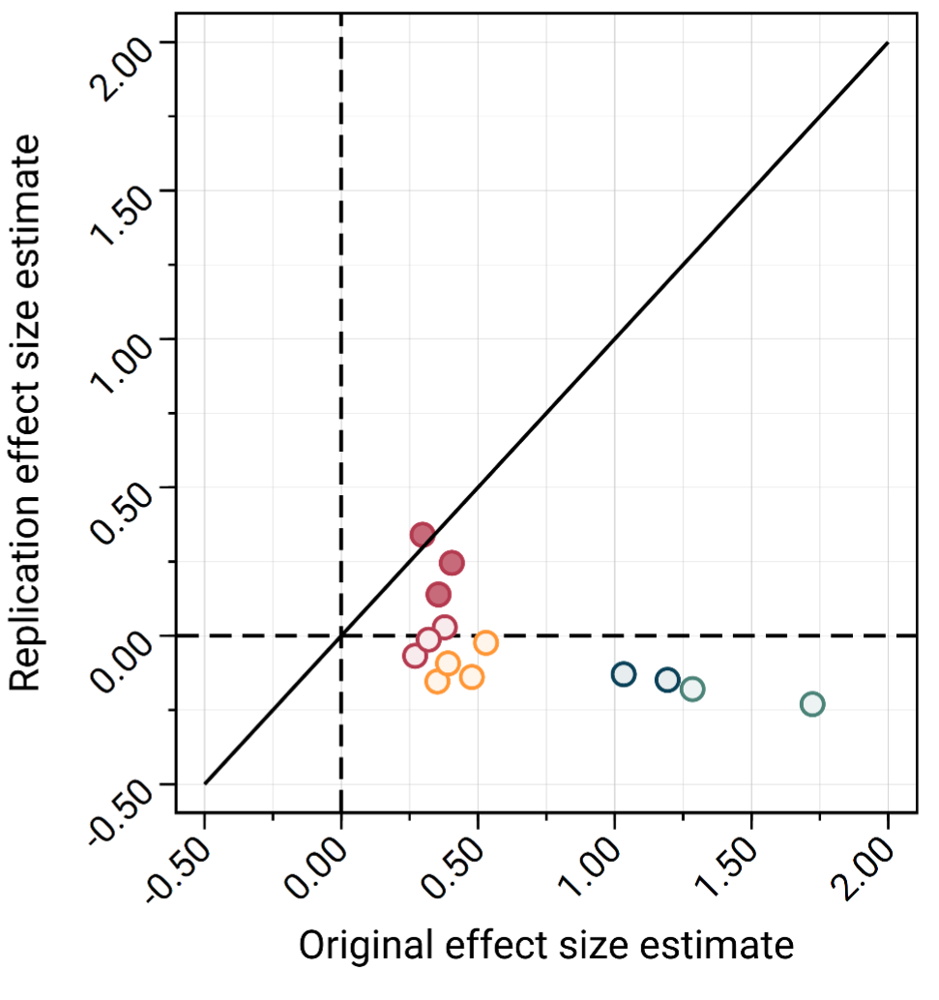{width="90%" style="margin:0;"}
:::
:::

# Do Experimental Asset Markets Replicate? {visibility="hidden"}

##  {background-image="thanks-background1.png"}

::: columns
::: {.column width="37%"}
<h2 class="thanks" style="margin:0; line-height:1em;">

Do Experimental Asset Markets Replicate?

</h2>
:::

::: {.column width="63%"}
:::
:::

##  {background-image="thanks-background1.png" visibility="uncounted"}

::: columns
::: {.column width="37%"}
<h2 class="thanks" style="margin:0; line-height:1em;">

Do Experimental Asset Markets Replicate?

</h2>
:::

::: {.column width="63%"}
-   High-powered, preregistered experiment with 1,544 participants to replicate 17 key results on experimental asset markets   
:::
:::

##  {background-image="thanks-background1.png" visibility="uncounted"}

::: columns
::: {.column width="37%"}
<h2 class="thanks" style="margin:0; line-height:1em;">

Do Experimental Asset Markets Replicate?

</h2>

:::

::: {.column width="63%"}
-   High-powered, preregistered experiment with 1,544 participants to replicate 17 key results on experimental asset markets   
:::
:::

##  {background-image="thanks-background1.png" visibility="uncounted"}

::: columns
::: {.column width="37%"}
<h2 class="thanks" style="margin:0; line-height:1em;">

Do Experimental Asset Markets Replicate?

</h2>

:::

::: {.column width="63%"}
-   High-powered, preregistered experiment with 1,544 participants to replicate 17 key results on experimental asset markets   

-   emotions do not affect market efficiency
:::
:::

##  {background-image="thanks-background1.png" visibility="uncounted"}

::: columns
::: {.column width="37%"}
<h2 class="thanks" style="margin:0; line-height:1em;">

Do Experimental Asset Markets Replicate?

</h2>

:::

::: {.column width="63%"}
-   High-powered, preregistered experiment with 1,544 participants to replicate 17 key results on experimental asset markets   

-   emotions do not affect market efficiency

-   self-control does not affect market efficiency
:::
:::

##  {background-image="thanks-background1.png" visibility="uncounted"}

::: columns
::: {.column width="37%"}
<h2 class="thanks" style="margin:0; line-height:1em;">

Do Experimental Asset Markets Replicate?

</h2>

:::

::: {.column width="63%"}
-   High-powered, preregistered experiment with 1,544 participants to replicate 17 key results on experimental asset markets   

-   emotions do not affect market efficiency

-   self-control does not affect market efficiency

-   gender composition does not affect market efficiency   
:::
:::

##  {background-image="thanks-background1.png" visibility="uncounted"}

::: columns
::: {.column width="37%"}
<h2 class="thanks" style="margin:0; line-height:1em;">

Do Experimental Asset Markets Replicate?

</h2>

{width="90%" style="margin:0;"}
:::

::: {.column width="63%"}
-   High-powered, preregistered experiment with 1,544 participants to replicate 17 key results on experimental asset markets   

-   emotions do not affect market efficiency

-   self-control does not affect market efficiency

-   gender composition does not affect market efficiency   

-   only 3 out of 14 original results (21.4%) reported as statistically significant successfully replicated
:::
:::

##  {background-image="thanks-background1.png" visibility="uncounted"}

::: columns
::: {.column width="37%"}
<h2 class="thanks" style="margin:0; line-height:1em;">

Do Experimental Asset Markets Replicate?

</h2>

{width="90%" style="margin:0;"}
:::

::: {.column width="63%"}
-   High-powered, preregistered experiment with 1,544 participants to replicate 17 key results on experimental asset markets   

-   emotions do not affect market efficiency

-   self-control does not affect market efficiency

-   gender composition does not affect market efficiency   

-   only 3 out of 14 original results (21.4%) reported as statistically significant successfully replicated

-   average replication effect size:  2.9% of the original estimates

:::
:::

##  {background-image="thanks-background1.png" visibility="uncounted"}

::: columns
::: {.column width="37%"}
<h2 class="thanks" style="margin:0; line-height:1em;">

Do Experimental Asset Markets Replicate?

</h2>

{width="90%" style="margin:0;"}
:::

::: {.column width="63%"}
-   High-powered, preregistered experiment with 1,544 participants to replicate 17 key results on experimental asset markets   

-   emotions do not affect market efficiency

-   self-control does not affect market efficiency

-   gender composition does not affect market efficiency   

-   only 3 out of 14 original results (21.4%) reported as statistically significant successfully replicated

-   average replication effect size:  2.9% of the original estimates

-   with equal weighting: replication rate 12.5%; replication effect size: -4.8% 

:::
:::

# Thanks {visibility="hidden"}

##  {.center background-image="thanks-background.png" visibility="uncounted"}

::: columns
::: {.column width="45%"}
:::

::: {.column width="55%"}
<h2 class="thanks">

Thanks

</h2>

::: {style="border: none; border-top: 5px solid black; width: 100px; height: 1cm; text-align: left; margin: 0;"}
:::

christoph.huber\@aalto.fi

chr-huber.com

{fig-align="left" width="250"}

:::
:::

::: footer
:::

## Direct replication of Andrade, Odean, Liu (2016) {visibility="uncounted"}

**Ex-ante manipulation check on Prolific**

\~200 participants randomized into two conditions: Excitement and Calm

67.4% describe their emotions as "excited/eager/enthusiastic" in Excitement\
2.9% in Calm (p \< 0.001)

4.2% describe their emotions as "calm/relaxed/peaceful" in Excitement\
68.0% in Calm (p \< 0.001)

## Direct replication of Andrade, Odean, Liu (2016) {visibility="uncounted"}

{fig-align="center"}

## Direct replication of Kocher, Lucks, Schindler (2019) {visibility="uncounted"}

## Relevance of chosen studies {visibility="uncounted"}

-   Andrade et al. (2016):
    -   Review of Finance (IF: 5.6)
    -   cited 149 citations
-   Kocher et al. (2019):
    -   Review of Financial Studies (IF: 6.8)
    -   cited 53 times
-   Eckel & Füllbrunn (2015):
    -   American Economic Review (IF: 10.3)
    -   cited 272 times
-   Corgnet et al. (2018)
    -   Journal of Finance (IF: 7.6)
    -   cited 108 times
